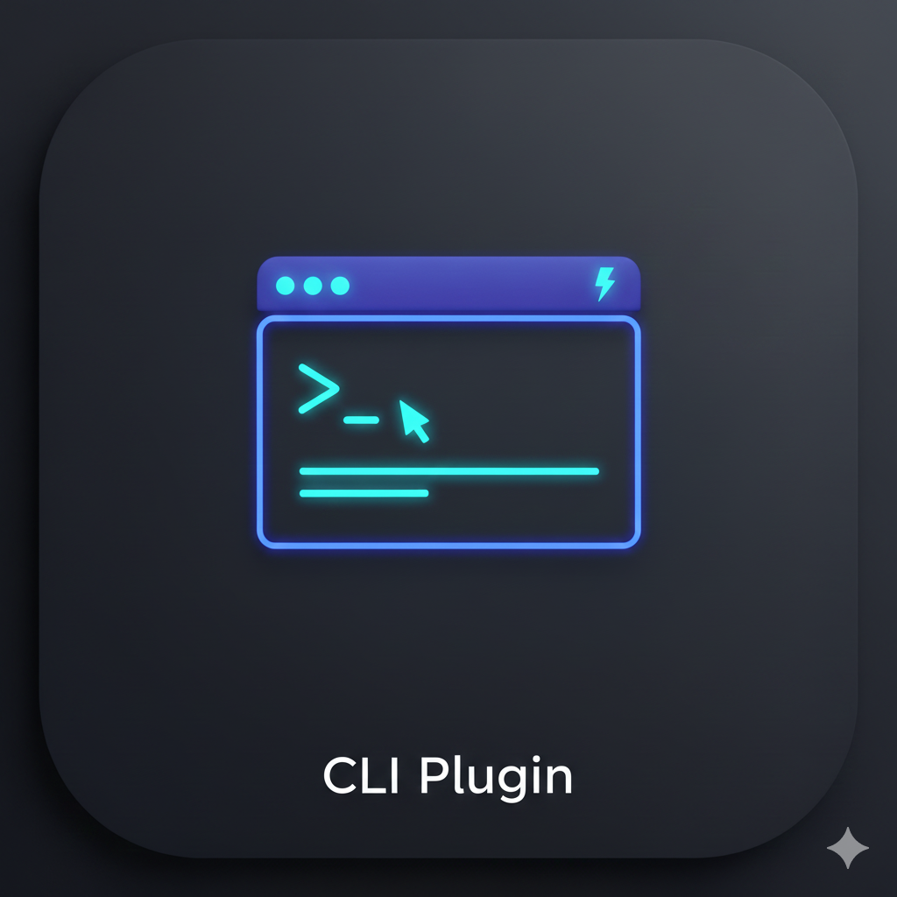
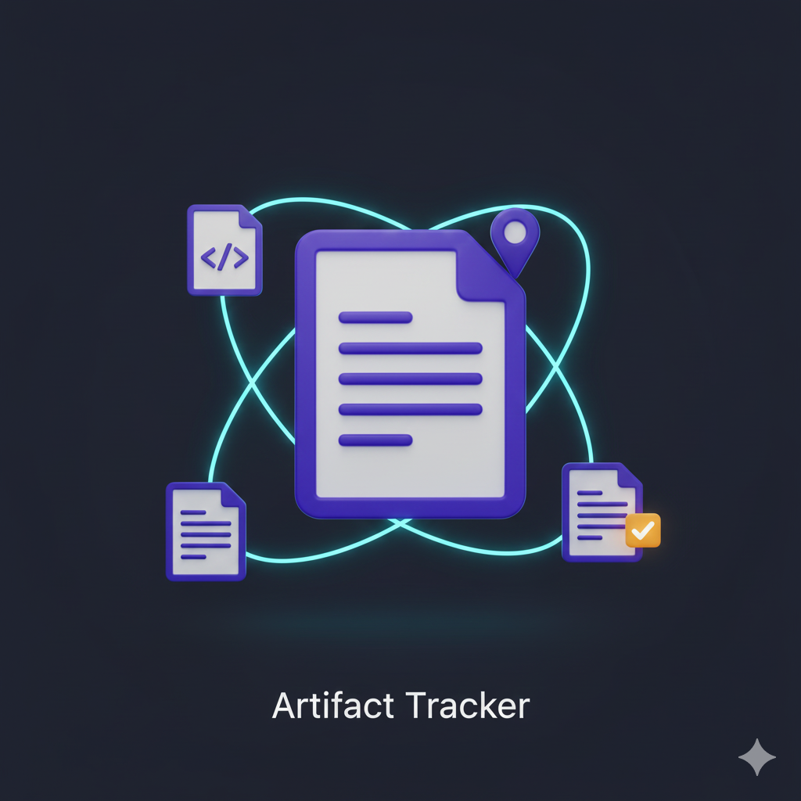
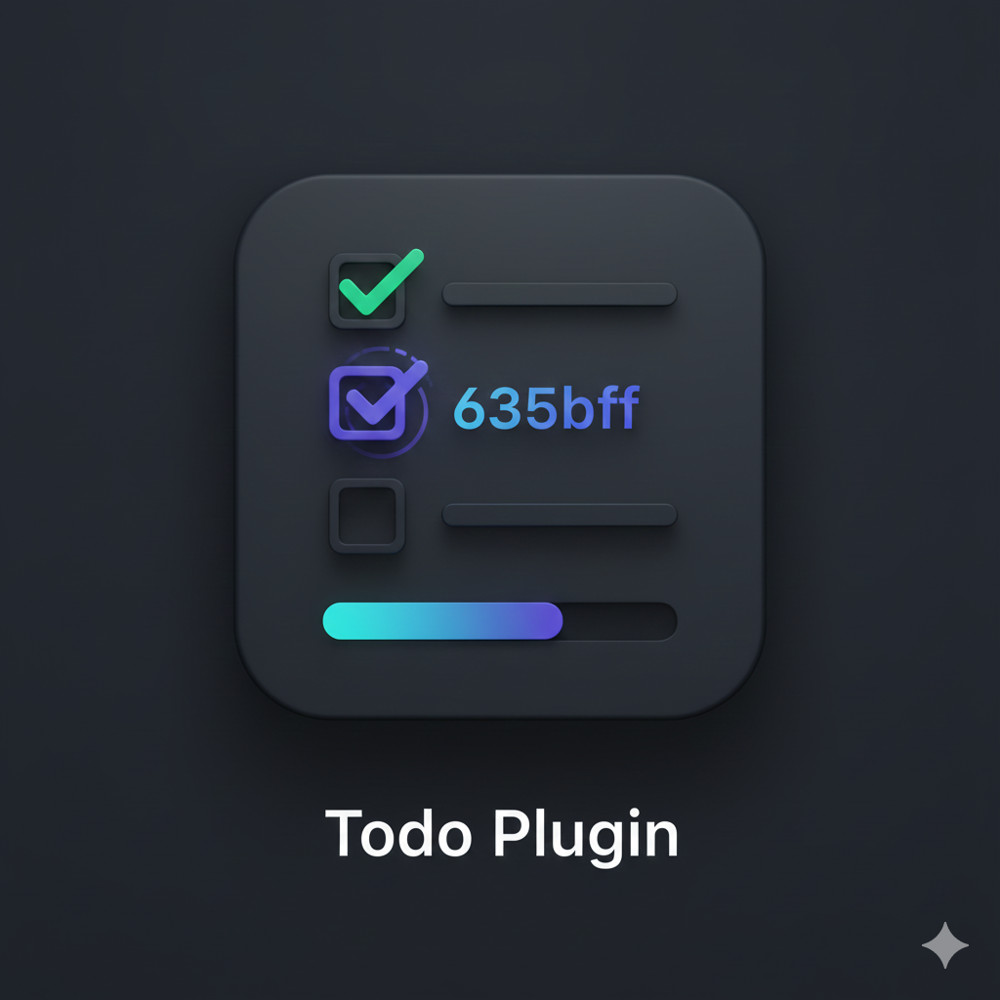
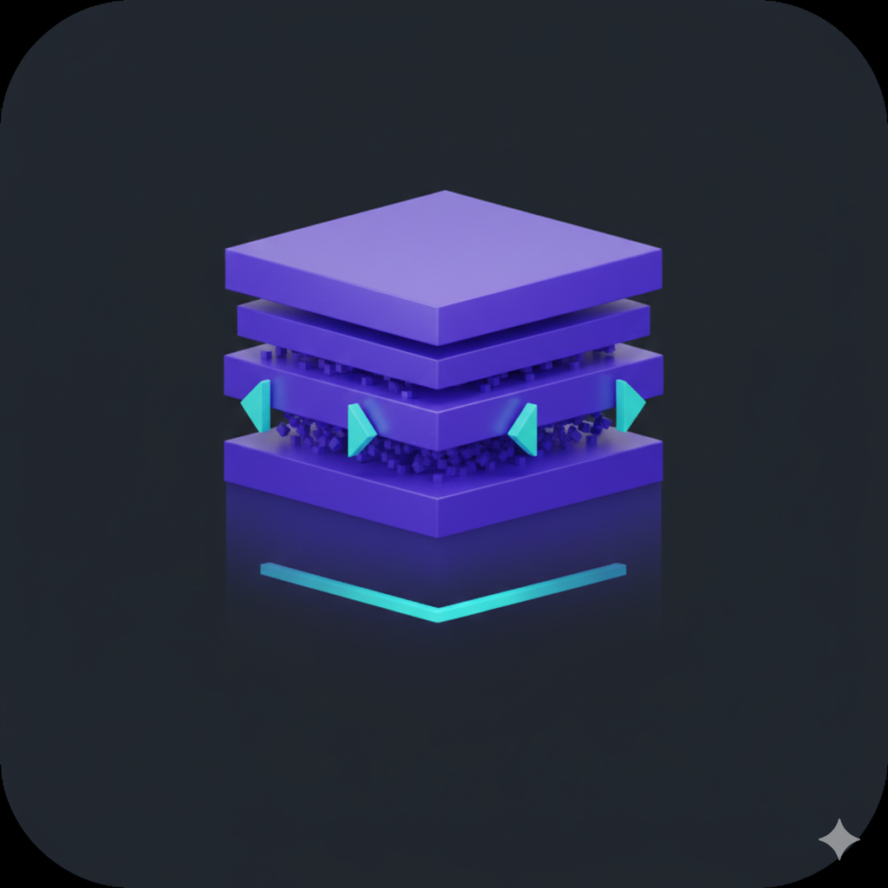
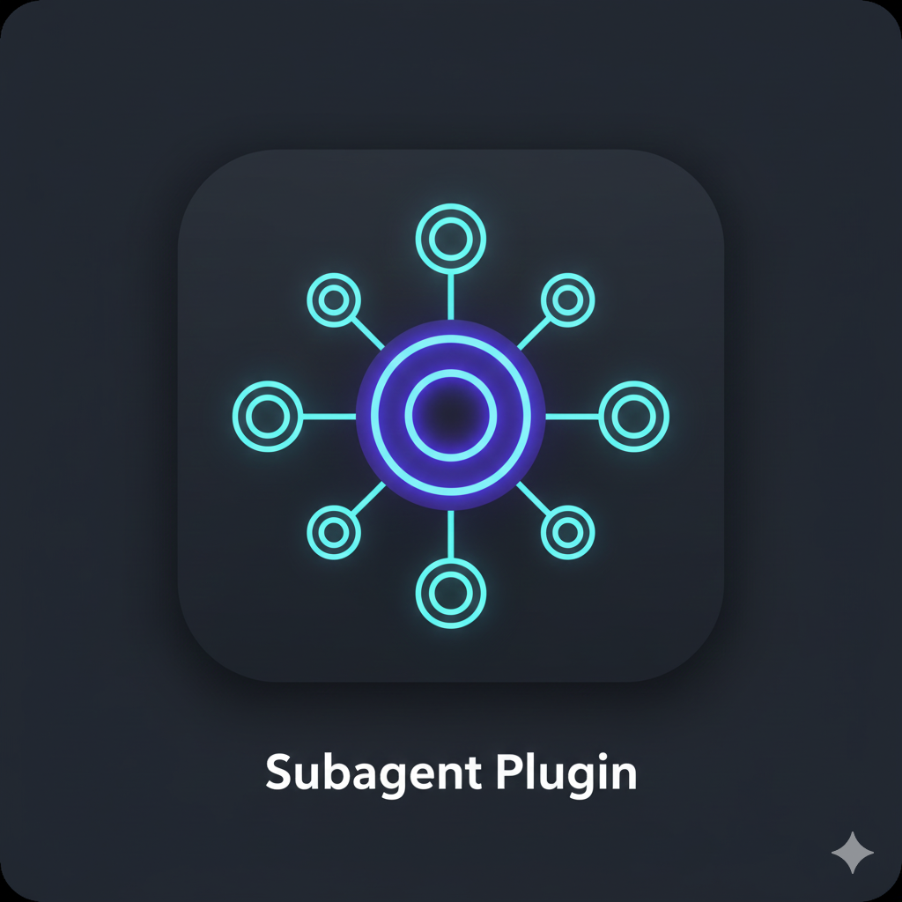
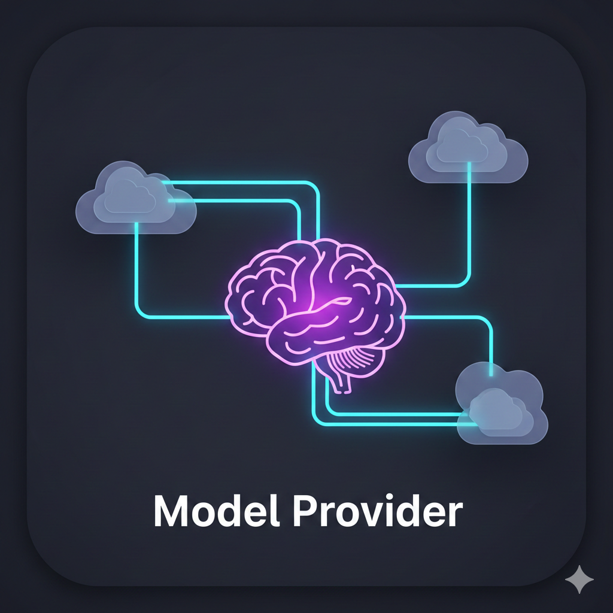

# jaato

<p align="center">
  
</p>

<p align="center">
  <strong>A production-grade framework for building agentic AI applications</strong>
</p>

<p align="center">
  15 model providers &bull; 40+ plugins &bull; Server-first architecture &bull; MCP &amp; CLI tool orchestration
</p>

<p align="center">
  <a href="https://jaato-framework-and-examples.github.io/jaato/web/index.html">Documentation</a> &bull;
  <a href="#quick-start">Quick Start</a> &bull;
  <a href="https://jaato-framework-and-examples.github.io/jaato/web/api-reference/plugins/index.html">Plugin Reference</a> &bull;
  <a href="https://github.com/Jaato-framework-and-examples/the_Jaato_Arch_visualization">Architecture</a>
</p>

> **🤖 Building on jaato with an AI coding agent? Point it at the skill and let it drive.**
> jaato ships a self-describing toolkit: the [`jaato-sdk-client` skill](.claude/skills/jaato-sdk-client/SKILL.md) plus two executable tools — **`jaato-scaffold`** (interrogate · validate · scaffold) and **`jaato-doctor`** (preflight · debug). They **introspect the _installed_ framework**, so your agent gets _current_ answers — providers, plugins, knobs, profiles, runtime + log layout — without reading the source and without drifting from the code. Point your agent (Claude Code, etc.) at the skill, say what you want to build, and let it scaffold a client, validate a profile, and debug a running session for you.

```bash
jaato-scaffold explain              # what the framework offers, right now
jaato-scaffold new client ...       # a runnable client, valid by construction
jaato-scaffold validate <profile>   # lint an agent profile vs the live registry
jaato-doctor   --workspace .        # preflight before connect()
jaato-doctor   --session latest     # debug a running session (workspace / path-tool failures)
```

See the **Developer Tooling** section below for the full surface.

## Overview

jaato is a framework for building agentic AI applications with LLM function calling, tool orchestration, and an extensible plugin architecture. It runs as a daemon with a typed event protocol, allowing multiple clients (TUI, web, headless) to connect simultaneously via IPC or WebSocket.

**Core capabilities:**

- **16 Model Providers** - hosted APIs (Google GenAI/Vertex AI, Anthropic Claude, Claude CLI, GitHub Models, Google Antigravity, ZhipuAI), local & self-hosted engines (Ollama, LM Studio, vLLM, TensorRT-LLM, Triton, NVIDIA NIM), and unified gateways (OpenRouter, Nebius, OVHcloud) — all behind one provider abstraction, switchable by configuration
- **40+ Plugins** - file editing, shell execution, interactive PTY sessions, MCP servers, subagent delegation, AST search, LSP diagnostics, memory, web search, inbound webhooks, and more — auto-discovered and auto-wired
- **Server-First Architecture** - daemon mode with IPC (Unix socket) and WebSocket (bearer-authenticated) transports, multi-session orchestration, and disk persistence
- **Agent Profiles & Subagents** - YAML/JSON profiles configure model, provider, plugins, and GC per agent; subagents spawn as lightweight sessions that share the parent's runtime (provider config, plugin registry, permissions, token ledger)
- **Per-Session Isolation** - optional kernel-enforced AppArmor confinement, plus a pre-warm runner-process pool that cuts per-session bootstrap from ~30s to ~7s
- **Parallel Tool Execution** - concurrent tool calls with thread-safe callbacks (up to 8 tools per turn), plus deferred (on-demand) tool loading
- **Context Management** - four garbage-collection strategies (truncation, summarization, hybrid generational, token-budget) with proactive threshold-based triggering
- **OpenTelemetry Observability** - structured tracing with span hierarchy (`jaato.turn` > `jaato.tool` > `jaato.permission`); spans follow OpenInference conventions and export to any compatible backend (Arize Phoenix, **Langfuse**, generic OTLP collectors), carrying per-call cost, token counts, and session/user attribution

### Etymology

While "jaato" serves as an acronym (**j**ust **a**nother **a**gentic **t**ool **o**rchestrator), the name carries deeper meaning. In the Himalayan region (Nepal, Sikkim, Darjeeling, and Bhutan), a **jaato** (जाँतो) is a traditional rotary hand-quern used to mill grains. This ancient tool consists of two round stones with a wooden handle (*hato*) used to turn the top stone in a circular motion.

The metaphor is intentional: just as a traditional jaato grinds raw grains into refined flour, this orchestrator processes raw inputs through LLM tools to produce refined outputs.

## Architecture

jaato uses a server-first design where the server is the source of truth and clients are thin presentation layers.

The full, current architecture — component diagrams, event flows, the cascade/reactor and confined-runner models — lives in its own visualization repo: **[the_Jaato_Arch_visualization](https://github.com/Jaato-framework-and-examples/the_Jaato_Arch_visualization)**.

**Key design decisions:**
- **Multi-client support** - Multiple UIs connect to the same running server
- **Session persistence** - State survives client disconnections and restarts
- **Resource sharing** - Single runtime for multiple agents with a shared token ledger
- **Pipeline-presentation split** - Server emits structured events; clients choose how to render them

See **[the_Jaato_Arch_visualization](https://github.com/Jaato-framework-and-examples/the_Jaato_Arch_visualization)** for current, detailed diagrams, and [Design Philosophy](docs/design-philosophy.md) for rationale.

## Provider Support

jaato abstracts model providers behind a unified interface. Switch providers by changing a configuration value — no code changes required.

| Provider | Type | Models | Authentication |
|----------|------|--------|----------------|
| **Google GenAI / Vertex AI** | Hosted API | Gemini 2.5 / 3 (Flash & Pro) | Service account JSON or Application Default Credentials |
| **Anthropic Claude** | Hosted API | Claude Opus, Sonnet, Haiku | PKCE OAuth (subscription) or API key |
| **Claude CLI** | Hosted API | Claude via CLI subscription | `claude login` (subscription, not API credits) |
| **GitHub Models** | Hosted API | Models via GitHub API | Device code OAuth or Personal Access Token |
| **Google Antigravity** | Hosted API | Gemini 3, Claude (via Google OAuth) | PKCE OAuth flow |
| **ZhipuAI** | Hosted API | GLM family (native + OpenAI-compatible surfaces) | API key |
| **Ollama** | Local | Any Ollama model (Qwen, Llama, Mistral, …) | Local — no auth |
| **LM Studio** | Local | Any LM Studio model (+ native load-control) | Local — optional bearer |
| **vLLM** | Self-hosted | Any `vllm serve` model | Local — optional `--api-key` bearer |
| **TensorRT-LLM** | Self-hosted | `trtllm-serve` engines | Local — optional bearer |
| **Triton** | Self-hosted | Triton + KServe v2 model repository | Local — optional bearer |
| **NVIDIA NIM** | Gateway / self-hosted | Llama, DeepSeek-R1, Nemotron, … | API key (hosted) or self-hosted (no auth) |
| **OpenRouter** | Gateway | 300+ models across vendors (`vendor/model`) | API key |
| **Nebius Token Factory** | Gateway | Serverless open models (Llama, Qwen, DeepSeek-R1, …) | API key |
| **OVHcloud AI Endpoints** | Gateway | Serverless open models on EU cloud (Llama, Mistral, Qwen, gpt-oss, …) | API key (or opt-in anonymous free tier) |

ZhipuAI ships as two registry entries — `zhipuai` (native API) and `zhipuai_openai` (OpenAI-compatible surface) — for **16 providers** total. Run `jaato-scaffold explain providers` for the live capability matrix: per-provider vision, PDF input, tool-choice forwarding, thinking, prompt caching, and streaming/cancellation support.

## Plugin Ecosystem

jaato ships with **40+ built-in plugins** organized by function. Plugins are auto-discovered and auto-wired — no manual registration needed.

### Tool Execution
| | Plugin | Description |
|:--:|--------|-------------|
|  | **cli** | Execute shell commands with intelligent auto-backgrounding for long-running processes |
|  | **mcp** | Connect to Model Context Protocol servers for external tool integrations |
|  | **background** | Orchestrate parallel background tasks across all BackgroundCapable plugins |
| | **interactive_shell** | Drive interactive processes (REPLs, debuggers, SSH, wizards) via persistent PTY sessions |
| | **environment** | Query execution environment (OS, shell, architecture) for platform-appropriate commands |
| | **webhook** | Inbound HTTP listener for external webhooks (GitHub, Slack, Jira) delivered to long-running agent sessions via subscribe/poll |

### File & Code Operations
| | Plugin | Description |
|:--:|--------|-------------|
|  | **file_edit** | File operations with diff-based approval, automatic backups, and undo support |
| | **filesystem_query** | File system search, traversal, and glob-based discovery |
| | **ast_search** | AST-based code search across Python, JavaScript, TypeScript, and more |
| | **lsp** | Language Server Protocol integration for diagnostics and code intelligence |
| | **notebook** | Jupyter notebook cell execution and management |
|  | **artifact_tracker** | Track file artifacts produced during agent sessions |

### Memory & State
| | Plugin | Description |
|:--:|--------|-------------|
|  | **memory** | Model self-curated persistent knowledge across sessions |
|  | **session** | Save and resume conversations across restarts |
|  | **todo** | Plan registration with progress tracking and workflow enforcement |
| | **waypoint** | Checkpoint and restore conversation state at named points |

### User Interaction
| | Plugin | Description |
|:--:|--------|-------------|
|  | **permission** | Control tool execution with policies, blacklists, and interactive approval |
|  | **clarification** | Request user input with single/multiple choice and free text responses |
| | **prompt_library** | Reusable prompt templates for common workflows |

### Context Management (GC)
| | Plugin | Description |
|:--:|--------|-------------|
|  | **gc_truncate** | Simple turn-based garbage collection via truncation |
|  | **gc_summarize** | Compression-based GC via summarization |
|  | **gc_hybrid** | Generational approach: recent preserved, middle summarized, oldest truncated |
| | **gc_budget** | Token budget management and threshold monitoring |

### Specialized Capabilities
| | Plugin | Description |
|:--:|--------|-------------|
|  | **web_search** | Web search integration for current information |
| | **web_fetch** | Fetch and process web page content |
|  | **subagent** | Delegate tasks to specialized subagents with isolated sessions and custom tools |
|  | **calculator** | Mathematical calculation tools with configurable precision |
|  | **references** | Inject documentation sources into model context (auto or user-selected) |
|  | **multimodal** | Handle images via @file references with lazy-loading |
| | **vision_capture** | Capture TUI screenshots as SVG/PNG for vision model input |
| | **thinking** | Extended thinking / chain-of-thought support for compatible models |
| | **telepathy** | Share context between concurrent agents (cross-agent messaging) |
| | **result_grep** | Model-directed regex filtering that shrinks large tool results before they reach the context |

### Infrastructure
| | Plugin | Description |
|:--:|--------|-------------|
|  | **model_provider** | Provider-agnostic abstraction layer (15 providers) |
|  | **registry** | Plugin discovery, lifecycle management, and tool exposure control |
| | **introspection** | Runtime self-inspection for tool and plugin discovery |
| | **streaming** | Token-level streaming with cancellation support |
| | **telemetry** | OpenTelemetry / OpenInference tracing — exports to Arize Phoenix, Langfuse, or any OTLP backend |
| | **reliability** | Per-tool reliability policies with configurable thresholds |
| | **sandbox_manager** | Sandboxed execution environments for untrusted tools |
| | **service_connector** | External web-service discovery and consumption (APIs, databases) |
| | **session_ops** | Cross-session introspection — interrogate, snapshot, and replay other live sessions |

Plus additional plugins for caching (per-provider), output formatting (code blocks, diffs, tables, Mermaid, notebooks), templating, content filtering, and per-provider authentication (OAuth flows + API-key managers).

For the complete reference, see the **[Plugin Documentation](https://jaato-framework-and-examples.github.io/jaato/web/api-reference/plugins/index.html)**. For plugin development, see [Plugin Development Guide](jaato-server/shared/plugins/README.md).

## Quick Start

### Prerequisites

- Python 3.10+
- An AI provider account (any of the 15 supported providers) — or a local engine (Ollama / LM Studio / vLLM) that needs no account

### Installation

jaato is structured as three packages:
- **jaato-sdk** - Lightweight client library and event protocol for building custom clients
- **jaato-server** - Runtime daemon with all plugins, providers, and core logic
- **jaato-tui** - Feature-rich terminal user interface client

```bash
git clone https://github.com/Jaato-framework-and-examples/jaato.git
cd jaato

# Create virtual environment
python3 -m venv .venv

# For contributors: install all packages in development mode
.venv/bin/pip install -e jaato-sdk/. -e "jaato-server/.[all]" -e "jaato-tui/.[all]"

# For SDK users: just the lightweight client library
.venv/bin/pip install jaato-sdk/

# Server with dev tools
.venv/bin/pip install "jaato-server/.[dev]"

# TUI with all optional dependencies
.venv/bin/pip install "jaato-tui/.[all]"
```

### Configuration

1. **Set up your AI provider** - Configure credentials for your chosen provider (see [Provider Setup Guides](https://jaato-framework-and-examples.github.io/jaato/web/api-reference/providers/index.html))
2. **Configure environment** - Copy `.env.example` to `.env` and edit with your credentials
3. **Optional: Add MCP servers** - Configure external tool integrations in `.mcp.json`

## Usage

### Starting the Server

```bash
# Start server as daemon with IPC socket
.venv/bin/python -m server --ipc-socket /tmp/jaato.sock --daemon

# Start with both IPC and WebSocket (for remote/web clients).
# WS clients present a bearer token; the daemon auto-generates one at
# ~/.jaato/ws.token on first WS start (override with --ws-token / --ws-token-file).
.venv/bin/python -m server --ipc-socket /tmp/jaato.sock --web-socket :8080 --daemon

# Server management
.venv/bin/python -m server --status    # Check if running
.venv/bin/python -m server --stop      # Stop the daemon
```

### Connecting Clients

```bash
# TUI client (interactive)
.venv/bin/python jaato-tui/rich_client.py --connect /tmp/jaato.sock

# With an agent profile (model + provider + plugins + GC from .jaato/profiles/<name>)
.venv/bin/python jaato-tui/rich_client.py --connect /tmp/jaato.sock --profile researcher

# Headless mode (scripting)
.venv/bin/python jaato-tui/rich_client.py --connect /tmp/jaato.sock --cmd "What time is it?"
```

### Running an agent from Python — one facade, three transports

The SDK ships a convenience facade (`Session.ask` / `.complete` / `.stream`) that runs the **same** agent three ways — pick one with `jaato.session(mode=...)`; the session spec and the facade are identical, `mode` is the only variable:

```python
import jaato

# in_process — embedded, no daemon (the agent runs in your process):
async with jaato.session(mode="in_process", profile={"model": "...", "provider": "..."}) as s:
    print(await s.ask("Hi"))

# ipc — a local daemon over a Unix socket:
async with jaato.session(mode="ipc", profile="researcher") as s:
    print(await s.ask("Hi"))

# ws — a remote daemon over WebSocket:
async with jaato.session(mode="ws", url="wss://host:8080", token="...", profile="researcher") as s:
    print(await s.ask("Hi"))
```

`in_process` (`InProcessClient`) needs no daemon; `ipc` (`IPCClient`) and `ws` (`WSClient`) talk to a daemon locally / remotely. All three expose the same facade, so you can develop embedded and deploy behind a daemon (or the reverse) without changing agent code. See [jaato-sdk/README.md](jaato-sdk/README.md#transports--three-ways-to-run-the-same-agent).

On the daemon transports, add `recovery=True` for the auto-reconnect client — `IPCRecoveryClient` (`ipc`) or `WSRecoveryClient` (`ws`), which survives daemon restarts / dropped sockets with exponential backoff + session reattachment; `mode="in_process", recovery=True` raises `ValueError`. Pass `on_status_change=` for the reconnection callback. For a self-signed `wss://` cert, pass `ssl=` (an `ssl.SSLContext`, or `True`/`False`) or `ca=` (a CA-bundle path) — scoped per connection, never `os.environ`. A non-terminal client (chat / web) can pass `presentation=` (a `PresentationContext` or `dict`) to replace the default terminal display context.

```python
# Remote daemon with auto-reconnect over WebSocket, trusting a dev wss:// cert:
async with jaato.session(mode="ws", url="wss://host:8080", token="...",
                         recovery=True, ca="/etc/jaato/dev-ca.pem",
                         on_status_change=lambda st: print(st.state)) as s:
    print(await s.ask("Long task..."))
```

### Developer Tooling — `jaato-doctor` & `jaato-scaffold`

Two console scripts (installed with the SDK / server) help you build and debug
custom clients and agent profiles **against the installed framework** — so they
can't drift from the code:

```bash
# jaato-doctor (ships with jaato-sdk) — client preflight: diagnose
# env / socket / daemon / auth BEFORE your client calls connect().
jaato-doctor --workspace . --env-file .env
#   Checks: `server` importable (autostart), socket listening / stale,
#   the daemon's HOME vs yours (why pass:// secrets resolve wrong),
#   env_file, and where profiles/logs land. Non-zero exit on any FAIL,
#   so it doubles as a CI gate.
jaato-doctor --session latest --workspace .  # debug a RUNNING session: did its
#   runner-tier path plugins resolve the workspace, or get workspace=none
#   (→ readFile/file_edit/cli Permission-denied)? Reads the session's logs.

# jaato-scaffold (ships with jaato-server) — interrogate / validate / scaffold.
jaato-scaffold explain                      # plugins · providers · gc · archetypes
jaato-scaffold explain archetypes           # what `new` WRITES — file tree per archetype
jaato-scaffold explain archetype <name>     # its files, what is in them, what you must edit
jaato-scaffold explain provider <name>      # capabilities · knobs (typed, by layer) · quirks
jaato-scaffold explain profile              # the agent-profile schema, field by field
jaato-scaffold explain runtime              # session/runner entities · workspace flow · log map
jaato-scaffold validate <profile.yaml|workspace>   # lint a profile vs the live registry
jaato-scaffold new client --workspace DIR --provider P --model M   # generate a starting client
jaato-scaffold new client --transport ws --url wss://host:8080 --recoverable --ca ca.pem ...
jaato-scaffold new <archetype> ... --dry-run       # the exact tree it would write, unwritten
```

`new client` takes `--transport {ipc,ws,in_process}` (default `ipc`): `ipc` emits an `IPCClient` (local daemon), `ws` a `WSClient` (remote — pass `--url`, optional `--token` / `--ca`, needs `jaato-sdk[ws]`), `in_process` an embedded `InProcessClient` (`from jaato import InProcessClient`, no daemon / socket). Add `--recoverable` on a daemon transport to emit the recovery client (`IPCRecoveryClient` / `WSRecoveryClient`); it is rejected for `in_process`. `--ca <bundle>` wires a self-signed `wss://` CA into the generated client. Every emitted client `.py` (the six client archetypes — `client` / `fire` / `cascade` / `observer` / `sweep` / `host-tools`) carries a `Generated by jaato-scaffold new ...` provenance line with the full resolved command (the profile-set YAML uses its own header). Before you run `new`, `explain archetypes` lists what each archetype writes and `explain archetype <name>` breaks one down file by file — which parts are placeholders you must edit, which are the generated-and-correct recipe — and `new ... --dry-run` rehearses the exact tree for *your* flags without touching the workspace.

`explain` reads the live plugin/provider registry, `validate` lints against it,
and `doctor` inspects the actual daemon you target — together they're the source
of truth for *current* patterns when authoring a client or profile. For runtime
failures, `explain runtime` is the map (session/runner entities, how the
workspace flows from client to plugin, and where each log lands) and
`doctor --session <id|latest>` applies it — turning a path-tool / `workspace=none`
hunt into one command instead of manual log-archaeology. (Equivalent module
forms, if the scripts aren't on `PATH`: `python -m jaato_sdk.doctor`,
`python -m shared.scaffold`.)

### TUI Features

- **Multi-turn conversations** with full context preservation
- **Permission system** with granular approval controls (yes, no, always, per-turn, idle-based)
- **Plan tracking** with the TODO plugin for complex multi-step tasks
- **Session persistence** for saving and resuming conversations across restarts
- **Theming** with built-in dark, light, and high-contrast themes plus custom theme support
- **Configurable keybindings** with external editor integration (Ctrl+G)
- **Search mode** (Ctrl+F) for finding text in session output
- **Subagent delegation** with tabbed agent UI
- **Authentication commands** for Anthropic, GitHub, and Google OAuth flows

### Interactive Commands

| Command | Description |
|---------|-------------|
| `help` | Show available commands |
| `tools` | List all registered tools |
| `reset` | Clear conversation history and start fresh |
| `model <name>` | Switch to a different model |
| `history` | Display conversation history |
| `context` | Show context window usage |
| `export [file]` | Export the current session to a file |
| `plan` | Show current task plan |
| `save` / `resume` | Save or resume sessions |
| `sessions` | List all saved sessions |
| `permissions` | Manage tool permission policies |
| `backtoturn <id>` | Revert conversation to a specific turn |
| `screenshot` | Capture TUI as SVG/PNG |

## Project Structure

```
jaato/
├── jaato-sdk/                     # Client SDK (events, protocol, trace)
│   └── jaato_sdk/
│       ├── events.py              # 25+ typed event definitions
│       ├── client/                # Client connection logic
│       └── plugins/               # Plugin type definitions
├── jaato-server/                  # Server runtime
│   ├── server/                    # Daemon, IPC, WebSocket
│   │   ├── __main__.py            # Entry point with daemon mode
│   │   ├── core.py                # JaatoServer (UI-agnostic core)
│   │   ├── session_manager.py     # Multi-session orchestration
│   │   ├── ipc.py                 # Unix domain socket transport
│   │   └── websocket.py           # WebSocket transport
│   └── shared/                    # Core library
│       ├── jaato_client.py        # JaatoClient facade
│       ├── jaato_runtime.py       # Shared runtime (providers, registry)
│       ├── jaato_session.py       # Per-agent conversation state
│       ├── ai_tool_runner.py      # Tool execution with permissions
│       ├── token_accounting.py    # Token ledger with rate-limit retries
│       ├── mcp_context_manager.py # Multi-server MCP management
│       └── plugins/               # 40+ plugins (see above)
├── jaato-tui/                     # Terminal UI client
│   ├── rich_client.py             # Entry point
│   ├── output_buffer.py           # Output rendering engine
│   ├── pt_display.py              # Prompt toolkit display layer
│   └── backend.py                 # IPC/WebSocket client backend
├── web-client/                    # Web client (React/Vite/Tailwind)
├── docs/                          # Comprehensive documentation (45+ docs)
├── examples/                      # Usage examples
├── out-of-tree-plugins/           # Third-party plugin template
└── scripts/                       # Utility scripts
```

## Environment Variables

### Provider Configuration

Provider environment variables (credentials, endpoints, model selection) differ per provider and change as providers are added — so jaato doesn't hardcode them here, where they'd drift. Discover them from the **installed framework**, which is the source of truth:

```bash
jaato-scaffold explain provider <name>      # typed env vars + knobs for one provider (e.g. anthropic, vllm, nebius)
jaato-scaffold explain providers            # the full provider list + capability matrix
jaato-doctor --workspace . --env-file .env  # verify your env actually resolves (creds, socket, daemon HOME)
```

Each provider's setup is also written up in the per-provider [provider docs](https://jaato-framework-and-examples.github.io/jaato/web/api-reference/providers/index.html).

### Runtime Configuration

| Variable | Description | Default |
|----------|-------------|---------|
| `AI_USE_CHAT_FUNCTIONS` | Enable function calling mode | `1` |
| `LEDGER_PATH` | Token accounting JSONL output path | `token_events_ledger.jsonl` |
| `JAATO_GC_THRESHOLD` | GC trigger threshold % | `80.0` |
| `JAATO_PARALLEL_TOOLS` | Enable parallel tool execution | `true` |
| `JAATO_DEFERRED_TOOLS` | Enable deferred tool loading | `true` |

### Retry & Rate Limiting

| Variable | Description | Default |
|----------|-------------|---------|
| `AI_RETRY_ATTEMPTS` | Max retry attempts for transient errors | `5` |
| `AI_RETRY_BASE_DELAY` | Base delay (seconds) for exponential backoff | `1.0` |
| `AI_RETRY_MAX_DELAY` | Maximum delay (seconds) between retries | `30.0` |
| `AI_REQUEST_INTERVAL` | Minimum seconds between requests | `0` |

### Proxy & Network

| Variable | Description | Default |
|----------|-------------|---------|
| `HTTPS_PROXY` / `HTTP_PROXY` | Standard proxy URL | — |
| `NO_PROXY` | No-proxy hosts (suffix matching) | — |
| `JAATO_KERBEROS_PROXY` | Enable Kerberos/SPNEGO proxy auth | `false` |
| `JAATO_SSL_VERIFY` | SSL certificate verification | `true` |

### OpenTelemetry

| Variable | Description | Default |
|----------|-------------|---------|
| `JAATO_TELEMETRY_ENABLED` | Enable OTel tracing | `false` |
| `OTEL_EXPORTER_OTLP_ENDPOINT` | OTLP collector endpoint | — |
| `OTEL_EXPORTER_OTLP_PROTOCOL` | Transport for generic OTLP (`grpc` / `http/protobuf`) | `grpc` |
| `JAATO_TELEMETRY_BACKEND` | Force a backend (`otel` / `langfuse`); auto-selects `langfuse` when a Langfuse key is set and no OTLP endpoint is configured | auto |
| `LANGFUSE_PUBLIC_KEY` / `LANGFUSE_SECRET_KEY` | Langfuse credentials — enable the built-in Langfuse backend (derives its OTLP endpoint, `http/protobuf` transport, and Basic auth) | — |
| `LANGFUSE_HOST` | Langfuse base URL (e.g. `https://cloud.langfuse.com`, a region host, or self-hosted) | `https://cloud.langfuse.com` |
| `JAATO_TELEMETRY_USER_ID` | User attribution stamped on traces (`user.id`) for per-user analytics | — |

For prompt authoring/versioning driven from the Langfuse UI (a separate, opt-in
integration that plugs into jaato's prefetch seam), see the
[jaato-langfuse-prompts PoC](https://github.com/Jaato-framework-and-examples/jaato-langfuse-prompts-integration-poc).

## Documentation

**[Full Documentation](https://jaato-framework-and-examples.github.io/jaato/web/index.html)** - Complete reference with examples, guides, and API documentation.

| Resource | Description |
|----------|-------------|
| [Architecture Visualization](https://github.com/Jaato-framework-and-examples/the_Jaato_Arch_visualization) | Current component diagrams, event flows, cascade/reactor & confined-runner models (dedicated repo) |
| [Design Philosophy](docs/design-philosophy.md) | Opinionated design decisions and rationale |
| [Plugin Reference](https://jaato-framework-and-examples.github.io/jaato/web/api-reference/plugins/index.html) | All built-in plugins with configuration and examples |
| [Plugin Development](jaato-server/shared/plugins/README.md) | Guide for creating custom plugins |
| [Provider Setup](https://jaato-framework-and-examples.github.io/jaato/web/api-reference/providers/index.html) | Configuration guides for each model provider |
| [GCP/Vertex AI Setup](docs/gcp-setup.md) | Google Cloud Platform setup walkthrough |
| [OpenTelemetry Design](docs/opentelemetry-design.md) | Tracing integration architecture |
| [Reliability Policies](docs/reliability-policies-config.md) | Per-tool thresholds and retry configuration |

## License

Business Source License 1.1 (BSL 1.1) — free for internal use, self-hosted deployments, and contributions. Converts to Apache 2.0 on 2030-09-01. See [LICENSE](LICENSE) for full terms.

## Premium Extensions

[jaato-premium](https://github.com/Jaato-framework-and-examples/jaato-premium) is an optional commercial package that adds curated system instructions, subagent profiles, knowledge modules, and multi-server gossip clustering. The public framework is fully functional without it — premium adds opinionated methodology and distributed infrastructure on top.
