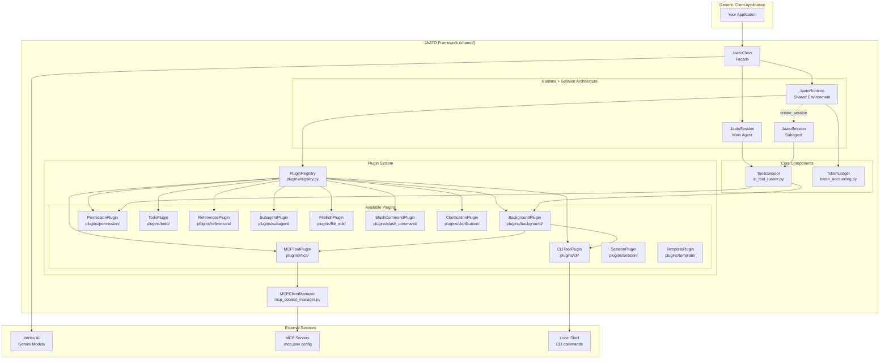
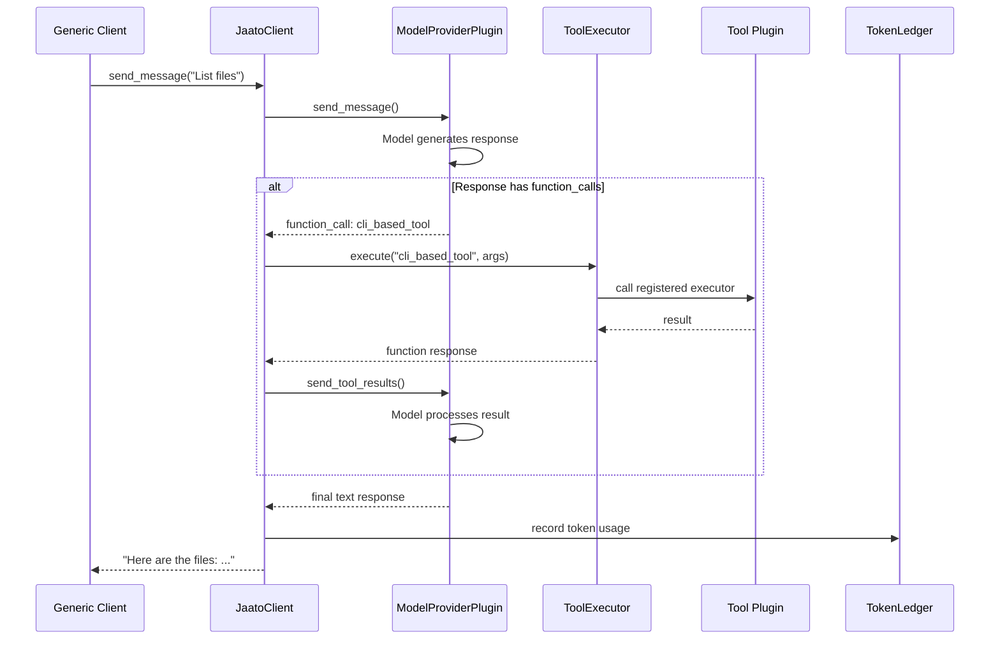
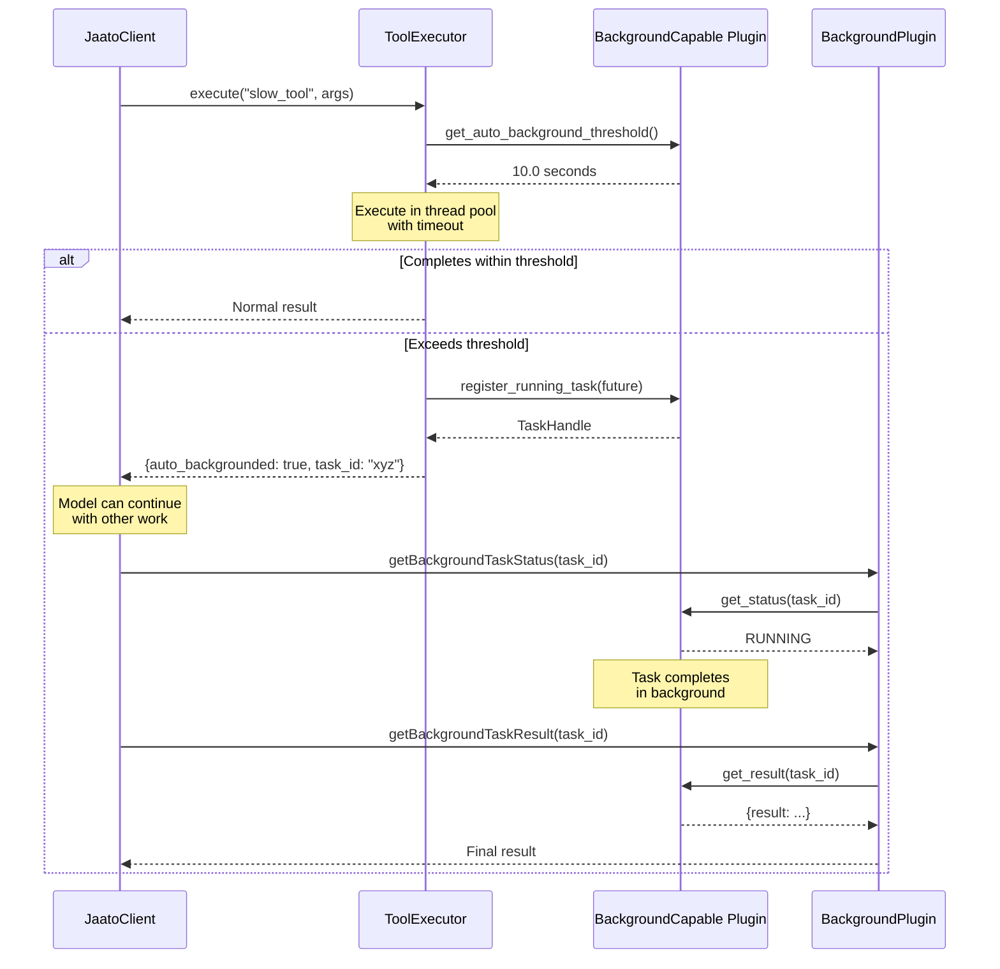
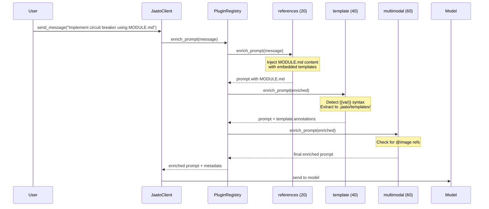
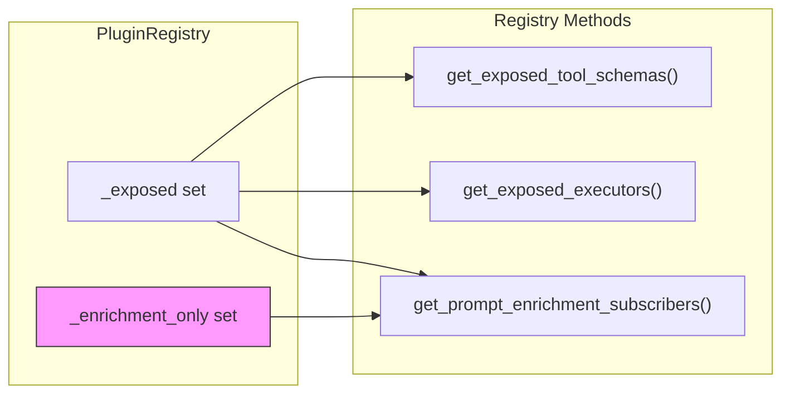

# JAATO Framework Architecture

This document describes the architecture of the jaato framework and how a generic client uses it.

## Server-First Architecture

The framework supports a server-first architecture where the core logic runs as a standalone daemon, enabling multiple clients to connect via IPC or WebSocket.

### Architecture Overview

```
┌─────────────────────────────────────────────────────────────────┐
│                     python -m server                             │
│  (Daemon - persists independently of clients)                   │
├─────────────────────────────────────────────────────────────────┤
│  SessionManager                                                  │
│  ├── Session "project-A" ─► JaatoServer ─► SessionPlugin        │
│  ├── Session "project-B" ─► JaatoServer ─► SessionPlugin        │
│  └── Session "default"   ─► JaatoServer ─► SessionPlugin        │
├─────────────────────────────────────────────────────────────────┤
│  --ipc-socket /tmp/jaato.sock   (local, fast, secure)           │
│  --web-socket :8080             (remote, web clients)           │
│  --daemon                       (background mode)               │
└─────────────────────────────────────────────────────────────────┘
              │                           │
              ▼                           ▼
    ┌──────────────────┐        ┌──────────────────┐
    │   rich-client    │        │   web-client     │
    │   (TUI via IPC)  │        │   (via WebSocket)│
    └──────────────────┘        └──────────────────┘
```

### Server Components

| Component | Location | Purpose |
|-----------|----------|---------|
| `JaatoServer` | `server/core.py` | Core logic extracted from RichClient, UI-agnostic |
| `SessionManager` | `server/session_manager.py` | Multi-session orchestration with persistence |
| `JaatoIPCServer` | `server/ipc.py` | Unix domain socket for local clients |
| `JaatoWSServer` | `server/websocket.py` | WebSocket for remote/web clients |
| `Event Protocol` | `server/events.py` | 25+ typed events for client-server communication |

### Event-Driven Communication

Instead of direct callbacks, the server emits events that clients subscribe to:

```
┌─────────────────────────────────────────────────────────────────┐
│                        JaatoServer                               │
├─────────────────────────────────────────────────────────────────┤
│  Plugins ──callbacks──► JaatoServer ──emit()──► Event Queue     │
│                                                                 │
│  • Permission hooks → emit(PermissionRequestedEvent)            │
│  • Clarification hooks → emit(ClarificationQuestionEvent)       │
│  • Plan reporter → emit(PlanUpdatedEvent)                       │
│  • Agent hooks → emit(AgentOutputEvent, ToolCallStartEvent...)  │
└─────────────────────────────────────────────────────────────────┘
                              │
                              ▼ broadcast
┌─────────────────────────────────────────────────────────────────┐
│                      Connected Clients                           │
│  Receive events → render appropriately for their UI             │
└─────────────────────────────────────────────────────────────────┘
```

### Event Protocol

Events are JSON-serializable dataclasses flowing over IPC/WebSocket:

**Server → Client Events:**
| Event Type | Purpose |
|------------|---------|
| `session.info` | State snapshot on connect (sessions, tools, models) |
| `agent.created` | New agent spawned |
| `agent.output` | Streaming text output |
| `agent.status_changed` | Agent active/done/error |
| `tool.call_start` / `tool.call_end` | Tool execution lifecycle |
| `permission.requested` | Permission prompt needed |
| `clarification.question` | User input needed |
| `plan.updated` | Plan/todo changed |
| `context.updated` | Token usage changed |
| `turn.completed` | Turn finished with accounting |
| `session.list` | Response to explicit session list request |

**Client → Server Events:**
| Event Type | Purpose |
|------------|---------|
| `message.send` | Send message to model |
| `permission.response` | Answer permission prompt |
| `clarification.response` | Answer clarification |
| `session.stop` | Cancel current operation |
| `command.execute` | Run a command |

### State Snapshot on Connect

When a client connects or attaches to a session, the server sends a `SessionInfoEvent` containing a complete state snapshot. This eliminates the need for separate data requests and ensures the client has all information needed for both display and completion:

```
┌─────────────────────────────────────────────────────────────────┐
│                        Client Connects                           │
└─────────────────────────────────────┬───────────────────────────┘
                                      │
                                      ▼
┌─────────────────────────────────────────────────────────────────┐
│                    SessionInfoEvent                              │
│  ┌─────────────────────────────────────────────────────────┐    │
│  │  Current Session:                                        │    │
│  │    session_id, session_name, model_provider, model_name  │    │
│  ├─────────────────────────────────────────────────────────┤    │
│  │  State Snapshot:                                         │    │
│  │    sessions: [{id, name, model, is_loaded, ...}, ...]   │    │
│  │    tools: [{name, description, enabled, plugin}, ...]   │    │
│  │    models: ["gemini-2.5-flash", "gemini-2.5-pro", ...]  │    │
│  └─────────────────────────────────────────────────────────┘    │
└─────────────────────────────────────────────────────────────────┘
                                      │
                                      ▼
┌─────────────────────────────────────────────────────────────────┐
│                       Client Local Cache                         │
│  • Session completions (for /session attach <TAB>)              │
│  • Tool completions (for tool status display)                   │
│  • Model completions (for /model command)                       │
│  • Status bar updates (provider/model display)                  │
└─────────────────────────────────────────────────────────────────┘
```

This design has several benefits:

| Aspect | Before (Request/Response) | After (State Snapshot) |
|--------|---------------------------|------------------------|
| **Round trips** | N requests for N data types | 1 event with all data |
| **Race conditions** | Data may arrive out of order | Atomic state delivery |
| **Code complexity** | Separate handlers per data type | Single event handler |
| **Consistency** | Data may be stale between requests | Point-in-time snapshot |

The server sends updated snapshots when relevant state changes (e.g., session created, model changed).

### SessionManager + SessionPlugin Integration

The runtime `SessionManager` integrates with the persistence `SessionPlugin`:

```
SessionManager (runtime)
├── In-memory sessions (hot)
│   └── JaatoServer instances
└── SessionPlugin (persistence)
    └── .jaato/sessions/*.json

Session Lifecycle:
┌─────────────┐     attach_session()     ┌─────────────┐
│   On Disk   │ ───────────────────────► │  In Memory  │
│  (cold)     │   SessionPlugin.load()   │   (hot)     │
└─────────────┘                          └─────────────┘
                                               │
                                               │ Client working...
                                               ▼
┌─────────────┐     detach_client()      ┌─────────────┐
│   On Disk   │ ◄─────────────────────── │  In Memory  │
│  (updated)  │   SessionPlugin.save()   │   (dirty)   │
└─────────────┘   _maybe_unload()        └─────────────┘
```

### Server Usage

```bash
# Start server as daemon
python -m server --ipc-socket /tmp/jaato.sock --daemon

# Start with WebSocket for remote access
python -m server --ipc-socket /tmp/jaato.sock --web-socket :8080 --daemon

# Check server status
python -m server --status

# Stop server
python -m server --stop

# Connect TUI client
python rich_client.py --connect /tmp/jaato.sock
```

### Benefits of Server-First Architecture

| Aspect | Embedded (Legacy) | Server-First |
|--------|-------------------|--------------|
| **Lifecycle** | Dies with TUI | Persists independently |
| **Multi-client** | Single client only | Multiple concurrent clients |
| **Session continuity** | Lost on exit | Preserved across reconnects |
| **Resource sharing** | N/A | Shared sessions, single model connection |
| **Client types** | TUI only | TUI, Web, IDE extensions, mobile |

---

## High-Level Overview

```
┌─────────────────────────────────────────────────────────────────────────────┐
│                           GENERIC CLIENT APPLICATION                         │
│  (Your code that wants to use AI with tools)                                │
└─────────────────────────────────────────────┬───────────────────────────────┘
                                              │
                                              ▼
┌─────────────────────────────────────────────────────────────────────────────┐
│                         JaatoClient (Facade)                                 │
│  ┌─────────────────────────────────────────────────────────────────────┐    │
│  │  Public API (Backwards Compatible):                                  │    │
│  │  • connect(project, location, model)                                │    │
│  │  • configure_tools(registry, permission_plugin, ledger)             │    │
│  │  • send_message(message) → response                                 │    │
│  │  • get_history() / reset_session()                                  │    │
│  │  • get_runtime() → JaatoRuntime (for subagent sessions)             │    │
│  │  • get_session() → JaatoSession (main agent session)                │    │
│  └─────────────────────────────────────────────────────────────────────┘    │
│                                    │                                         │
│                    ┌───────────────┴───────────────┐                        │
│                    ▼                               ▼                        │
│  ┌──────────────────────────────┐   ┌──────────────────────────────┐       │
│  │      JaatoRuntime            │   │      JaatoSession            │       │
│  │   (Shared Environment)       │   │   (Per-Agent State)          │       │
│  │  • Provider config           │   │  • Conversation history      │       │
│  │  • PluginRegistry            │◄──│  • Model selection           │       │
│  │  • PermissionPlugin          │   │  • Tool subset               │       │
│  │  • TokenLedger               │   │  • ToolExecutor              │       │
│  │  • create_session()          │   │  • Turn accounting           │       │
│  └──────────────────────────────┘   └──────────────────────────────┘       │
│                    │                                                         │
│                    │ create_session() for subagents                         │
│                    ▼                                                         │
│  ┌──────────────────────────────┐                                           │
│  │      JaatoSession            │  (Subagent - shares runtime)              │
│  │  • Own history, model, tools │                                           │
│  └──────────────────────────────┘                                           │
└─────────────────────────────────────────────────────────────────────────────┘

### Runtime vs Session Separation

| Component | Scope | Contains |
|-----------|-------|----------|
| **JaatoRuntime** | Shared (all agents) | Provider config, registry, permissions, ledger |
| **JaatoSession** | Per-agent | History, model, tools, executor, turn accounting |
| **JaatoClient** | Facade | Wraps runtime + main session for backwards compatibility |

Benefits:
- **Efficient subagent spawning**: `runtime.create_session()` is lightweight
- **Resource sharing**: Subagents share provider connection, permissions
- **Backwards compatibility**: Existing `JaatoClient` code works unchanged
                                              │
                                              ▼
                               ┌──────────────────────────┐
                               │   ModelProviderPlugin    │
                               │   (Provider abstraction) │
                               └────────────┬─────────────┘
                                            │
                     ┌──────────────────────┼──────────────────────┐
                     ▼                      ▼                      ▼
           ┌─────────────────┐   ┌─────────────────┐   ┌─────────────────┐
           │  Google GenAI   │   │   Anthropic     │   │    Others...    │
           │ (Gemini models) │   │ (Claude models) │   │                 │
           └─────────────────┘   └─────────────────┘   └─────────────────┘
```

## Component Diagram (Mermaid)



## Message Flow Sequence



## Streaming & Cancellation

The framework supports streaming responses and mid-turn cancellation for responsive user experiences.

### Cancellation Architecture

```
┌─────────────────────────────────────────────────────────────────────────────┐
│                         User Signal (Ctrl+C, UI button)                      │
└─────────────────────────────────────────┬───────────────────────────────────┘
                                          │
                                          ▼
                              ┌───────────────────────┐
                              │   JaatoClient.stop()  │
                              └───────────┬───────────┘
                                          │
                                          ▼
                              ┌───────────────────────┐
                              │ JaatoSession          │
                              │   .request_stop()     │
                              │   ↓                   │
                              │ CancelToken.cancel()  │
                              └───────────┬───────────┘
                                          │
                     ┌────────────────────┼────────────────────┐
                     ▼                    ▼                    ▼
          ┌─────────────────┐  ┌─────────────────┐  ┌─────────────────┐
          │ Streaming Loop  │  │   Retry Logic   │  │  Tool Execution │
          │ checks token    │  │ checks between  │  │ checks between  │
          │ between chunks  │  │    attempts     │  │     tools       │
          └─────────────────┘  └─────────────────┘  └─────────────────┘
```

### CancelToken

The `CancelToken` class provides thread-safe cancellation signaling:

```python
from shared.plugins.model_provider.types import CancelToken, CancelledException

token = CancelToken()

# In worker thread: poll for cancellation
while not token.is_cancelled:
    do_work_chunk()

# In main thread: request stop
token.cancel()  # Signals all waiters

# Or use blocking wait with timeout
cancelled = token.wait(timeout=5.0)

# Or register callbacks
token.on_cancel(lambda: cleanup())
```

### Streaming Provider Support

Model providers can implement streaming for real-time output:

```python
# Check if provider supports streaming
if provider.supports_streaming():
    response = provider.send_message_streaming(
        message="Tell me a story",
        on_chunk=lambda text: print(text, end='', flush=True),
        cancel_token=token
    )
else:
    response = provider.send_message(message)
```

When cancelled, the response contains:
- Partial text accumulated before cancellation
- `finish_reason = FinishReason.CANCELLED`

### Client API

```python
import threading
import time

# Start message in background
client = JaatoClient()
client.connect(project, location, model)
client.configure_tools(registry)

def run_message():
    return client.send_message("Tell me a long story")

thread = threading.Thread(target=run_message)
thread.start()

# User can cancel mid-response
time.sleep(2)
if client.is_processing:
    client.stop()  # Signals cancellation

thread.join()  # Response will contain partial text + "[Generation cancelled]"

# Control streaming (enabled by default)
client.set_streaming_enabled(True)   # Real-time output, better cancellation
client.set_streaming_enabled(False)  # Batched output, simpler but no mid-stream cancel
```

### Interruptible Retry

The retry logic respects cancellation during backoff sleeps:

```python
from shared.retry_utils import with_retry, interruptible_sleep

# Retry with cancellation support
token = CancelToken()
response, stats = with_retry(
    lambda: provider.send_message(message),
    context="send_message",
    cancel_token=token
)

# Manual interruptible sleep
interruptible_sleep(30.0, cancel_token=token)  # Wakes if cancelled
```

### Cancellation Points

The session checks for cancellation at these points:

| Location | Behavior |
|----------|----------|
| Before send_message | Returns immediately |
| During streaming | Breaks chunk loop |
| Between retry attempts | Raises CancelledException |
| During retry backoff | Wakes and raises |
| Before each tool | Skips remaining tools |
| After tool execution | Returns partial results |

## Subagent Coordination

The SubagentPlugin supports advanced coordination patterns including parallel execution, cancellation propagation, and shared state.

### Parallel Execution

Subagents can be spawned in background threads for concurrent task execution:

```
┌─────────────────────────────────────────────────────────────────────────────┐
│                           Parent Agent                                       │
│                                                                             │
│  spawn_subagent(task="A", background=True)  ─────────────┐                  │
│  spawn_subagent(task="B", background=True)  ──────┐      │                  │
│  spawn_subagent(task="C", background=True)  ─┐    │      │                  │
│                                              │    │      │                  │
│  Parent continues working...                 │    │      │                  │
│                                              ▼    ▼      ▼                  │
│  ┌─────────────────────────────────────────────────────────────────────┐   │
│  │                    Background Threads                                │   │
│  │  ┌─────────────┐   ┌─────────────┐   ┌─────────────┐                │   │
│  │  │ Subagent C  │   │ Subagent B  │   │ Subagent A  │                │   │
│  │  │ (running)   │   │ (running)   │   │ (running)   │                │   │
│  │  └─────────────┘   └─────────────┘   └─────────────┘                │   │
│  └─────────────────────────────────────────────────────────────────────┘   │
│                                                                             │
│  get_subagent_result(agent_id) ◄────── Collect results when ready          │
└─────────────────────────────────────────────────────────────────────────────┘
```

### Cancellation Propagation

Parent cancellation automatically propagates to all child subagents through shared `CancelToken` references:

```
┌─────────────────────────────────────────────────────────────────────────────┐
│                         User Signal (Ctrl+C)                                 │
└─────────────────────────────────────────┬───────────────────────────────────┘
                                          │
                                          ▼
                              ┌───────────────────────┐
                              │ Parent Session        │
                              │   CancelToken.cancel()│
                              └───────────┬───────────┘
                                          │
                     ┌────────────────────┼────────────────────┐
                     ▼                    ▼                    ▼
          ┌─────────────────┐  ┌─────────────────┐  ┌─────────────────┐
          │ Subagent A      │  │ Subagent B      │  │ Subagent C      │
          │ parent_token ───┼──┼─► is_cancelled  │  │ parent_token    │
          │ _is_cancelled() │  │ = True          │  │ sees parent     │
          │ → True          │  └─────────────────┘  │ cancellation    │
          └─────────────────┘                       └─────────────────┘
```

Each subagent checks both its own and parent's cancel token:

```python
def _is_cancelled(self) -> bool:
    if self._cancel_token and self._cancel_token.is_cancelled:
        return True
    if self._parent_cancel_token and self._parent_cancel_token.is_cancelled:
        return True
    return False
```

### Shared State

Thread-safe shared state enables inter-agent communication:

```
┌─────────────────────────────────────────────────────────────────────────────┐
│                         SubagentPlugin                                       │
│                                                                             │
│  ┌─────────────────────────────────────────────────────────────────────┐   │
│  │                  Shared State (Thread-Safe Dict)                     │   │
│  │   _state_lock: threading.Lock()                                      │   │
│  │   _shared_state: {"analysis": {...}, "progress": 42, ...}            │   │
│  └─────────────────────────────────────────────────────────────────────┘   │
│           ▲                    ▲                    ▲                       │
│           │                    │                    │                       │
│  ┌────────┴───────┐   ┌───────┴────────┐   ┌──────┴─────────┐             │
│  │  Subagent A    │   │  Subagent B    │   │  Subagent C    │             │
│  │  set_shared    │   │  get_shared    │   │  list_shared   │             │
│  │  _state(k,v)   │   │  _state(k)     │   │  _state()      │             │
│  └────────────────┘   └────────────────┘   └────────────────┘             │
└─────────────────────────────────────────────────────────────────────────────┘
```

Use cases:
- **Coordination flags**: One agent sets "ready", others wait
- **Result aggregation**: Multiple agents contribute to shared collection
- **Progress tracking**: Shared counters for monitoring

## Background Task Flow

When a tool supports background execution and exceeds its configured threshold, the ToolExecutor automatically converts it to a background task:



## Plugin System Architecture

The framework supports four plugin kinds with different purposes:

### Plugin Kind Identification

Each plugin module declares its kind via a `PLUGIN_KIND` constant:

```python
# Tool plugins (for model function calling)
PLUGIN_KIND = "tool"

# GC plugins (for context garbage collection)
PLUGIN_KIND = "gc"

# Session plugins (for conversation persistence)
PLUGIN_KIND = "session"

# Model provider plugins (for SDK abstraction)
PLUGIN_KIND = "model_provider"
```

Entry point groups are mapped by plugin kind:
- `"tool"` → `jaato.plugins`
- `"gc"` → `jaato.gc_plugins`
- `"session"` → `jaato.session_plugins`
- `"model_provider"` → `jaato.model_providers`

### Tool Plugins (PluginRegistry)

Tool plugins implement the `ToolPlugin` protocol and provide capabilities for model function calling. They are managed by `PluginRegistry`:

```python
registry = PluginRegistry()
registry.discover(plugin_kind="tool")  # Default behavior
registry.expose_tool('cli')
```

Tool plugins can provide:
- **Tool schemas** (`get_tool_schemas()`) for model function calling
- **Executors** that run when the model invokes tools
- **System instructions** to guide model behavior
- **User commands** for direct user invocation (bypassing the model)
- **Prompt enrichment** (optional) - Modify/enrich prompts before sending to model
- **Model requirements** (optional) - Declare required model patterns (e.g., `gemini-3-pro*`)

### GC Plugins (Separate System)

GC plugins implement the `GCPlugin` protocol and manage context window overflow. They are **not** managed by `PluginRegistry` - they have their own discovery and loading system:

```python
from shared.plugins.gc import discover_gc_plugins, load_gc_plugin

plugins = discover_gc_plugins()  # Uses jaato.gc_plugins entry point
gc_plugin = load_gc_plugin('gc_truncate')
# threshold_percent defaults to JAATO_GC_THRESHOLD env var (or 80.0)
client.set_gc_plugin(gc_plugin, GCConfig(threshold_percent=75.0))
```

GC plugins have a completely different interface focused on history management:
- **should_collect()** - Check if garbage collection should trigger
- **collect()** - Perform collection on conversation history

### Session Plugins (Separate System)

Session plugins implement the `SessionPlugin` protocol and manage conversation persistence. Like GC plugins, they are **not** managed by `PluginRegistry` - they connect directly to JaatoClient:

```python
from shared.plugins.session import create_plugin, SessionConfig, load_session_config

# Load config from .jaato/.sessions.json (or use defaults)
config = load_session_config()

# Create and configure plugin
session_plugin = create_plugin()
session_plugin.initialize({'storage_path': config.storage_path})

# Connect to client
client.set_session_plugin(session_plugin, config)
```

Session plugins provide:
- **save(state)** / **load(session_id)** - Core persistence operations
- **list_sessions()** - List available sessions
- **Lifecycle hooks** - `on_turn_complete()`, `on_session_start()`, `on_session_end()`
- **User commands** - `save`, `resume`, `sessions`, `delete-session`
- **Prompt enrichment** - Request model-generated session descriptions after N turns

Configuration is stored in `.jaato/.sessions.json`:
```json
{
  "storage_path": ".jaato/sessions",
  "auto_save_on_exit": true,
  "checkpoint_after_turns": 10,
  "request_description_after_turns": 3,
  "max_sessions": 20
}
```

### Model Provider Plugins (Provider Abstraction)

Model provider plugins implement the `ModelProviderPlugin` protocol and abstract away SDK-specific details, enabling support for multiple AI providers:

```python
from shared.plugins.model_provider import (
    ModelProviderPlugin,
    ProviderConfig,
    load_provider,
)
from shared.plugins.model_provider.types import ToolSchema, Message

# Load a provider (auto-discovered or from known implementations)
provider = load_provider('google_genai')
provider.initialize(ProviderConfig(project='my-project', location='us-central1'))
provider.connect('gemini-2.5-flash')

# Create session with provider-agnostic tools
provider.create_session(
    system_instruction="You are a helpful assistant.",
    tools=[ToolSchema(name='greet', description='Say hello', parameters={})]
)

# Send messages
response = provider.send_message("Hello!")
print(response.text)
print(response.function_calls)  # If any
```

Model provider plugins provide:
- **Connection management** (`initialize()`, `connect()`, `shutdown()`)
- **Chat sessions** (`create_session()`, `get_history()`)
- **Message handling** (`send_message()`, `send_tool_results()`)
- **Token management** (`count_tokens()`, `get_context_limit()`)
- **History serialization** (`serialize_history()`, `deserialize_history()`)

#### Provider-Agnostic Types

All plugins use internal types defined in `shared/plugins/model_provider/types.py`:

| Type | Purpose | Replaces |
|------|---------|----------|
| `ToolSchema` | Tool/function declaration | `types.FunctionDeclaration` |
| `Message` | Conversation message | `types.Content` |
| `Part` | Message content part | `types.Part` |
| `FunctionCall` | Function call from model | SDK-specific |
| `ToolResult` | Function execution result | SDK-specific |
| `ProviderResponse` | Unified response format | SDK-specific |

#### Available Providers

- **google_genai** - Google GenAI SDK (Vertex AI, Gemini models)
- **github_models** - GitHub Models API (multi-provider via Azure AI Inference)
- **anthropic** - Anthropic SDK (Claude models with extended thinking & prompt caching)

### Prompt Enrichment Pipeline

Plugins can subscribe to enrich user prompts before they are sent to the model. Plugins are called in **priority order** (lower values first), enabling pipelines where later plugins process content injected by earlier plugins.

#### Enrichment Priority Order

```
┌─────────────────────────────────────────────────────────────────────────────┐
│                         Prompt Enrichment Pipeline                           │
│                                                                             │
│  User prompt                                                                │
│       │                                                                     │
│       ▼                                                                     │
│  ┌─────────────────────────────────────────────────────────────────────┐   │
│  │ Priority 20: references                                              │   │
│  │ Injects MODULE.md, SKILL.md content into prompt                     │   │
│  └─────────────────────────────────────────────────────────────────────┘   │
│       │                                                                     │
│       ▼                                                                     │
│  ┌─────────────────────────────────────────────────────────────────────┐   │
│  │ Priority 40: template                                                │   │
│  │ Detects embedded templates in injected content, extracts to         │   │
│  │ .jaato/templates/, annotates prompt with extraction info            │   │
│  └─────────────────────────────────────────────────────────────────────┘   │
│       │                                                                     │
│       ▼                                                                     │
│  ┌─────────────────────────────────────────────────────────────────────┐   │
│  │ Priority 60: multimodal                                              │   │
│  │ Detects @image.jpg references, adds viewImage tool info             │   │
│  └─────────────────────────────────────────────────────────────────────┘   │
│       │                                                                     │
│       ▼                                                                     │
│  ┌─────────────────────────────────────────────────────────────────────┐   │
│  │ Priority 80: memory                                                  │   │
│  │ Analyzes enriched prompt, adds hints about relevant memories        │   │
│  └─────────────────────────────────────────────────────────────────────┘   │
│       │                                                                     │
│       ▼                                                                     │
│  ┌─────────────────────────────────────────────────────────────────────┐   │
│  │ Priority 90: session                                                 │   │
│  │ Adds session description hints after N turns                        │   │
│  └─────────────────────────────────────────────────────────────────────┘   │
│       │                                                                     │
│       ▼                                                                     │
│  Enriched prompt sent to model                                             │
└─────────────────────────────────────────────────────────────────────────────┘
```





This enables:
- **Content injection** - References plugin injects documentation content
- **Template extraction** - Template plugin extracts embedded templates for later use
- **@file references** - Detect and process file references
- **Lazy loading** - Model decides when to load heavy content (images, documents)
- **Context injection** - Add relevant information based on prompt content

Example plugin implementing enrichment with priority:


```python
class TemplatePlugin:
    def get_enrichment_priority(self) -> int:
        """Return priority (lower = earlier). Default is 50."""
        return 40  # Run after references (20), before multimodal (60)

    def subscribes_to_prompt_enrichment(self) -> bool:
        return True

    def enrich_prompt(self, prompt: str) -> PromptEnrichmentResult:
        # Detect code blocks with {{ }} or  syntax
        # Extract to .jaato/templates/
        # Annotate prompt with extraction info
        return PromptEnrichmentResult(prompt=enriched, metadata={...})
```


### Manual Plugin Registration

Some plugins are not discovered via entry points (like session and GC plugins). These can be manually registered with the registry using `register_plugin()`:

```python
# Full registration - exposes tools and participates in enrichment
registry.register_plugin(my_plugin, expose=True)

# Enrichment-only registration - only prompt enrichment, no tool exposure
registry.register_plugin(session_plugin, enrichment_only=True)
```

The `enrichment_only` mode is used when:
1. The plugin's tools are already registered elsewhere (e.g., via `set_session_plugin()`)
2. You want to avoid duplicate tool declarations in `get_exposed_tool_schemas()`
3. The plugin only needs prompt enrichment, not full exposure



This allows the session plugin to:
- Have its tools (`session_describe`) managed by JaatoClient
- Participate in the registry's prompt enrichment pipeline for session descriptions

### Model Requirements

Plugins can declare model compatibility using glob patterns:

```python
class MultimodalPlugin:
    def get_model_requirements(self) -> List[str]:
        return ["gemini-3-pro*", "gemini-3.5-*"]  # Requires Gemini 3+
```

When exposing a plugin, the registry checks if the current model matches:

```python
registry = PluginRegistry(model_name="gemini-2.5-flash")
registry.expose_tool('multimodal')  # Skipped! Model doesn't match
# Warning: Plugin 'multimodal' skipped: model 'gemini-2.5-flash' not in ['gemini-3-pro*', ...]
```



```mermaid
classDiagram
    class UserCommand {
        <<NamedTuple>>
        +name: str
        +description: str
        +share_with_model: bool = False
    }

    class ToolPlugin {
        <<Protocol>>
        +name: str
        +get_tool_schemas() List~ToolSchema~
        +get_executors() Dict
        +initialize(config)
        +shutdown()
        +get_system_instructions() str
        +get_auto_approved_tools() List
        +get_user_commands() List~UserCommand~
        +get_model_requirements() List~str~ [optional]
        +subscribes_to_prompt_enrichment() bool [optional]
        +enrich_prompt(prompt) PromptEnrichmentResult [optional]
    }

    class GCPlugin {
        <<Protocol>>
        +name: str
        +initialize(config)
        +shutdown()
        +should_collect(context_usage, config) Tuple
        +collect(history: List~Message~, context_usage, config, reason) Tuple
    }

    class ModelProviderPlugin {
        <<Protocol>>
        +name: str
        +initialize(config: ProviderConfig)
        +shutdown()
        +connect(model: str)
        +create_session(system_instruction, tools, history)
        +send_message(message: str) ProviderResponse
        +send_tool_results(results: List~ToolResult~) ProviderResponse
        +get_history() List~Message~
        +count_tokens(content: str) int
        +get_context_limit() int
        +serialize_history(history) str
        +deserialize_history(data) List~Message~
    }

    class ToolSchema {
        <<dataclass>>
        +name: str
        +description: str
        +parameters: Dict
    }

    class Message {
        <<dataclass>>
        +role: Role
        +parts: List~Part~
        +text: str [property]
        +function_calls: List~FunctionCall~ [property]
    }

    class SessionPlugin {
        <<Protocol>>
        +name: str
        +initialize(config)
        +shutdown()
        +save(state: SessionState)
        +load(session_id) SessionState
        +list_sessions() List~SessionInfo~
        +delete(session_id) bool
        +on_turn_complete(state, config)
        +on_session_start(config) SessionState
        +on_session_end(state, config)
        +set_description(session_id, description)
        +needs_description(state, config) bool
    }

    class PluginRegistry {
        <<ToolPlugin only>>
        -_plugins: Dict
        -_exposed: Set
        +discover(plugin_kind) List
        +expose_tool(name, config)
        +unexpose_tool(name)
        +get_exposed_tool_schemas() List~ToolSchema~
        +get_exposed_executors()
        +get_exposed_user_commands() List~UserCommand~
    }

    class GCDiscovery {
        <<standalone functions>>
        +discover_gc_plugins() Dict
        +load_gc_plugin(name, config) GCPlugin
    }

    class CLIToolPlugin {
        +name = "cli"
        -extra_paths: List
        +cli_based_tool(command)
    }

    class MCPToolPlugin {
        +name = "mcp"
        -manager: MCPClientManager
        +call_mcp_tool(server, tool, args)
    }

    class PermissionPlugin {
        +name = "permission"
        -policy: PermissionPolicy
        -channel: PermissionChannel
        +check_permission(tool, args)
        +askPermission(tool)
    }

    class TodoPlugin {
        +name = "todo"
        +createPlan()
        +updateStep()
        +getPlanStatus()
        +plan user command
    }

    class ReferencesPlugin {
        +name = "references"
        +selectReferences()
        +listReferences()
        +listReferences user command
        +selectReferences user command
    }

    class SubagentPlugin {
        +name = "subagent"
        +auto_discover_profiles: bool
        +profiles_dir: str
        +spawn_subagent()
        +continue_subagent()
        +close_subagent()
        +cancel_subagent()
        +get_subagent_result()
        +list_active_subagents()
        +list_subagent_profiles()
        +set_shared_state()
        +get_shared_state()
        +list_shared_state()
        +discover_profiles()
        +profiles user command
    }

    class FileEditPlugin {
        +name = "file_edit"
        -backup_manager: BackupManager
        +readFile(path)
        +updateFile(path, new_content)
        +writeNewFile(path, content)
        +removeFile(path)
        +undoFileChange(path)
    }

    class SlashCommandPlugin {
        +name = "slash_command"
        -commands_dir: str
        +processCommand(command_name, args)
    }

    class BackgroundPlugin {
        +name = "background"
        -registry: PluginRegistry
        -capable_plugins: Dict
        +startBackgroundTask(plugin, tool, args)
        +getBackgroundTaskStatus(task_id)
        +getBackgroundTaskResult(task_id)
        +cancelBackgroundTask(task_id)
        +listBackgroundTasks()
        +tasks user command
    }

    class BackgroundCapable {
        <<Protocol>>
        +supports_background(tool_name) bool
        +get_auto_background_threshold(tool_name) float
        +start_background(tool_name, args) TaskHandle
        +get_status(task_id) TaskStatus
        +get_result(task_id) TaskResult
        +cancel(task_id) bool
    }

    class MultimodalPlugin {
        +name = "multimodal"
        +MODEL_REQUIREMENTS: List~str~
        +viewImage(path)
        +subscribes_to_prompt_enrichment() bool
        +enrich_prompt(prompt) PromptEnrichmentResult
        +get_model_requirements() List~str~
        +get_enrichment_priority() int
    }

    class TemplatePlugin {
        +name = "template"
        +renderTemplate(template, variables, output_path)
        +listExtractedTemplates()
        +subscribes_to_prompt_enrichment() bool
        +enrich_prompt(prompt) PromptEnrichmentResult
        +get_enrichment_priority() int
    }

    class ClarificationPlugin {
        +name = "clarification"
        -channel: ClarificationChannel
        +request_clarification(context, questions)
    }

    class FileSessionPlugin {
        +name = "session"
        -_storage_path: Path
        -_current_session_id: str
        +save(state)
        +load(session_id)
        +list_sessions()
        +on_turn_complete(state, config)
        +save user command
        +resume user command
        +sessions user command
        +session_describe model tool
        +subscribes_to_prompt_enrichment() bool
        +enrich_prompt(prompt) PromptEnrichmentResult
    }

    ToolPlugin <|.. BackgroundPlugin
    ToolPlugin <|.. CLIToolPlugin
    ToolPlugin <|.. MCPToolPlugin
    ToolPlugin <|.. PermissionPlugin
    ToolPlugin <|.. TodoPlugin
    ToolPlugin <|.. ReferencesPlugin
    ToolPlugin <|.. SubagentPlugin
    ToolPlugin <|.. FileEditPlugin
    ToolPlugin <|.. SlashCommandPlugin
    ToolPlugin <|.. MultimodalPlugin
    ToolPlugin <|.. TemplatePlugin
    ToolPlugin <|.. ClarificationPlugin
    SessionPlugin <|.. FileSessionPlugin
    PluginRegistry o-- ToolPlugin
    ToolPlugin ..> UserCommand : returns
```

## Typical Client Usage

```python
from shared import JaatoClient, PluginRegistry, TokenLedger

model_name = 'gemini-2.5-flash'

# 1. Create model-aware registry
# Passing model_name enables automatic compatibility checking.
# Plugins that require specific model features (like multimodal
# function responses) will be skipped if the model doesn't support them.
registry = PluginRegistry(model_name=model_name)
registry.discover()
registry.expose_tool('cli')
registry.expose_tool('mcp')

# Check if any plugins were skipped due to model requirements
skipped = registry.list_skipped_plugins()
if skipped:
    print(f"Skipped plugins: {skipped}")

# 2. Create client and connect
client = JaatoClient()
client.connect(
    project_id='my-gcp-project',
    location='us-central1',
    model=model_name
)

# 3. Configure tools
ledger = TokenLedger()
client.configure_tools(registry, ledger=ledger)

# 4. Have a conversation (history managed automatically)
# The callback receives (source, text, mode) for real-time output
def on_output(source: str, text: str, mode: str):
    print(f"[{source}]: {text}")

response1 = client.send_message("What's in my current directory?", on_output=on_output)
response2 = client.send_message("Show me the git log", on_output=on_output)

# 5. Check usage
usage = client.get_context_usage()
print(f"Context: {usage['percent_used']:.1f}% used")
```

## Data Flow Summary

```
┌────────────────┐
│ Generic Client │
└───────┬────────┘
        │ send_message()
        ▼
┌───────────────────────────────────────────────────────────────┐
│                        JaatoClient                            │
│  ┌─────────────────────────────────────────────────────────┐  │
│  │              Internal Function Call Loop                 │  │
│  │                                                          │  │
│  │   ┌──────────┐    ┌──────────────┐    ┌─────────────┐   │  │
│  │   │  Model   │───▶│ Function     │───▶│ ToolExecutor│   │  │
│  │   │ Response │    │ Call Detected│    │   .execute()│   │  │
│  │   └──────────┘    └──────────────┘    └──────┬──────┘   │  │
│  │        ▲                                      │          │  │
│  │        │              ┌───────────────────────┘          │  │
│  │        │              ▼                                  │  │
│  │   ┌────┴─────┐   ┌──────────────┐                       │  │
│  │   │  Model   │◀──│   Function   │                       │  │
│  │   │ Continue │   │   Response   │                       │  │
│  │   └──────────┘   └──────────────┘                       │  │
│  │                                                          │  │
│  │   Loop until model returns text without function calls   │  │
│  └─────────────────────────────────────────────────────────┘  │
└───────────────────────────────────────────────────────────────┘
        │
        ▼
┌────────────────┐
│ Final Response │
└────────────────┘
```

## File Structure

```
server/                          # Server package (top-level)
├── __init__.py                  # Package exports
├── __main__.py                  # Entry point: python -m server
├── core.py                      # JaatoServer - UI-agnostic core logic
├── events.py                    # Event protocol (25+ typed events)
├── session_manager.py           # Multi-session orchestration
├── ipc.py                       # Unix domain socket server
├── websocket.py                 # WebSocket server
└── test_client.py               # Interactive test client

shared/
├── __init__.py              # Package exports
├── jaato_client.py          # Client facade (wraps Runtime + Session)
├── jaato_runtime.py         # Shared environment (provider, registry, permissions)
├── jaato_session.py         # Per-agent session (history, model, tools)
├── ai_tool_runner.py        # ToolExecutor & function loop
├── token_accounting.py      # TokenLedger for usage tracking
├── mcp_context_manager.py   # MCP server connections
└── plugins/
    ├── __init__.py          # Exports ToolPlugin, PluginRegistry, UserCommand
    ├── base.py              # ToolPlugin protocol, UserCommand NamedTuple
    ├── registry.py          # PluginRegistry (for tool plugins)
    │
    │   # Model Provider Plugins (PLUGIN_KIND = "model_provider")
    ├── model_provider/      # Provider-agnostic types and protocols
    │   ├── __init__.py      # Exports, discovery functions
    │   ├── base.py          # ModelProviderPlugin protocol
    │   ├── types.py         # ToolSchema, Message, Part, ProviderResponse
    │   ├── google_genai/    # Google GenAI implementation
    │   │   ├── provider.py  # GoogleGenAIProvider
    │   │   └── converters.py # Type conversion utilities
    │   ├── github_models/   # GitHub Models implementation
    │   │   ├── provider.py  # GitHubModelsProvider
    │   │   └── converters.py # Type conversion utilities
    │   └── anthropic/       # Anthropic Claude implementation
    │       ├── provider.py  # AnthropicProvider (extended thinking, caching)
    │       ├── converters.py # Type conversion utilities
    │       └── errors.py    # Custom error types
    │
    │   # Tool Plugins (PLUGIN_KIND = "tool")
    ├── background/          # BackgroundPlugin (orchestrator + protocol)
    │   ├── protocol.py      # BackgroundCapable protocol, TaskHandle, TaskResult
    │   ├── mixin.py         # BackgroundCapableMixin for easy implementation
    │   └── plugin.py        # BackgroundPlugin orchestrator
    ├── cli/                 # CLIToolPlugin (model tools only)
    ├── mcp/                 # MCPToolPlugin (model tools only)
    ├── multimodal/          # MultimodalPlugin (prompt enrichment + model requirements)
    ├── template/            # TemplatePlugin (template rendering + extraction via enrichment)
    ├── permission/          # PermissionPlugin (model tools only)
    ├── todo/                # TodoPlugin (model tools + user commands)
    ├── references/          # ReferencesPlugin (model tools + user commands)
    ├── subagent/            # SubagentPlugin (model tools + user commands)
    ├── file_edit/           # FileEditPlugin (file operations with diff approval)
    ├── slash_command/       # SlashCommandPlugin (process /command references)
    ├── clarification/       # ClarificationPlugin (request user input)
    │
    │   # Session Plugins (PLUGIN_KIND = "session") - NOT managed by PluginRegistry
    ├── session/             # Base types + FileSessionPlugin
    │   ├── base.py          # SessionPlugin protocol, SessionState, SessionConfig
    │   ├── serializer.py    # History serialization (uses Message type)
    │   ├── file_session.py  # FileSessionPlugin - file-based persistence
    │   └── config_loader.py # Load config from .jaato/.sessions.json
    │
    │   # GC Plugins (PLUGIN_KIND = "gc") - NOT managed by PluginRegistry
    ├── gc/                  # Base types: GCPlugin protocol, GCConfig, GCResult
    │   ├── base.py          # GCPlugin protocol definition (uses Message type)
    │   └── utils.py         # Shared utilities for GC plugins
    ├── gc_truncate/         # TruncateGCPlugin - removes oldest turns
    ├── gc_summarize/        # SummarizeGCPlugin - compresses old turns
    └── gc_hybrid/           # HybridGCPlugin - generational collection
```

## UI Hooks Architecture

The framework provides a UI hooks system (`AgentUIHooks` protocol) that enables rich terminal UIs to integrate with agent execution. The hooks provide visibility into agent lifecycle, tool execution, and accounting.

### Hook Integration Points

```
┌─────────────────────────────────────────────────────────────────────────────┐
│                         JaatoClient / JaatoSession                          │
│                                                                             │
│  User sends input ──► on_agent_status_changed(agent_id, "active")           │
│         │                        │                                          │
│         ▼                        ▼                                          │
│  ┌─────────────┐         ┌──────────────────┐                               │
│  │   Spinner   │◄────────│  OutputBuffer    │                               │
│  │   starts    │         │  starts spinner  │                               │
│  └─────────────┘         └──────────────────┘                               │
│         │                                                                   │
│         ▼                                                                   │
│  ┌─────────────────────────────────────────────────────────────────────┐    │
│  │                    Tool Execution Loop                               │    │
│  │                                                                      │    │
│  │   for fc in function_calls:                                         │    │
│  │       ──► on_tool_call_start(agent_id, tool_name, args)             │    │
│  │       │                                                              │    │
│  │       │   executor.execute(tool_name, args)                         │    │
│  │       │                                                              │    │
│  │       ──► on_tool_call_end(agent_id, tool_name, success, duration)  │    │
│  └─────────────────────────────────────────────────────────────────────┘    │
│         │                                                                   │
│         ▼                                                                   │
│  on_agent_output(agent_id, "model", response_text, "write")                 │
│  on_agent_turn_completed(agent_id, turn_data)                               │
│  on_agent_context_updated(agent_id, usage)                                  │
│  on_agent_history_updated(agent_id, history)                                │
└─────────────────────────────────────────────────────────────────────────────┘
```

### Tool Call Lifecycle Hooks

The `on_tool_call_start` and `on_tool_call_end` hooks enable real-time visualization of tool execution:

```python
# Emitted from JaatoSession._run_chat_loop()
for fc in function_calls:
    name = fc.name
    args = fc.args

    # Hook: tool starting (shows in UI below spinner)
    if self._ui_hooks:
        self._ui_hooks.on_tool_call_start(
            agent_id=self._agent_id,
            tool_name=name,
            tool_args=args
        )

    # Execute tool
    result = executor.execute(name, args)

    # Hook: tool ended (removes from UI)
    if self._ui_hooks:
        self._ui_hooks.on_tool_call_end(
            agent_id=self._agent_id,
            tool_name=name,
            success=True,
            duration_seconds=elapsed
        )
```

This enables the UI to display active tools below the spinner:

```
Model> ⠋ thinking...
       ├─ cli_execute({'cmd': 'ls -la'})
       └─ web_search({'query': 'python docs'})
```

### Hook and Callback Propagation

Hooks and callbacks are set at multiple levels to ensure all agents (main and subagents) behave consistently:

| Component | Method | Purpose |
|-----------|--------|---------|
| `JaatoClient` | `set_ui_hooks(hooks)` | Sets hooks on main agent, passes to session |
| `JaatoSession` | `set_ui_hooks(hooks, agent_id)` | Stores hooks for tool lifecycle emission |
| `JaatoSession` | `set_retry_callback(callback)` | Routes retry notifications through custom handler |
| `SubagentPlugin` | `set_ui_hooks(hooks)` | Stores hooks, passes to spawned sessions |
| `SubagentPlugin` | `set_retry_callback(callback)` | Stores callback, passes to spawned sessions |
| `SubagentPlugin` | `set_plan_reporter(reporter)` | Injects plan reporter into subagent TodoPlugins |

The retry callback (`RetryCallback`) ensures rate limit retry messages from subagents are routed through the same channel as the parent (e.g., to the rich client's output panel) instead of printing to console.

The plan reporter ensures subagent plans are displayed in the UI (e.g., status bar popup) instead of the console. The reporter is injected via `_injected_reporter` in the TodoPlugin config when subagents are spawned.

### Available Hooks

| Hook | When Called | Purpose |
|------|-------------|---------|
| `on_agent_created` | Agent spawned | Register agent in UI |
| `on_agent_status_changed` | Status change | Start/stop spinner ("active", "done", "error") |
| `on_agent_output` | Any output | Route to agent's output buffer |
| `on_tool_call_start` | Tool begins | Show active tool in spinner area |
| `on_tool_call_end` | Tool completes | Remove tool from spinner area |
| `on_agent_turn_completed` | Turn ends | Update per-turn accounting |
| `on_agent_context_updated` | Context changes | Update context usage display |
| `on_agent_history_updated` | History changes | Update history snapshot |
| `on_agent_completed` | Agent finishes | Mark agent as done |

### Spinner Animation

The spinner system advances animations for ALL agents with active spinners, not just the selected one:

```python
def _advance_spinner(self) -> None:
    # Advance spinners on ALL agent buffers
    for agent_id in self._agent_registry.get_all_agent_ids():
        buffer = self._agent_registry.get_buffer(agent_id)
        if buffer and buffer.spinner_active:
            buffer.advance_spinner()
```

This ensures that when you switch agents (F2), the spinner is already animating if that agent is thinking.

## User Commands vs Model Tools

Plugins can provide two types of capabilities:

| Type | Invocation | Example | History |
|------|------------|---------|---------|
| **Model tools** | AI calls via function calling | `cli_based_tool`, `createPlan` | Always in history |
| **User commands** | User types directly | `plan`, `listReferences` | Configurable via `share_with_model` |

User commands are declared via `get_user_commands()` returning `List[UserCommand]`:
- `share_with_model=True`: Command output added to conversation history (model sees it)
- `share_with_model=False`: Output only displayed to user (model doesn't see it)
