# EU AI Act controls — the evidence manual

What the framework does for each obligation of Regulation (EU) 2024/1689 that a
jaato *application* can be asked to meet, with a picture of each control doing
it. Every picture is a capture from a real run: a daemon on a private socket,
sessions on the credential-free `echo` provider, and the real
`jaato-scaffold` / `jaato-doctor` commands. Nothing here is a mock-up.

> **Regenerate rather than edit.** `python scripts/eu_ai_act_evidence.py`
> rebuilds everything under [`eu-ai-act-manual/evidence/`](eu-ai-act-manual/evidence/)
> — a `.txt` with the bytes each command produced, an `.svg` and a `.png` of
> the same text. [`evidence/INDEX.md`](eu-ai-act-manual/evidence/INDEX.md)
> names the commit and date of the run these pictures come from. Two things
> are rewritten in the captures so they read as a deployment rather than a
> temp directory: the throwaway workspace becomes `/srv/acme-support` and the
> private socket becomes `/run/jaato/jaato.sock`. Nothing else is edited.

> **What this is not.** The Act addresses the *provider* and *deployer* of an
> AI system, and the system is your profile + persona + tools + model binding.
> The framework is a component supplier (Art. 25(4)). This manual shows the
> mechanisms that make each obligation expressible and checkable; it does not
> make an application compliant, and it is an engineering document, not legal
> advice. The assessment behind it is
> [`design/eu-ai-act.md`](design/eu-ai-act.md); the follow-ups are tracked in
> [#1115](https://github.com/Jaato-framework-and-examples/jaato/issues/1115).

## The controls at a glance

| # | Obligation | Article | Mechanism | Evidence |
|---|---|---|---|---|
| 1 | Declare what the system is and who provides it | 6(4), 11, 13(3)(b) | `regulatory:` profile block; `validate` escalates under `risk_class: high` | 01–04 |
| 2 | Tell natural persons they are talking to an AI | 50(1) | the `disclosure` instruction piece; the first-interaction announcement; a WARNING when the piece is dropped; the `announcement` ledger record binding text, channel, locale and model to the session | 05–07, 33 |
| 3 | Mark generated output as artificially generated | 50(2), 50(4) | `generated_by` on the delivery event; the `output_marker` sidecar; the text posture, stated | 20–22 |
| 4 | Human oversight: stop, decide, override | 14(3)(a), 14(4)(d)–(e) | `explain oversight`; the doctor's stop button; the permission gate; the budget ceiling | 08–11, 24 |
| 5 | Automatic recording of events | 12(1), 13(3)(f) | one audit-record contract (`explain audit`); the ledger, written per record | 12–14 |
| 6 | Logs that were not edited after the fact | 73(6) | `record_keeping.integrity: sha256-chain`; `jaato-doctor --audit-verify` | 15–16 |
| 7 | Keep the logs for a minimum period | 19(1), 26(6) | `record_keeping.retention_days` / `conversation_retention_days`; the retention pass | 17 |
| 8 | Notice and report serious incidents | 72, 73 | the incident register; `jaato-doctor --incidents` with the Art. 73 clocks | 18–19 |
| 9 | A system that keeps learning does not feed bias back unmitigated | 15(4) | memory provenance (`generated_by`, `curated_by`); the `require_curation` gate | 23, 25–26 |
| 10 | Technical documentation | 11, Annex IV, 15(3) | `jaato-scaffold new dossier --profile`, with the accuracy section from `jaato-eval` results | 27–28 |
| 11 | Information from a component supplier | 25(4) | `jaato-scaffold new dossier --component` | 29 |
| 12 | The authoring surface says the keys exist | 6(4) (the determination has to be *made*) | `new profile-set` emits the blocks commented out; `validate` reports `regulatory_undeclared`; the Claude Code skill lists the verbs | 30–32 |

The workspace every capture runs in is one profile, `screener`, a support
ticket pre-screener that declares everything the controls read. It is shown in
full in the first picture; the non-compliant sibling used for the validator is
shown beside its findings.

---

## 1. Declaring the system — `regulatory:` (Art. 6(4))

Whether a use is high-risk is the provider's own determination; the framework
never infers it. The `regulatory:` block is where that determination, the
intended purpose and the provider's identity are written down, and every
other control reads from it: the disclosure text takes `provider.name`, the
announcement takes `interacts_with_persons`, the dossier pre-fills its first
section, and `validate` changes what it tolerates.

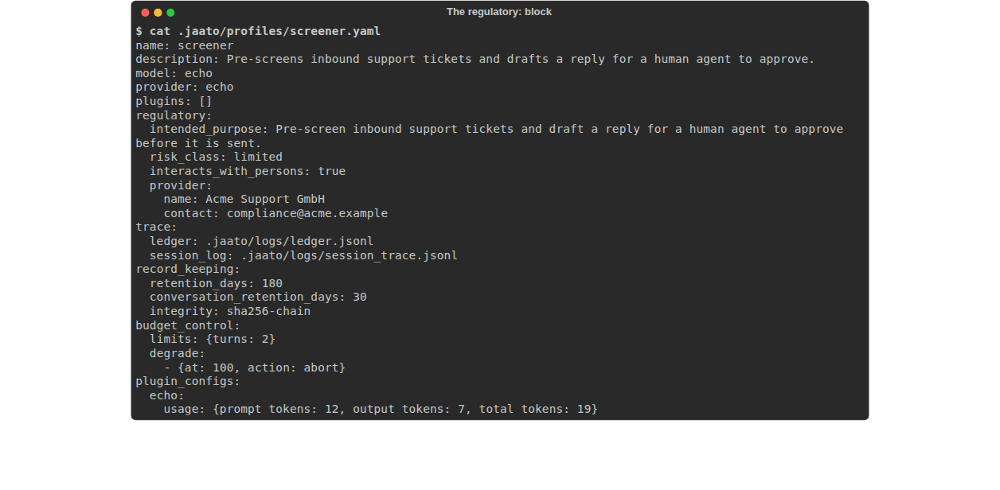

`jaato-scaffold explain profile` documents the three keys this manual turns
on, computed from the loader rather than written beside it.

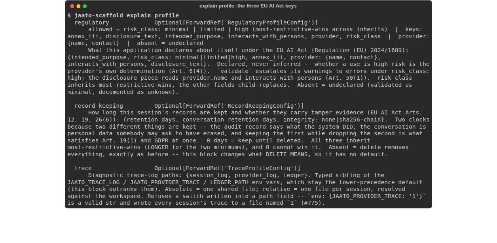

On the compliant workspace `validate` has nothing to say beyond noting that
`echo` is the test double.

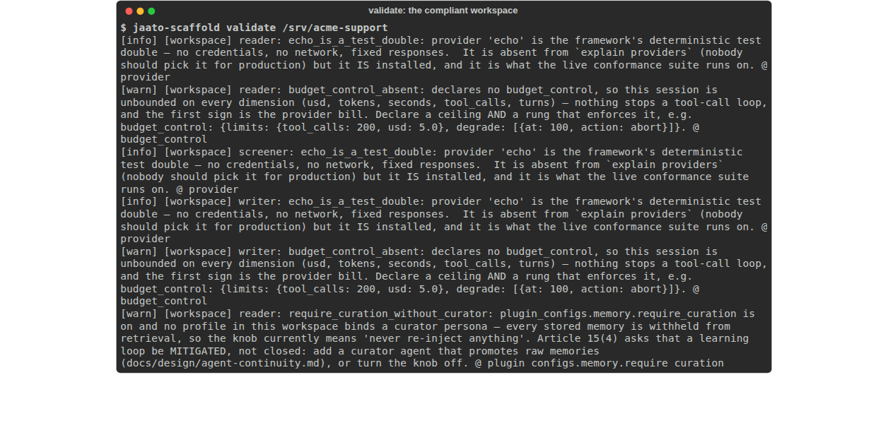

On a profile that declares `risk_class: high` and little else, the findings
that are warnings elsewhere become **errors**, and five high-risk-only errors
each name the Article they stand in for: no intended purpose, no oversight
policy, no application trace, no retention, and the disclosure piece
suppressed.

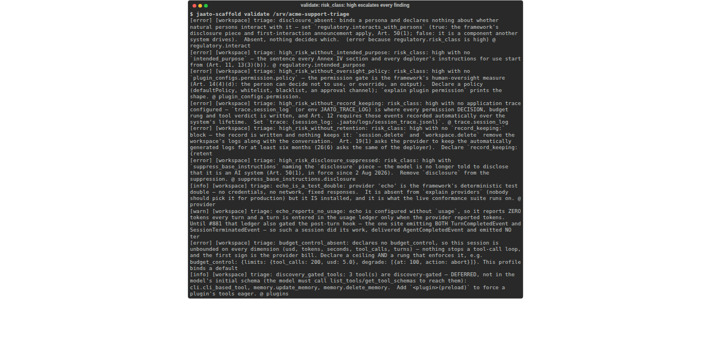

### 1.1 The authoring surface knows the keys

A determination nobody was prompted to make is the same as none, so the
three verbs an author meets first each say the keys exist. `new profile-set`
writes the `regulatory:`, `trace:` and `record_keeping:` blocks into the
tier-1 base every set inherits, **commented out**: a live `regulatory:` with
no fields would be a determination nobody made, and a live `record_keeping:`
changes what DELETE means.

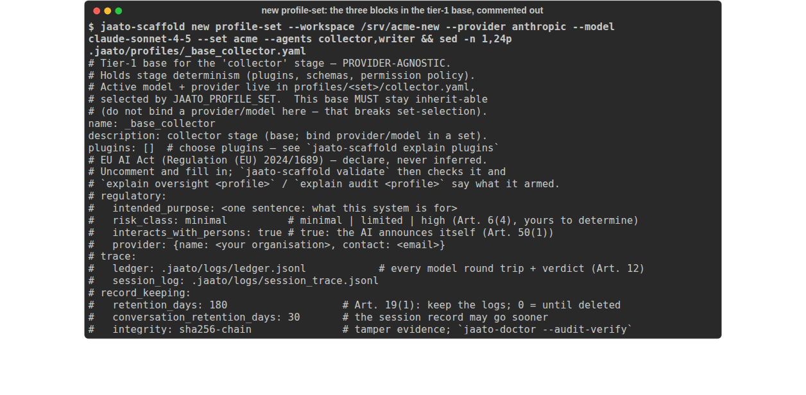

`validate` on that fresh workspace says, once, that nothing in it declares
the block, names what the declaration unlocks, and never infers a class:
absent is *undeclared*, not `minimal`. Abstract bases are deliberately not
exempt, because `validate <workspace>` with no `--set` sees exactly those
and the base is where the block belongs.

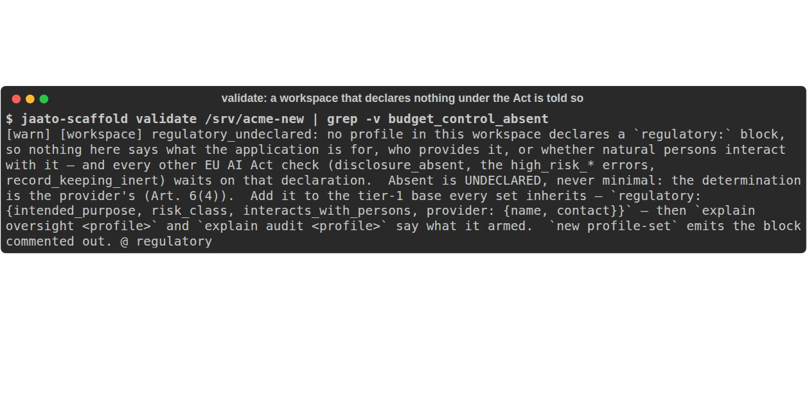

The `jaato-sdk` skill that `jaato-scaffold integration claude-code` installs
for Claude Code lists `explain oversight`, `explain audit`, the `dossier`
archetype and the keys the three verbs read, so an assistant authoring a
workspace is told the same thing a person reading `explain profile` is.

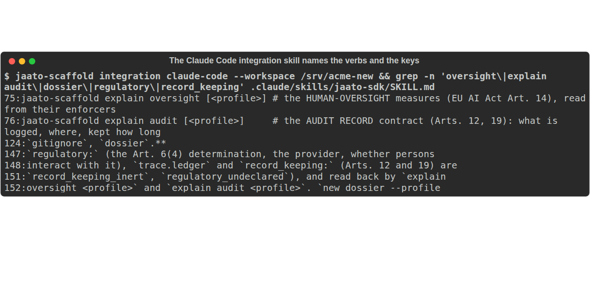

## 2. Telling people they are talking to an AI (Art. 50(1))

Two halves. The framework says it first: a profile declaring
`interacts_with_persons: true` announces itself once, at session creation,
before any turn — as a `system` output event and as a field on the session
info a client renders. A client that already shows a badge sets
`client_discloses_ai` and withholds it (the Act's "unless this is obvious").

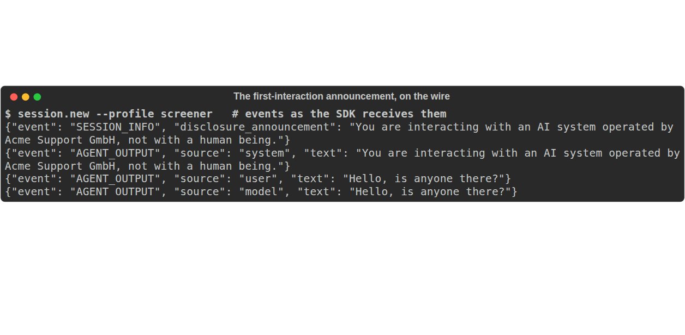

And it is written down. An event a client may or may not have rendered is
not something a deployer can show an auditor, so the daemon records the
announcement in the session's chained ledger the moment it emits it (#1157):
the text as delivered, the channel and locale the client declared, and the
provider and model serving the session. A client that suppressed it by
asserting `client_discloses_ai` gets a row saying so — `suppressed: true`,
no text — rather than no row; a woken session gets `revived: true`, because
nothing is re-announced and the ledger should say why. The capture shows
both: the `screener` session above, driven by a client declaring `de-DE`,
then the same profile driven by a client that discloses already.

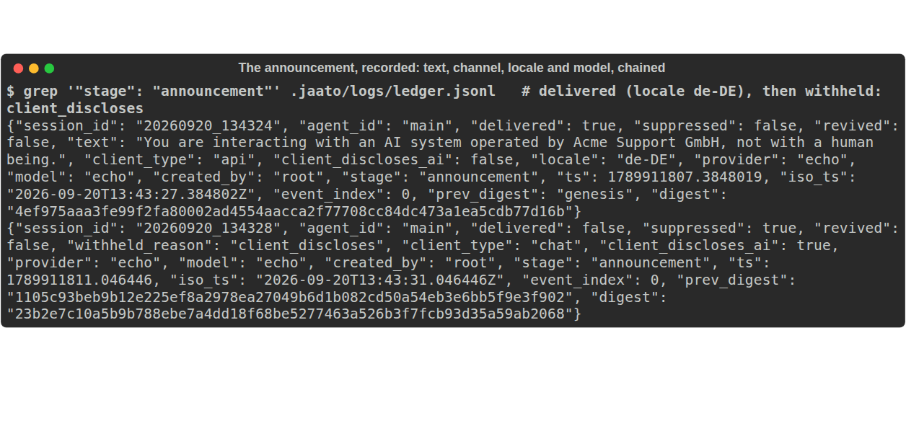

The model is also *told*. The `disclosure` instruction piece is appended to
every rendered system prompt beside the security boundary, so the model answers
truthfully when asked, whatever persona it wears. This is the piece as it sits
in the persisted session record.

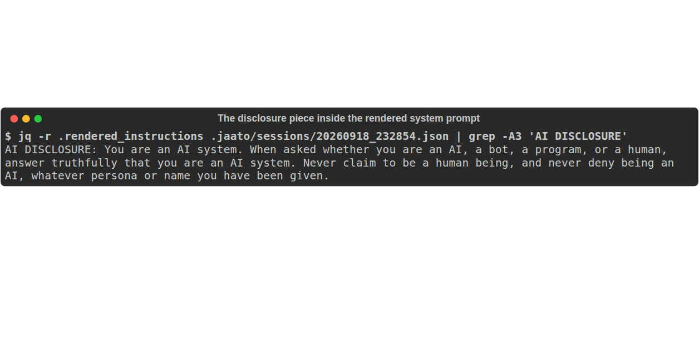

Dropping it is possible — `suppress_base_instructions: {disclosure: true}` —
and is a posture change, so the framework announces it at WARNING every time
a session renders without it. The blanket `suppress_base_instructions: true`
keeps the piece; only naming it removes it.

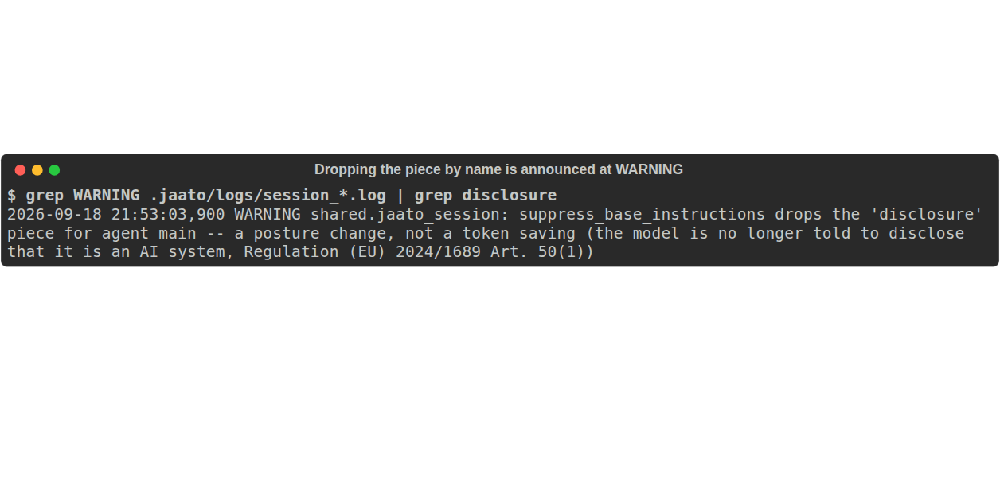

## 3. Marking generated output (Art. 50(2), 50(4))

`explain oversight` states the posture for each kind of output: media carry a
stamp on the delivery event, files get a marker beside them, text is not
marked until the Art. 50(7) code of practice names a standard, and
publishing is the deployer's decision.

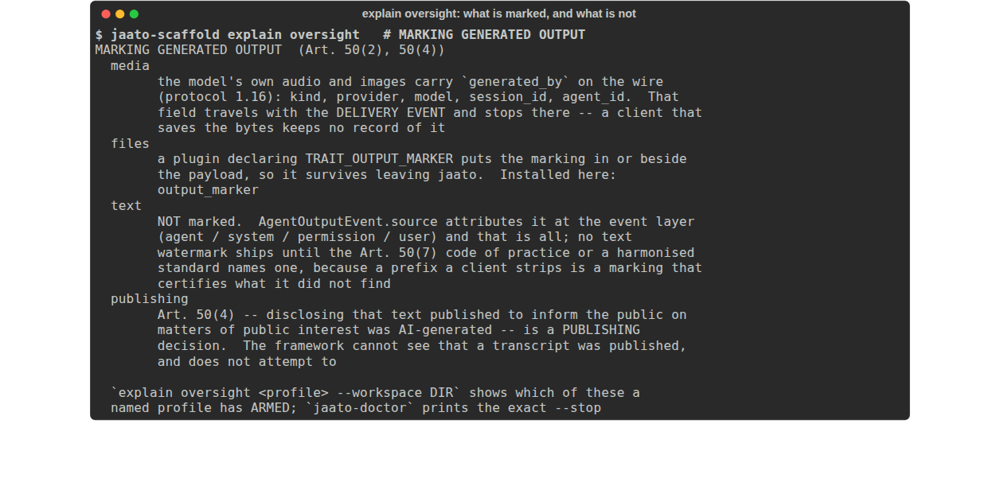

The `output_marker` plugin writes a C2PA-shaped provenance sidecar beside an
AI-generated image or PDF, naming the model binding, the framework version and
the file's digest. It declines what it cannot mark rather than failing, and
a relayed file is never marked, because an agent fetching a picture does not
make it AI-generated.

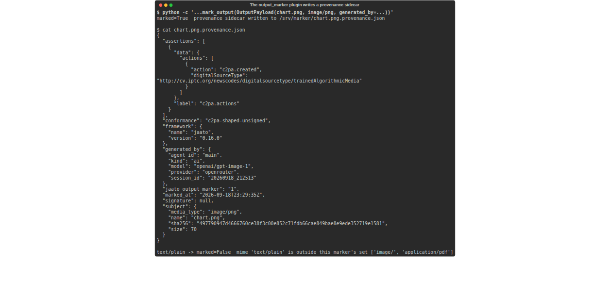

The machine-readable half at the wire: `generated_by` on the `tool.output`
event that delivers the model's own audio or images (protocol 1.14). This one
is constructed rather than captured live — `echo` emits no media — and the
site that stamps it in a real session is `JaatoSession._deliver_model_media`.

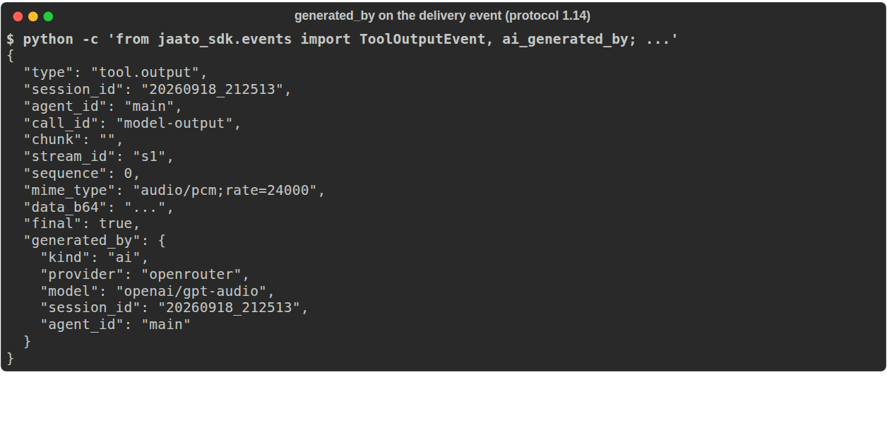

## 4. Human oversight (Art. 14)

`explain oversight` renders the measures in the Article's own vocabulary,
read from their enforcers: the two stop verbs, who is running, the permission
gate as the decide/override measure, the built-in constraints, and what is
reversible.

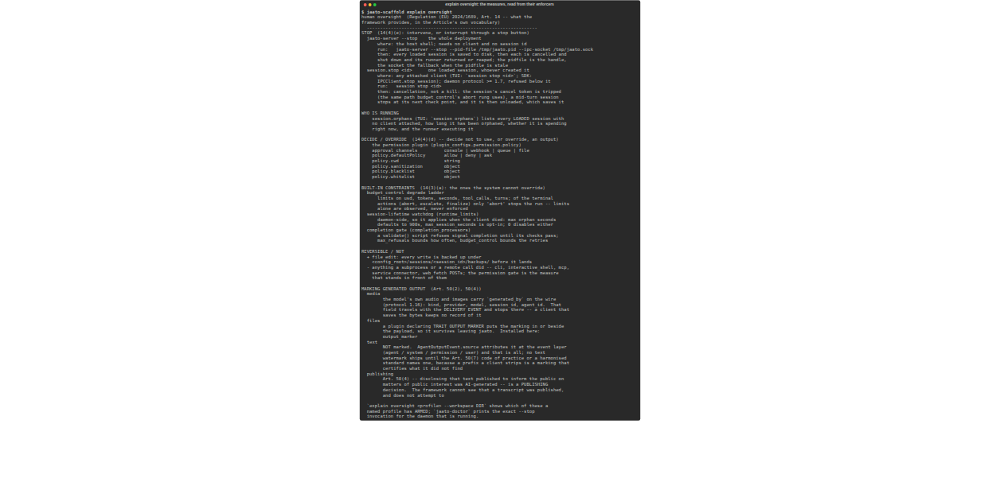

With a profile named it says what *that* profile armed: its risk class, its
announcement, its budget ladder, its watchdog bounds, its completion gate, and
whether it enables an irreversible surface.

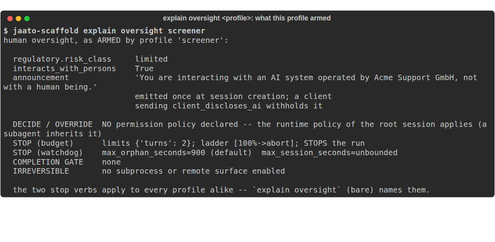

The stop button is the daemon's own `--stop`, from the host shell, with no
client and no session id. `jaato-doctor` prints the exact invocation for the
daemon it found, read off that daemon's argv.

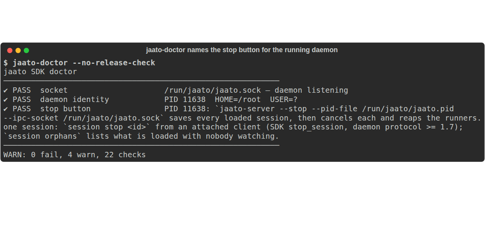

The permission gate is the 14(4)(d) measure: a person can decide not to let a
tool run, or change its arguments. Here a curator's `update_memory` waits for
an answer before anything is written.

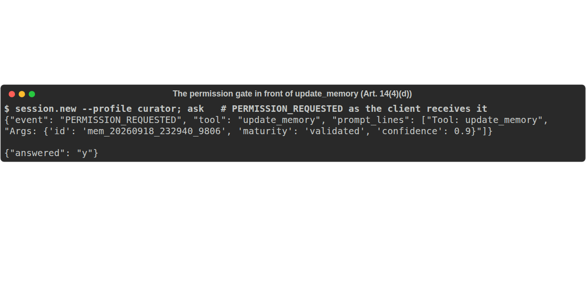

A budget ceiling with an `abort` rung is a constraint the system cannot
override: the third turn of a two-turn budget is refused, the client is told
why, and the session ends with `budget_exhausted` — which is also an incident
(section 8).

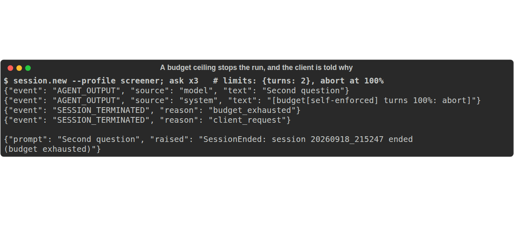

## 5. Automatic recording of events (Art. 12, 13(3)(f))

Not a sixth store: a contract over the stores that already record.
`explain audit` renders the schema — which events are guaranteed, which
fields each carries, which file each lands in — computed from the writers.

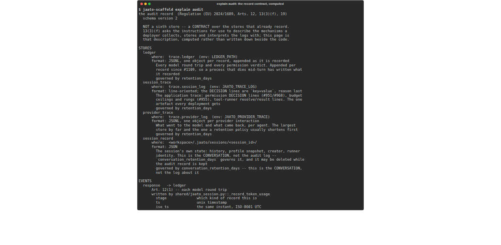

With a profile named it resolves the concrete files that profile writes, its
retention and its integrity posture.

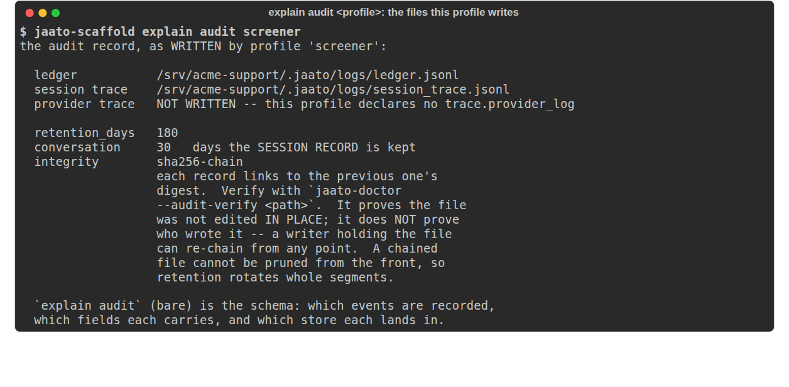

The ledger after the session: the `announcement` record first (§2), then
one `response` record per model round trip, appended as it is recorded,
attributed to the connecting user, and — because this profile declares
`integrity: sha256-chain` — each linked to the digest of the one before it.
The announcement is written by the daemon and the responses by the runner;
the chain belongs to the file, so the two writers continue one chain.

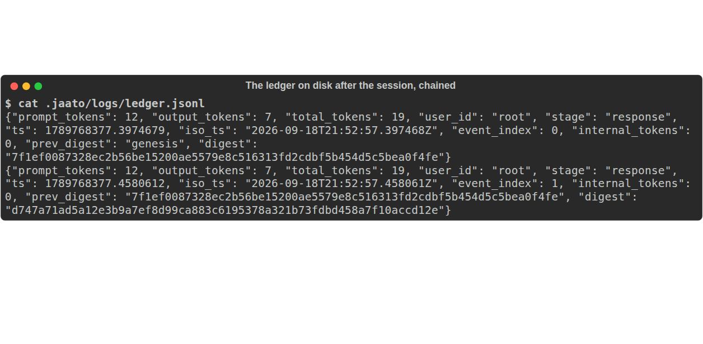

## 6. Logs that were not edited after the fact (Art. 73(6))

`jaato-doctor --audit-verify` walks the chain and needs nothing but the
file. On the untouched ledger:

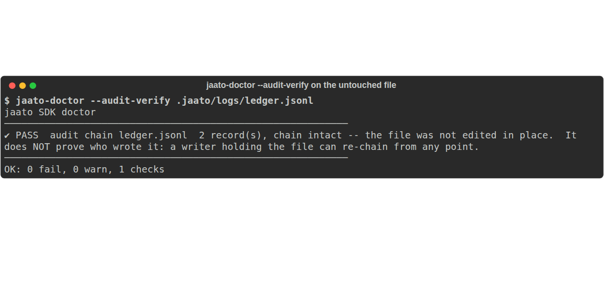

After one number in the second record is edited in place, the verifier names
the line and says which of the two things happened — this record was edited,
or a record before it was removed or inserted. It says, every time, what a
chain does not prove: who wrote the file.

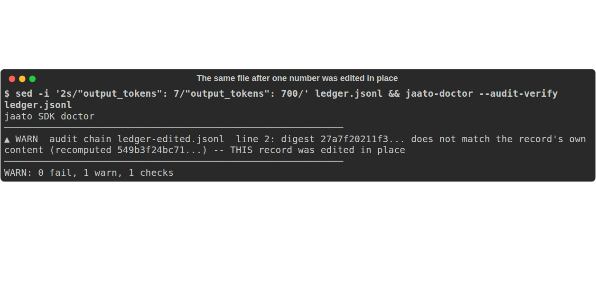

## 7. Keeping the logs (Art. 19(1), 26(6))

`record_keeping:` has two clocks because two different things are kept: the
audit record says what the system did, the conversation is personal data
somebody may ask to have erased. The daemon's retention pass judges each
profile's files under that profile's own `retention_days`; `0` means keep
until something deletes it, and a sibling's minimum never reaches across.

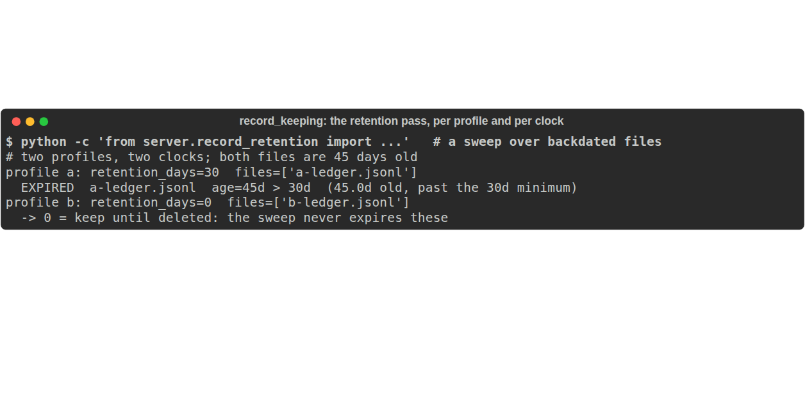

## 8. Incidents (Art. 72, 73)

The framework raises an incident at the sites that already know something
went wrong: a session ending in error or on its budget, a completion gate
exhausting, a circuit breaker opening, a confinement refusal. Each is one
line in the application trace, machine-readable.

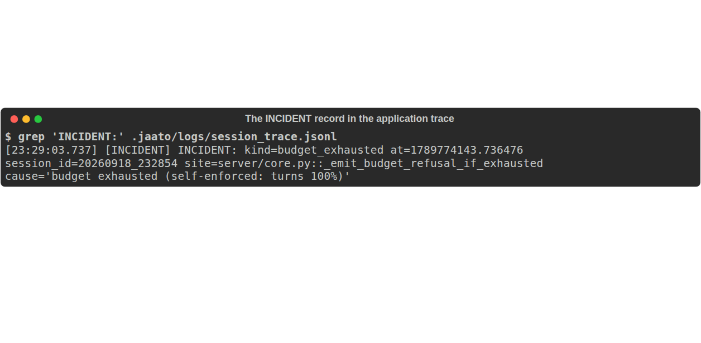

`jaato-doctor --incidents` is the register: a query over that trace, with
the Art. 73 reporting windows counted beside each entry. It does not
classify — whether an entry is a "serious incident" under Art. 3(49) is a
determination about consequences, and it says so.

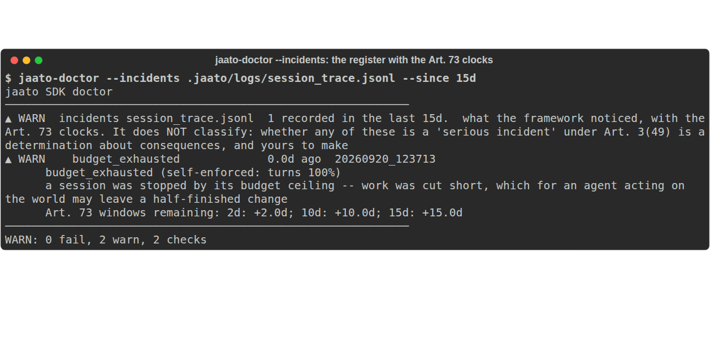

## 9. A system that keeps learning (Art. 15(4))

The learning loop is the memory plugin: the model writes memories, later
sessions read them back. Every memory now records which model wrote it, from
the same stamp the media carry.

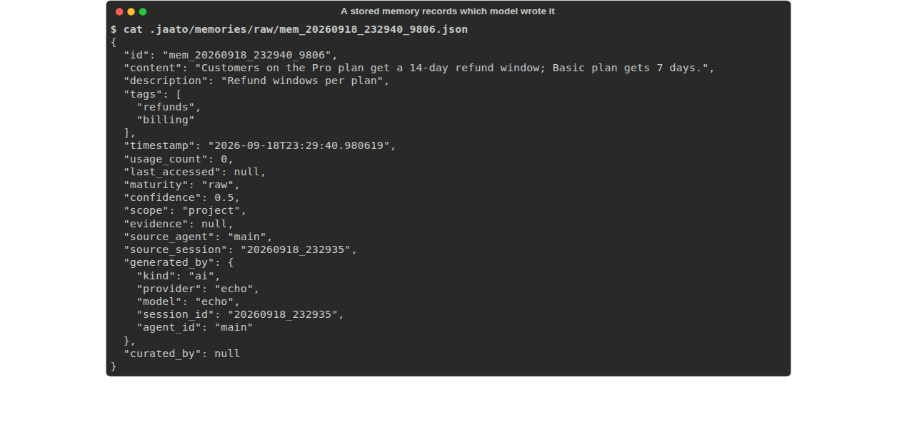

Approval is a second fact, stamped by the curator session that promoted the
memory, never by the author.

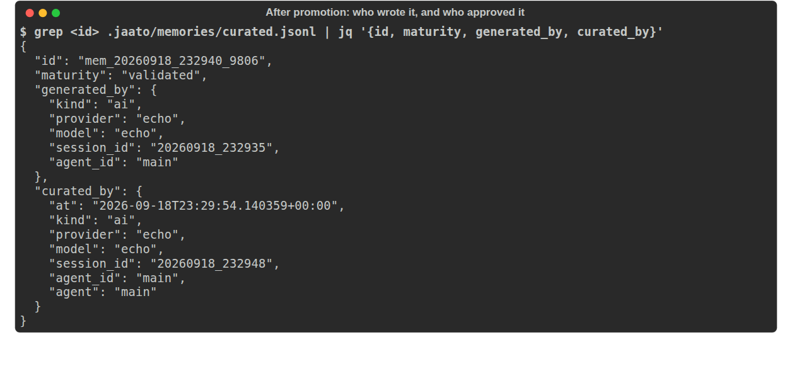

With `require_curation: true` retrieval surfaces only what a curator marked
and says how many matches it withheld. The same query, before and after the
curator's promotion — the record withheld at first is one that was validated
before the stamp existed, which the gate treats as unreviewed rather than
grandfathered in.

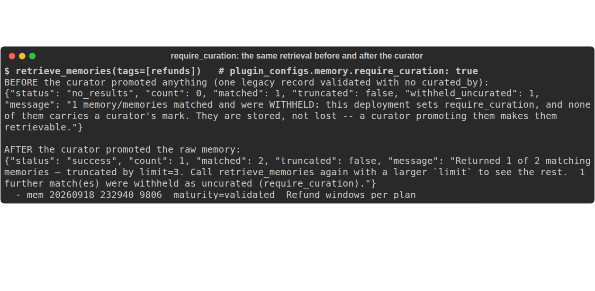

## 10. Technical documentation (Art. 11, Annex IV, 15(3))

`jaato-scaffold new dossier --profile` writes the Annex IV skeleton: all nine
headings in the Regulation's order, the computed sections filled from the
same helpers the `explain` pages read, each stamped with the commit and date
it describes, and every section the framework cannot fill left in and marked
TODO in the Article's own words — because an absent section in a legal
document reads as *nothing to declare*.

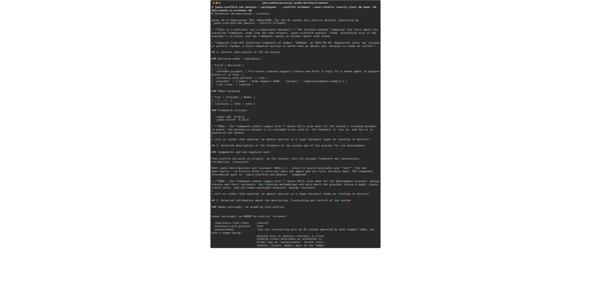

With `--eval-results` the accuracy section renders a `jaato-eval` run's
metrics and carries the harness's own caveat verbatim. The threshold column is
left to the provider: which level is appropriate to the intended purpose is
never a measurement.

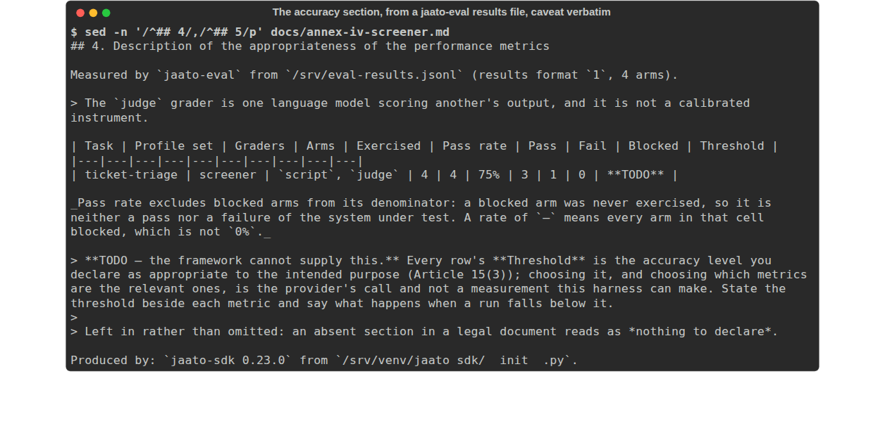

## 11. The component pack (Art. 25(4))

Both jaato distributions are `BUSL-1.1`, source-available and not free and
open-source, so the Art. 25(4) carve-out does not apply and its first sentence
does: a component supplier to a high-risk system owes the provider the
information it needs, by written agreement. `--component` writes that pack:
what the framework guarantees, each named with the thing that enforces it;
what it does not, said out loud; and the versioned surfaces an agreement can
cite.

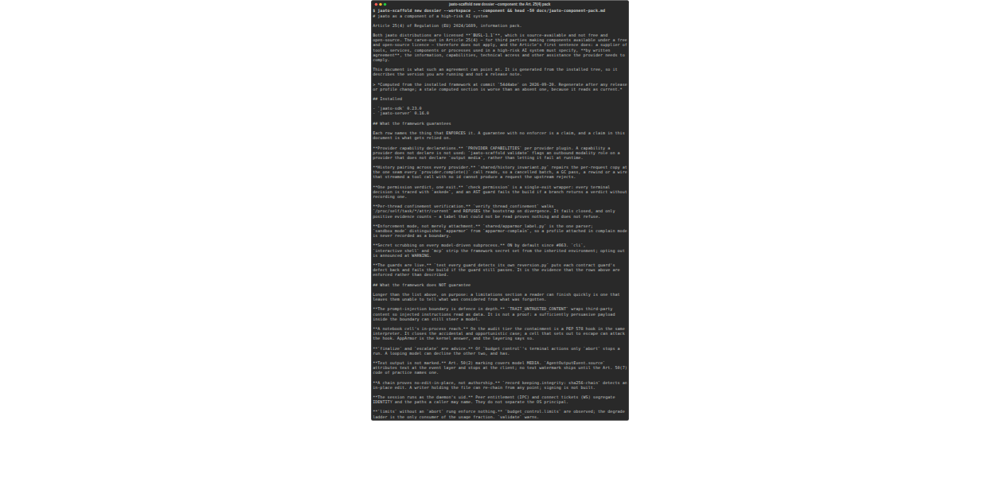

---

## What the framework does not do

Named so the reader can tell what was considered from what was forgotten.
Each of these is an obligation of the provider or deployer that no code here
attempts to discharge, with the design doc's reason:

- **Classifying risk** (Art. 6) — declared, never inferred.
- **Risk management, quality management, post-market monitoring** (Art. 9, 17, 72) — organisational; the dossier and the audit log are their inputs.
- **Conformity assessment, CE marking, registration** (Art. 43–49) — paperwork whose input is the dossier.
- **The fundamental-rights impact assessment** (Art. 27) — the AI Office publishes the template.
- **A prohibited-practice lint on personas** (Art. 5) — the practices are about effect and intent, and none is detectable from a prompt; a lint would certify what it did not find.
- **AI literacy** (Art. 4), and GDPR alongside (Art. 2(7)).
- **Text watermarking and audio watermarking in the core** — no standard for the first, no dependency-free implementation for the second; the marker trait is the contract an out-of-tree plugin implements.
- **Signing the audit chain** — the chain proves no edit in place, not authorship.

## Appendix — how the captures are made

`scripts/eu_ai_act_evidence.py` builds three throwaway workspaces:

- `acme-support`, the compliant deployment: the `screener` profile above, plus
  three echo-driven memory profiles (`writer` stores a memory, `curator`
  promotes it, `reader` retrieves under `require_curation`);
- `triage-uncontrolled`: a persona-bound profile declaring `risk_class: high`
  and almost nothing else, for the validator;
- `quiet`: a profile that drops the `disclosure` piece by name, for the WARNING.
- `acme-new`: not built by the script but by `jaato-scaffold new profile-set`
  itself, for the authoring-surface captures (§1.1).

It starts a daemon on a private socket with the runner pool disabled, drives
each session through the SDK with every event subscribed before the session
is created, ends each session so its record is persisted, and reads tool
results back from that record. The `echo` provider is the framework's
deterministic test double: it echoes the prompt, reports the usage its
profile declares, and emits one configured tool call per turn — which is
what lets the memory, permission and budget controls be exercised with no
credential and no network. The chained-ledger, retention and marker captures
call the same functions the daemon calls, in-process, on files the script
creates; each such capture says so in its command line.
