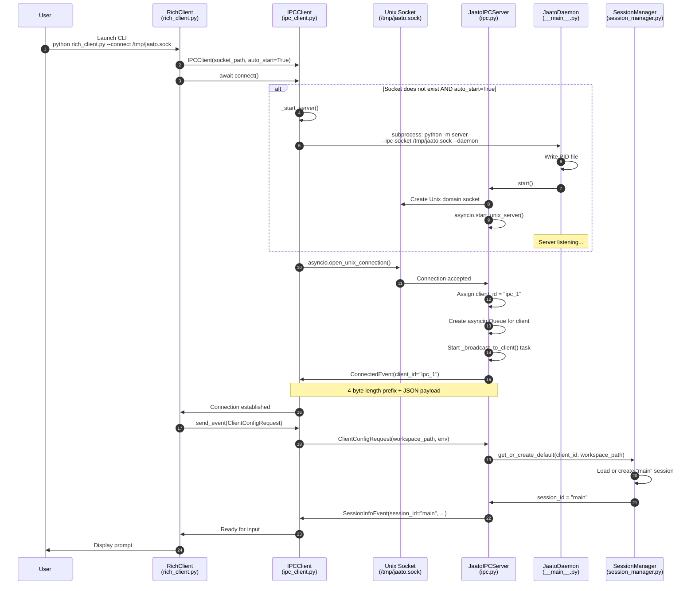
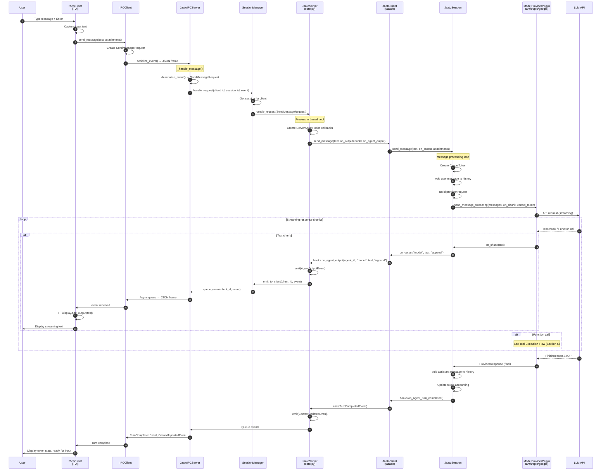
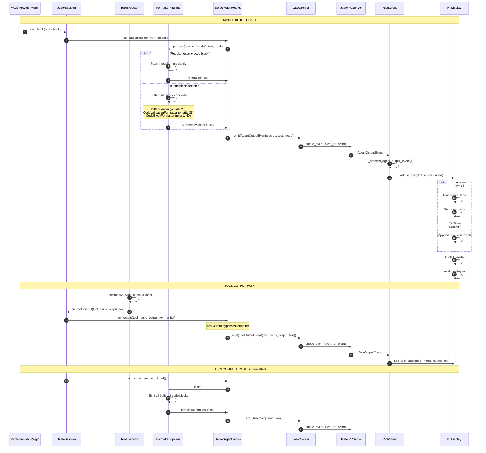
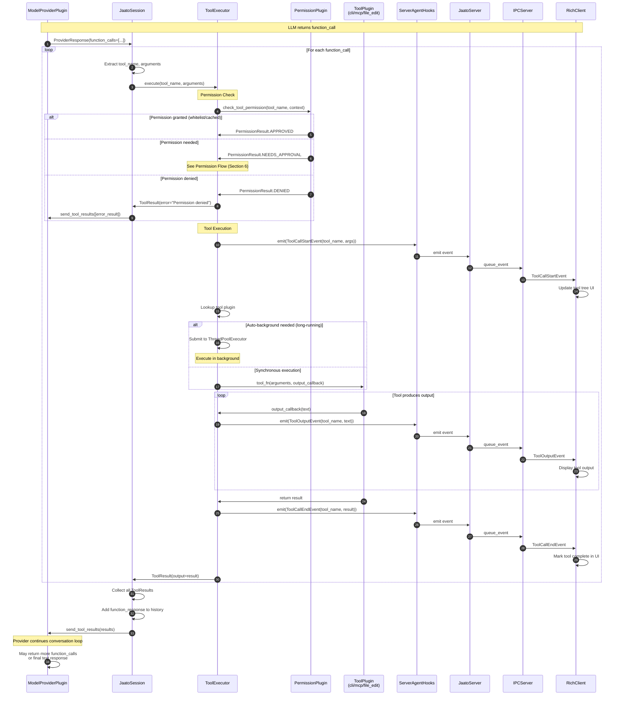
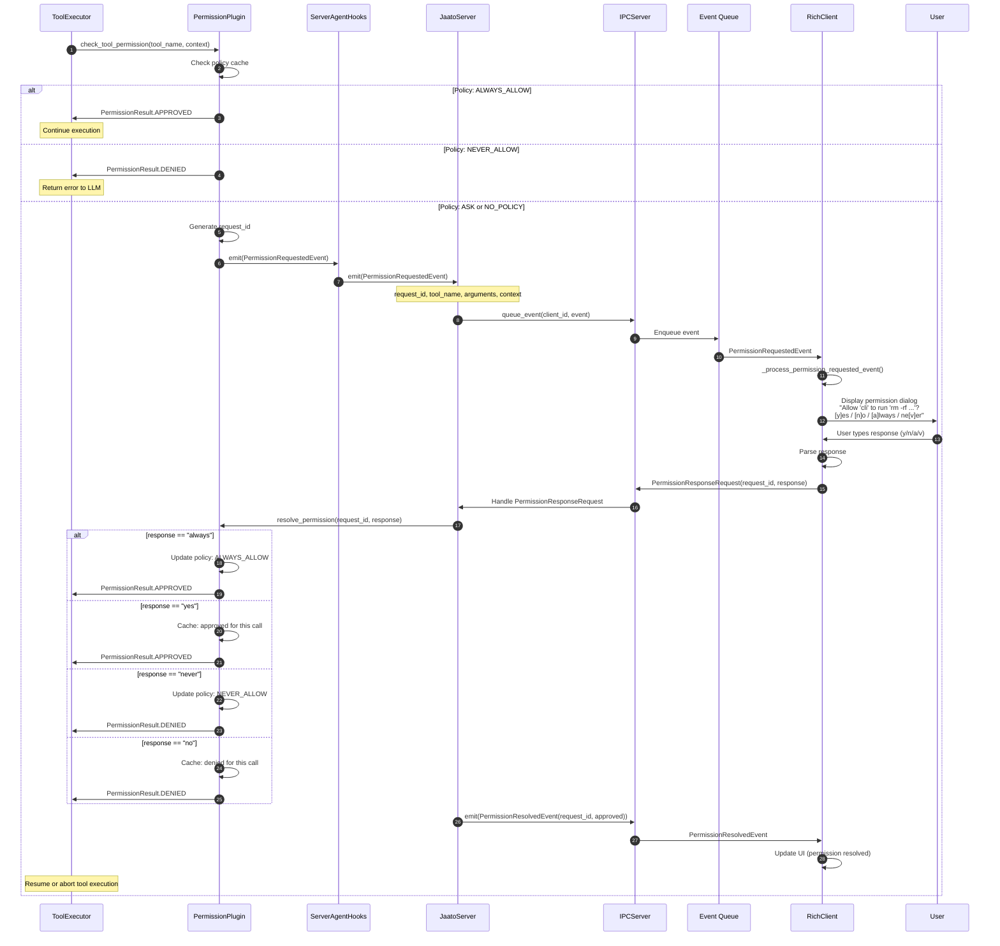
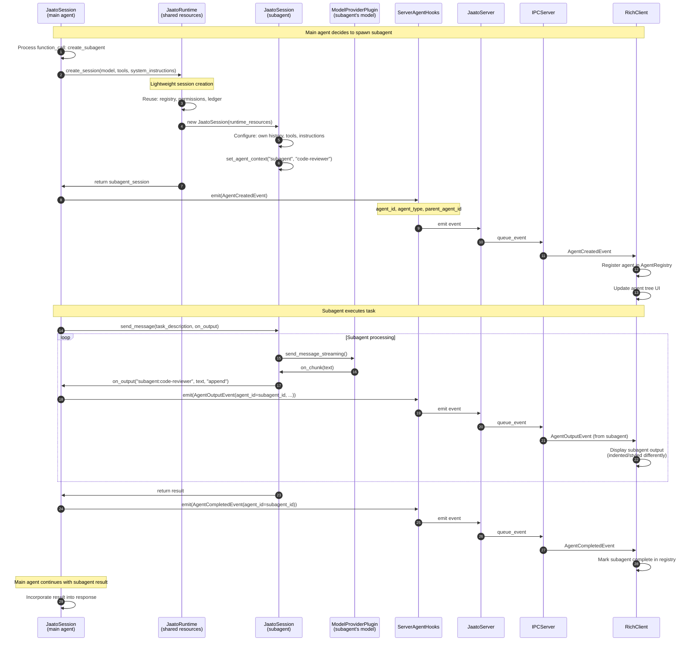
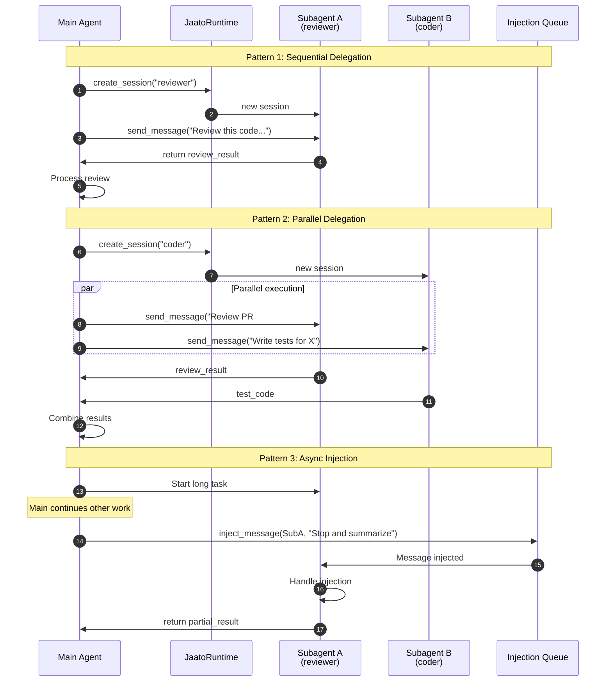
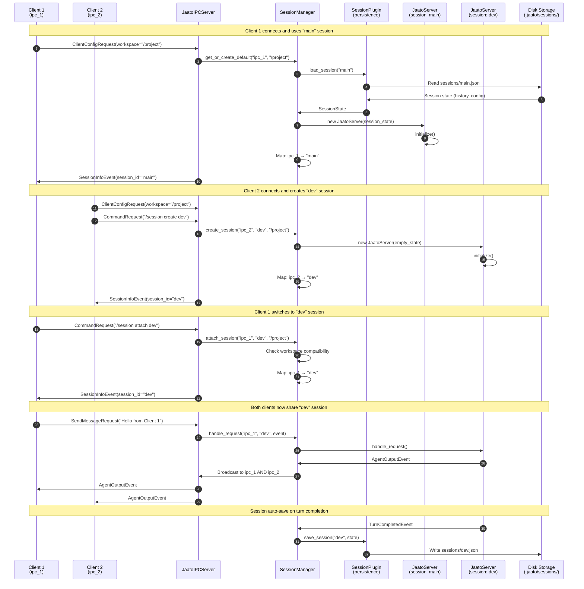
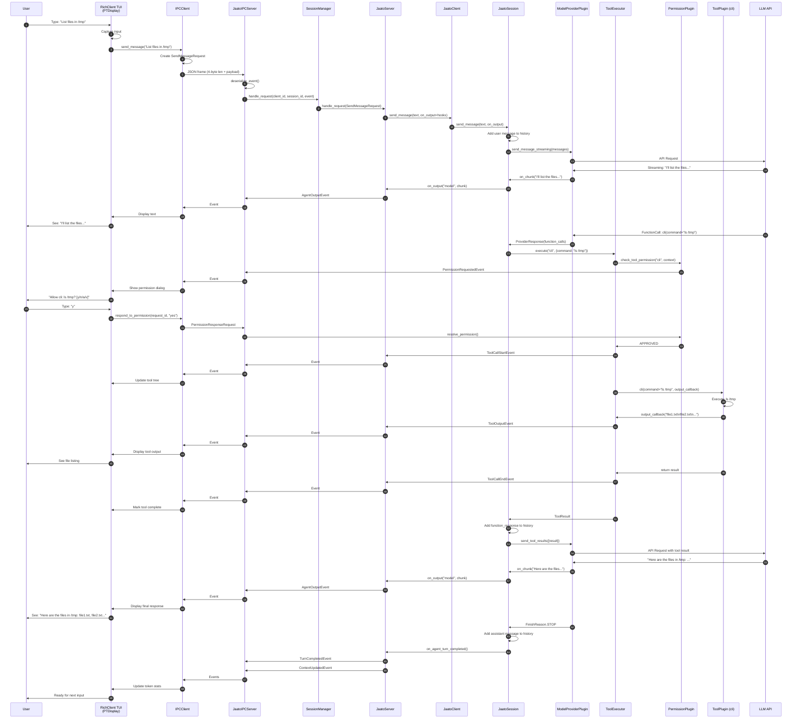

# Jaato Architecture - Detailed Sequence Diagrams

This document provides ultra-detailed sequence diagrams showing the complete interaction flow between the rich client, server, sessions, agents, tool plugins, and output rendering pipeline.

## Table of Contents

1. [System Overview](#1-system-overview)
2. [Client-Server Connection Flow](#2-client-server-connection-flow)
3. [Message Processing Flow](#3-message-processing-flow)
4. [Streaming Output Pipeline](#4-streaming-output-pipeline)
5. [Tool Execution Flow](#5-tool-execution-flow)
6. [Permission Request Flow](#6-permission-request-flow)
7. [Multi-Agent / Subagent Flow](#7-multi-agent--subagent-flow)
8. [Session Management Flow](#8-session-management-flow)
9. [Complete End-to-End Flow](#9-complete-end-to-end-flow)
10. [Component Reference](#10-component-reference)

---

## 1. System Overview

### Architecture Layers

```
┌─────────────────────────────────────────────────────────────────────────────────┐
│                              PRESENTATION LAYER                                  │
│  ┌─────────────────────────────────────────────────────────────────────────┐    │
│  │  RichClient (TUI)          │  WebClient (future)  │  IDE Plugin (future) │    │
│  │  jaato-tui/rich_client.py │                      │                      │    │
│  └─────────────────────────────────────────────────────────────────────────┘    │
│                                      │                                           │
│                          ┌───────────┴───────────┐                              │
│                          │   Backend Abstraction │                              │
│                          │   backend.py          │                              │
│                          └───────────┬───────────┘                              │
│                                      │                                           │
│                    ┌─────────────────┴─────────────────┐                        │
│                    ▼                                   ▼                        │
│           ┌────────────────┐                  ┌────────────────┐                │
│           │  DirectBackend │                  │   IPCBackend   │                │
│           │ (embedded mode)│                  │  (daemon mode) │                │
│           └────────────────┘                  └────────┬───────┘                │
└────────────────────────────────────────────────────────│────────────────────────┘
                                                         │
                                            IPC Socket / WebSocket
                                            (/tmp/jaato.sock)
                                                         │
┌────────────────────────────────────────────────────────│────────────────────────┐
│                              TRANSPORT LAYER           │                         │
│  ┌─────────────────────────────────────────────────────┴───────────────────┐    │
│  │                        JaatoIPCServer / JaatoWSServer                    │    │
│  │                        server/ipc.py, server/websocket.py                │    │
│  │  • Length-prefixed framing (4-byte header + JSON)                       │    │
│  │  • Async event queues per client                                         │    │
│  │  • Event serialization/deserialization                                   │    │
│  └─────────────────────────────────────────────────────────────────────────┘    │
└─────────────────────────────────────────────────────────────────────────────────┘
                                                         │
                                                         ▼
┌─────────────────────────────────────────────────────────────────────────────────┐
│                              SERVER LAYER                                        │
│  ┌─────────────────────────────────────────────────────────────────────────┐    │
│  │                          JaatoDaemon                                     │    │
│  │                          server/__main__.py                              │    │
│  │  • Daemon process management (PID file, signals)                        │    │
│  │  • Routes requests to SessionManager                                     │    │
│  └─────────────────────────────────────────────────────────────────────────┘    │
│                                      │                                           │
│                                      ▼                                           │
│  ┌─────────────────────────────────────────────────────────────────────────┐    │
│  │                        SessionManager                                    │    │
│  │                        server/session_manager.py                         │    │
│  │  • Multi-session orchestration                                          │    │
│  │  • Client → Session mapping                                              │    │
│  │  • Session persistence via SessionPlugin                                 │    │
│  └─────────────────────────────────────────────────────────────────────────┘    │
│                                      │                                           │
│            ┌─────────────────────────┼─────────────────────────┐                │
│            ▼                         ▼                         ▼                │
│  ┌──────────────────┐     ┌──────────────────┐     ┌──────────────────┐        │
│  │  JaatoServer     │     │  JaatoServer     │     │  JaatoServer     │        │
│  │  (session: main) │     │  (session: dev)  │     │  (session: N)    │        │
│  │  server/core.py  │     │  server/core.py  │     │  server/core.py  │        │
│  └──────────────────┘     └──────────────────┘     └──────────────────┘        │
└─────────────────────────────────────────────────────────────────────────────────┘
                                      │
                                      ▼
┌─────────────────────────────────────────────────────────────────────────────────┐
│                              CORE LAYER                                          │
│  ┌─────────────────────────────────────────────────────────────────────────┐    │
│  │                          JaatoClient (Facade)                            │    │
│  │                          shared/jaato_client.py                          │    │
│  │  • Backwards-compatible API                                              │    │
│  │  • Wraps Runtime + Session                                               │    │
│  └─────────────────────────────────────────────────────────────────────────┘    │
│                    ┌─────────────────┴─────────────────┐                        │
│                    ▼                                   ▼                        │
│  ┌─────────────────────────────┐       ┌─────────────────────────────┐         │
│  │      JaatoRuntime           │       │      JaatoSession           │         │
│  │   (shared resources)        │◄──────│   (per-agent state)         │         │
│  │   jaato_runtime.py          │       │   jaato_session.py          │         │
│  │                             │       │                             │         │
│  │  • Provider configuration   │       │  • Conversation history     │         │
│  │  • PluginRegistry           │       │  • Tool configuration       │         │
│  │  • PermissionPlugin         │       │  • System instructions      │         │
│  │  • TokenLedger              │       │  • CancelToken (stop)       │         │
│  │  • create_session()         │       │  • ToolExecutor             │         │
│  └─────────────────────────────┘       └─────────────────────────────┘         │
└─────────────────────────────────────────────────────────────────────────────────┘
                                      │
                                      ▼
┌─────────────────────────────────────────────────────────────────────────────────┐
│                              PLUGIN LAYER                                        │
│  ┌───────────────────┐  ┌───────────────────┐  ┌───────────────────┐           │
│  │  Tool Plugins     │  │  GC Plugins       │  │  Model Providers  │           │
│  │  • cli/           │  │  • gc_truncate/   │  │  • anthropic/     │           │
│  │  • mcp/           │  │  • gc_summarize/  │  │  • google_genai/  │           │
│  │  • file_edit/     │  │  • gc_hybrid/     │  │  • github_models/ │           │
│  │  • web_search/    │  │                   │  │                   │           │
│  │  • permission/    │  │                   │  │                   │           │
│  └───────────────────┘  └───────────────────┘  └───────────────────┘           │
│                                                                                  │
│  ┌─────────────────────────────────────────────────────────────────────────┐    │
│  │                          ToolExecutor                                    │    │
│  │                          shared/ai_tool_runner.py                        │    │
│  │  • Tool registration and lookup                                          │    │
│  │  • Permission checking                                                   │    │
│  │  • Auto-backgrounding for long tasks                                     │    │
│  │  • Output callback streaming                                             │    │
│  └─────────────────────────────────────────────────────────────────────────┘    │
└─────────────────────────────────────────────────────────────────────────────────┘
```

---

## 2. Client-Server Connection Flow

### Initial Connection Sequence



### Message Framing Protocol

```
┌─────────────────────────────────────────────────────────────────┐
│                    IPC Message Frame                             │
├─────────────┬───────────────────────────────────────────────────┤
│  4 bytes    │              Variable length                       │
│  (uint32    │              (JSON payload)                        │
│   big-end)  │                                                    │
├─────────────┼───────────────────────────────────────────────────┤
│  Length N   │  {"type": "SendMessageRequest", "text": "...",    │
│             │   "session_id": "main", "attachments": [...]}     │
└─────────────┴───────────────────────────────────────────────────┘

Max message size: 10 MB
```

---

## 3. Message Processing Flow

### Complete Message Lifecycle



---

## 4. Streaming Output Pipeline

### Output Callback Chain



### Output Sources

```
┌─────────────────────────────────────────────────────────────────────────────────┐
│                          Output Source Taxonomy                                  │
├─────────────────────────────────────────────────────────────────────────────────┤
│                                                                                  │
│  source: "model"                                                                │
│  ├─ LLM-generated text responses                                               │
│  ├─ Processed through FormatterPipeline                                        │
│  └─ Triggers: code highlighting, diff rendering, LSP diagnostics               │
│                                                                                  │
│  source: "tool" or tool_name (e.g., "cli", "file_edit", "web_search")          │
│  ├─ Direct tool execution output                                               │
│  ├─ Bypasses formatter (raw output)                                            │
│  └─ Displayed in tool output section                                           │
│                                                                                  │
│  source: "system"                                                               │
│  ├─ Framework messages (initialization, errors, warnings)                      │
│  └─ Styled differently in UI                                                   │
│                                                                                  │
│  source: plugin_name (e.g., "mcp", "gc_plugin")                                │
│  ├─ Plugin-generated messages                                                  │
│  └─ Plugin-specific styling                                                    │
│                                                                                  │
├─────────────────────────────────────────────────────────────────────────────────┤
│  mode: "write"  → Start new output block (replace current)                     │
│  mode: "append" → Continue current output block (streaming)                    │
└─────────────────────────────────────────────────────────────────────────────────┘
```

---

## 5. Tool Execution Flow

### Function Calling Loop



### Tool Plugin Registration

```
┌─────────────────────────────────────────────────────────────────────────────────┐
│                          Tool Plugin Lifecycle                                   │
├─────────────────────────────────────────────────────────────────────────────────┤
│                                                                                  │
│  1. DISCOVERY (PluginRegistry.discover_plugins())                               │
│     ├─ Scan shared/plugins/ directories                                         │
│     ├─ Load plugin modules with __init__.py                                     │
│     └─ Call create_plugin() factory function                                    │
│                                                                                  │
│  2. INITIALIZATION (plugin.initialize(config))                                  │
│     ├─ Plugin-specific setup                                                    │
│     ├─ MCP: Connect to MCP servers defined in .mcp.json                        │
│     └─ CLI: Setup shell environment                                             │
│                                                                                  │
│  3. SCHEMA EXPORT (plugin.get_tool_schemas())                                   │
│     ├─ Return List[ToolSchema] for LLM function definitions                    │
│     └─ ToolSchema: name, description, parameters (JSON Schema)                 │
│                                                                                  │
│  4. REGISTRATION (ToolExecutor.register(name, fn))                              │
│     ├─ Map tool names to executor functions                                     │
│     └─ Configure permissions, output callbacks                                  │
│                                                                                  │
│  5. EXECUTION (tool_fn(args, output_callback))                                  │
│     ├─ Receive arguments from LLM function_call                                │
│     ├─ Execute tool logic                                                       │
│     ├─ Stream output via output_callback                                        │
│     └─ Return result string                                                     │
│                                                                                  │
└─────────────────────────────────────────────────────────────────────────────────┘
```

---

## 6. Permission Request Flow

### Interactive Permission Dialog



### Permission Context

```
┌─────────────────────────────────────────────────────────────────────────────────┐
│                          Permission Context Fields                               │
├─────────────────────────────────────────────────────────────────────────────────┤
│                                                                                  │
│  PermissionContext:                                                              │
│  ├─ agent_type: str          # "main", "subagent", "review"                     │
│  ├─ agent_name: str          # Human-readable agent identifier                  │
│  ├─ tool_name: str           # Tool being invoked                               │
│  ├─ arguments: Dict          # Tool arguments (for display)                     │
│  ├─ workspace_path: str      # Current working directory                        │
│  ├─ file_paths: List[str]    # Files being accessed (if applicable)            │
│  └─ risk_level: str          # "low", "medium", "high", "critical"             │
│                                                                                  │
│  Risk Levels:                                                                    │
│  ├─ low: Read-only operations (file read, search)                              │
│  ├─ medium: Local modifications (file write, git commit)                       │
│  ├─ high: System operations (shell commands, network)                          │
│  └─ critical: Destructive operations (rm -rf, git push --force)                │
│                                                                                  │
└─────────────────────────────────────────────────────────────────────────────────┘
```

---

## 7. Multi-Agent / Subagent Flow

### Subagent Creation and Communication



### Agent Hierarchy

```
┌─────────────────────────────────────────────────────────────────────────────────┐
│                          Agent Hierarchy Model                                   │
├─────────────────────────────────────────────────────────────────────────────────┤
│                                                                                  │
│                    ┌─────────────────────────────────┐                          │
│                    │        JaatoRuntime             │                          │
│                    │  (Shared across all agents)     │                          │
│                    │                                 │                          │
│                    │  • Provider configuration       │                          │
│                    │  • PluginRegistry               │                          │
│                    │  • PermissionPlugin             │                          │
│                    │  • TokenLedger (aggregated)     │                          │
│                    └──────────────┬──────────────────┘                          │
│                                   │                                              │
│              ┌────────────────────┼────────────────────┐                        │
│              │                    │                    │                        │
│              ▼                    ▼                    ▼                        │
│  ┌───────────────────┐  ┌───────────────────┐  ┌───────────────────┐           │
│  │   JaatoSession    │  │   JaatoSession    │  │   JaatoSession    │           │
│  │   (main agent)    │  │   (subagent A)    │  │   (subagent B)    │           │
│  │                   │  │                   │  │                   │           │
│  │  • Own history    │  │  • Own history    │  │  • Own history    │           │
│  │  • All tools      │  │  • Tool subset    │  │  • Tool subset    │           │
│  │  • gemini-2.5-pro │  │  • gemini-flash   │  │  • claude-sonnet  │           │
│  │  • Full instruct  │  │  • Review focus   │  │  • Code focus     │           │
│  └───────────────────┘  └───────────────────┘  └───────────────────┘           │
│           │                      │                      │                       │
│           │                      │                      │                       │
│           │         ┌────────────┴────────────┐         │                       │
│           │         │     Parent manages      │         │                       │
│           └─────────┤  • Spawn/terminate      ├─────────┘                       │
│                     │  • Inject messages      │                                  │
│                     │  • Collect results      │                                  │
│                     └─────────────────────────┘                                  │
│                                                                                  │
├─────────────────────────────────────────────────────────────────────────────────┤
│  Benefits:                                                                       │
│  • No redundant provider connections (shared runtime)                           │
│  • Fast spawning (lightweight session creation)                                 │
│  • Isolated conversations (separate histories)                                  │
│  • Shared permissions (consistent policy across agents)                         │
│  • Aggregated token accounting (single ledger)                                  │
└─────────────────────────────────────────────────────────────────────────────────┘
```

### Agent Communication Patterns



---

## 8. Session Management Flow

### Multi-Session Orchestration



### Session State Persistence

```
┌─────────────────────────────────────────────────────────────────────────────────┐
│                          Session State Structure                                 │
├─────────────────────────────────────────────────────────────────────────────────┤
│                                                                                  │
│  .jaato/sessions/main.json:                                                     │
│  {                                                                               │
│    "session_id": "main",                                                        │
│    "created_at": "2025-01-07T10:00:00Z",                                        │
│    "last_activity": "2025-01-07T14:30:00Z",                                     │
│    "workspace_path": "/home/user/project",                                      │
│    "model": "gemini-2.5-pro",                                                   │
│    "system_instructions": "You are a helpful assistant...",                     │
│    "history": [                                                                  │
│      {                                                                           │
│        "role": "user",                                                          │
│        "parts": [{"text": "Hello"}]                                             │
│      },                                                                          │
│      {                                                                           │
│        "role": "assistant",                                                      │
│        "parts": [{"text": "Hi! How can I help?"}]                               │
│      }                                                                           │
│    ],                                                                            │
│    "tool_config": {                                                              │
│      "enabled_tools": ["cli", "file_edit", "web_search"],                       │
│      "permissions": {                                                            │
│        "cli": "ask",                                                            │
│        "file_edit": "always_allow"                                              │
│      }                                                                           │
│    },                                                                            │
│    "token_usage": {                                                              │
│      "total_prompt_tokens": 15000,                                              │
│      "total_output_tokens": 8000                                                │
│    },                                                                            │
│    "metadata": {                                                                 │
│      "gc_runs": 2,                                                              │
│      "turns_count": 25                                                          │
│    }                                                                             │
│  }                                                                               │
│                                                                                  │
└─────────────────────────────────────────────────────────────────────────────────┘
```

---

## 9. Complete End-to-End Flow

### Full Request Lifecycle with Tool Execution



---

## 10. Component Reference

### Key Classes and Files

| Component | File | Purpose |
|-----------|------|---------|
| **RichClient** | `jaato-tui/rich_client.py` | TUI application, event handling |
| **IPCClient** | `jaato-tui/ipc_client.py` | Client-side IPC connection |
| **PTDisplay** | `jaato-tui/pt_display.py` | prompt_toolkit display layout |
| **Backend** | `jaato-tui/backend.py` | Backend abstraction (Direct/IPC) |
| **JaatoDaemon** | `server/__main__.py` | Daemon process, PID management |
| **JaatoIPCServer** | `server/ipc.py` | Server-side IPC handling |
| **JaatoWSServer** | `server/websocket.py` | WebSocket server |
| **SessionManager** | `server/session_manager.py` | Multi-session orchestration |
| **JaatoServer** | `server/core.py` | Per-session request handler |
| **Events** | `server/events.py` | Event types, serialization |
| **JaatoClient** | `shared/jaato_client.py` | Core facade |
| **JaatoRuntime** | `shared/jaato_runtime.py` | Shared resources |
| **JaatoSession** | `shared/jaato_session.py` | Per-agent state |
| **ToolExecutor** | `shared/ai_tool_runner.py` | Tool execution |
| **TokenLedger** | `shared/token_accounting.py` | Token tracking |
| **PluginRegistry** | `shared/plugins/registry.py` | Plugin discovery |
| **PermissionPlugin** | `shared/plugins/permission/` | Permission control |
| **ModelProviderPlugin** | `shared/plugins/model_provider/` | Provider abstraction |

### Event Types Quick Reference

| Event | Direction | Purpose |
|-------|-----------|---------|
| `ConnectedEvent` | S→C | Connection established |
| `SessionInfoEvent` | S→C | Session metadata |
| `AgentCreatedEvent` | S→C | New agent spawned |
| `AgentOutputEvent` | S→C | Streaming text output |
| `AgentStatusChangedEvent` | S→C | Agent state change |
| `AgentCompletedEvent` | S→C | Agent finished |
| `ToolCallStartEvent` | S→C | Tool execution started |
| `ToolCallEndEvent` | S→C | Tool execution completed |
| `ToolOutputEvent` | S→C | Tool output chunk |
| `PermissionRequestedEvent` | S→C | Permission needed |
| `PermissionResolvedEvent` | S→C | Permission resolved |
| `TurnCompletedEvent` | S→C | Turn finished |
| `ContextUpdatedEvent` | S→C | Token usage update |
| `PlanUpdatedEvent` | S→C | Plan step progress |
| `SendMessageRequest` | C→S | User message |
| `PermissionResponseRequest` | C→S | Permission response |
| `StopRequest` | C→S | Cancel processing |
| `CommandRequest` | C→S | Execute command |
| `HistoryRequest` | C→S | Get history |
| `ClientConfigRequest` | C→S | Client configuration |

---

## Appendix: Mermaid Diagram Rendering

These diagrams use Mermaid syntax. To render them:

1. **GitHub**: Mermaid diagrams render automatically in markdown files
2. **VS Code**: Install "Markdown Preview Mermaid Support" extension
3. **Online**: Use [Mermaid Live Editor](https://mermaid.live)
4. **CLI**: Use `mmdc` (Mermaid CLI) to export as PNG/SVG

```bash
# Install Mermaid CLI
npm install -g @mermaid-js/mermaid-cli

# Export diagram
mmdc -i docs/sequence-diagram-architecture.md -o diagram.png
```
