# File Edit Plugin

The file_edit plugin provides tools for reading, modifying, and managing files with integrated permission approval (showing diffs) and automatic backups.

## Demo

The demo below shows the file edit workflow: reading a config file, then updating it to change `MAX_RETRIES` from 3 to 5. The update shows a colorized diff for approval before modifying the file.



## Overview

This plugin enables the model to perform file operations with safety features:
- **Diff preview**: File modifications show a unified diff for approval before execution
- **Automatic backups**: Updates and deletions create backups that can be restored
- **Colorized display**: Console approval shows colorized diffs (green for additions, red for deletions)

## Tool Declarations

The plugin exposes seven tools:

| Tool | Description | Auto-approved |
|------|-------------|---------------|
| `readFile` | Read file contents | Yes |
| `updateFile` | Update an existing file | No (shows diff) |
| `writeNewFile` | Create a new file | No (shows content) |
| `removeFile` | Delete a file | No (shows confirmation) |
| `moveFile` | Move or rename a file | No (shows confirmation) |
| `renameFile` | Alias for moveFile | No (shows confirmation) |
| `undoFileChange` | Restore from backup | Yes |

### readFile

Read the contents of a file.

**Parameters:**
```json
{
  "path": "Path to the file to read"
}
```

**Response:**
```json
{
  "path": "/path/to/file.txt",
  "content": "File contents...",
  "size": 1234,
  "lines": 50
}
```

### updateFile

Update an existing file with new content. Shows a diff for approval and creates a backup before modifying.

**Parameters:**
```json
{
  "path": "Path to the file to update",
  "new_content": "The new content to write to the file"
}
```

**Response:**
```json
{
  "success": true,
  "path": "/path/to/file.txt",
  "size": 1234,
  "lines": 50,
  "backup": ".jaato/backups/_path_to_file.txt_2025-12-06T14-30-00.bak"
}
```

### writeNewFile

Create a new file. Shows the content for approval. Fails if the file already exists.

**Parameters:**
```json
{
  "path": "Path where the new file should be created",
  "content": "Content to write to the new file"
}
```

**Response:**
```json
{
  "success": true,
  "path": "/path/to/newfile.txt",
  "size": 500,
  "lines": 20
}
```

### removeFile

Delete a file. Creates a backup before deletion so it can be restored.

**Parameters:**
```json
{
  "path": "Path to the file to delete"
}
```

**Response:**
```json
{
  "success": true,
  "path": "/path/to/file.txt",
  "deleted": true,
  "backup": ".jaato/backups/_path_to_file.txt_2025-12-06T14-30-00.bak"
}
```

### moveFile

Move or rename a file. Creates destination directories if needed. Creates a backup before moving. Fails if destination already exists unless overwrite=True.

**Parameters:**
```json
{
  "source_path": "Path to the source file to move",
  "destination_path": "Path where the file should be moved to",
  "overwrite": false
}
```

**Response (success):**
```json
{
  "success": true,
  "source": "/path/to/original.java",
  "destination": "/path/to/new/location.java",
  "source_backup": ".jaato/backups/_path_to_original.java_2025-12-06T14-30-00.bak"
}
```

**Response (error - source doesn't exist):**
```json
{
  "error": "Source file does not exist",
  "source": "/path/to/original.java"
}
```

**Response (error - destination exists):**
```json
{
  "error": "Destination file already exists. Use overwrite=True to replace it.",
  "source": "/path/to/original.java",
  "destination": "/path/to/new/location.java"
}
```

### renameFile

Alias for `moveFile`. Use for renaming files (same parameters and response format).

### undoFileChange

Restore a file from its most recent backup.

**Parameters:**
```json
{
  "path": "Path to the file to restore"
}
```

**Response:**
```json
{
  "success": true,
  "path": "/path/to/file.txt",
  "restored_from": ".jaato/backups/_path_to_file.txt_2025-12-06T14-30-00.bak",
  "message": "File restored from backup"
}
```

## Usage

### Basic Setup

```python
from shared.plugins.registry import PluginRegistry

registry = PluginRegistry()
registry.discover()
registry.expose_all()  # file_edit plugin is exposed by default
```

### With Custom Backup Directory

```python
registry.expose_all({
    "file_edit": {"backup_dir": "/custom/backup/path"}
})
```

### With JaatoClient

```python
from shared import JaatoClient, PluginRegistry
from shared.plugins.permission import PermissionPlugin

client = JaatoClient()
client.connect(project_id, location, model_name)

registry = PluginRegistry()
registry.discover()
registry.expose_all()

# Important: Set registry on permission plugin for diff display
permission_plugin = PermissionPlugin()
permission_plugin.initialize()
permission_plugin.set_registry(registry)

client.configure_tools(registry, permission_plugin)
response = client.send_message("Update config.json to add a new setting")
```

## Permission Integration

The file_edit plugin integrates with the permission system to show formatted diffs when requesting approval:

```
============================================================
[askPermission] Main agent requesting tool execution:
  Update file: src/config.py (+5, -2 lines)

--- a/src/config.py
+++ b/src/config.py
@@ -10,7 +10,10 @@
 DEFAULT_TIMEOUT = 30
-MAX_RETRIES = 3
+MAX_RETRIES = 5
+ENABLE_CACHE = True
+CACHE_TTL = 3600

============================================================

Options: [y]es, [n]o, [a]lways, [never], [once], [all]
```

The plugin implements the optional `format_permission_request()` method to provide custom display formatting.

## Backup System

### Backup Location

Backups are stored in `.jaato/backups/` with the naming convention:
```
{path_with_underscores}_{ISO_timestamp}.bak
```

Example:
```
.jaato/backups/
├── _home_user_project_src_main.py_2025-12-06T14-30-00.bak
├── _home_user_project_src_main.py_2025-12-06T14-35-22.bak
└── _home_user_project_config.json_2025-12-06T14-32-11.bak
```

### Backup Retention

The number of backups kept per file is controlled by the `JAATO_FILE_BACKUP_COUNT` environment variable (default: 5). When a new backup is created, old backups exceeding this limit are automatically pruned.

### Gitignore Integration

On initialization, the plugin automatically adds `.jaato` to `.gitignore` if the file exists and the entry is not already present.

## System Instructions

The plugin provides these system instructions to the model:

```
You have access to file editing tools:

- `readFile(path)`: Read file contents. Safe operation, no approval needed.
- `updateFile(path, new_content)`: Update an existing file. Shows diff for approval and creates backup.
- `writeNewFile(path, content)`: Create a new file. Shows content for approval. Fails if file exists.
- `removeFile(path)`: Delete a file. Creates backup before deletion.
- `moveFile(source_path, destination_path, overwrite=False)`: Move or rename a file. Creates destination directories if needed. Creates backup before moving.
- `renameFile(source_path, destination_path, overwrite=False)`: Alias for moveFile. Use for renaming files.
- `undoFileChange(path)`: Restore a file from its most recent backup.

File modifications (updateFile, writeNewFile, removeFile, moveFile) will show you a preview
and require approval before execution. Backups are automatically created for
updateFile, removeFile, and moveFile operations.
```

## Configuration Reference

Profile-level config under `plugin_configs.file_edit`:

| Option | Type | Default | Description |
|--------|------|---------|-------------|
| `backup_dir` | str | `.jaato/backups` | Directory for storing backups |
| `max_edit_span_chars` | int | `null` (unlimited) | Cap on the character length of a single **targeted** edit's `old` and `new` (applied to each independently). Rejects oversized whole-file `old`/`new` anchors with a guiding error. Does **not** cap `new_content`. A non-positive or non-integer value disables the cap (logged). |
| `allow_full_replace` | bool | `true` | When `false`, removes `updateFile`'s whole-file replacement mode (`new_content`) for the session — dropped from the tool schema **and** rejected at runtime — leaving targeted `old`/`new` edits as the only path. |

### Targeted-edit constraints (constraining weak models)

`max_edit_span_chars` and `allow_full_replace` are orthogonal knobs a
constrained profile typically sets **together** so a weak model has no
whole-file path that bypasses the cap (the *clobber* path — each cascade step
regenerating the file and dropping prior edits):

```yaml
plugin_configs:
  file_edit:
    max_edit_span_chars: 800
    allow_full_replace: false
```

The `updateFile` tool description and its rejection errors teach a single
consistent **anchoring model** (the tool contract is the canonical home for
these rules — not a persona):

- **Two independent sizing axes, never conflated:** the EDIT (`old`/`new`) is
  the changed text only, minimal; the LOCATOR (`prologue`+`old`+`epilogue`) is
  sized for **uniqueness**.
- **Default: try `old` ALONE** — a signature/import/package line is almost
  always already unique.
- **Add `prologue`/`epilogue` ONLY when the tool reports the match ambiguous** —
  copy the literal adjacent lines verbatim (blank lines included), extending
  outward until unique. Never pre-emptively, never from memory:
  `prologue`+`old`+`epilogue` must be an exact substring of the file.

## Line Endings

A write reproduces the line ending the file will hold in the working tree —
it never converts the rest of the file as a side effect of editing one line
(jaato #805). What the model sees is always LF: content is normalised on
read, matched and diffed as LF, and the ending is re-applied on write.

Resolution order, highest first:

| # | Source | Wins because |
|---|--------|--------------|
| 1 | `.gitattributes` — `-text` / `binary` | The path is not text; its bytes are left exactly as they are. |
| 2 | `.gitattributes` — `eol=crlf` / `eol=lf` | The repository has named the ending for this path. |
| 3 | `core.autocrlf` — `true` → CRLF, `input` → LF | The repository (or the user's global config) has named it for every path. |
| 4 | `core.eol` (default `native`), when a `text` attribute is in force | Same, one tier down. Ignored without a `text` attribute, because git's default configuration converts nothing. |
| 5 | The file's own dominant ending | Nothing in the repository has an opinion, so the file keeps its convention. |
| 6 | LF | A new file, in a repository with no opinion. |

**A file with mixed endings is repaired to its dominant one.** Editing one
line of a file that holds 2 CRLF and 1 LF returns it with 3 CRLF — so an
edit does change other lines' endings there, which is the complaint this
feature answers, bounded to the minority lines instead of every line. That
is deliberate: rule 5 has to pick one ending, and a file cannot be left half
converted. Ties break towards CRLF, because nothing adds a CR to an LF file
by accident while every LF-only editor strips them — the mixed files #794
found were each a stray LF inside an otherwise-CRLF file, which is exactly
that signature.

Applies to `updateFile` (both modes), `writeNewFile`, `multiFileEdit` and
`findAndReplace` alike. The git lookup reads `.gitattributes`, `.git/config`
and the user's global config directly — no `git` binary is required — and
caches per repository; an edited `.gitattributes` is picked up without a
daemon restart. Every failure path (no repository, unreadable config,
malformed pattern) degrades to "no opinion", so a line-ending preference is
never the reason an edit fails.

The implementation is `line_endings.py` (the LF round trip) over
`git_eol.py` (the repository lookup).

## Environment Variables

| Variable | Default | Description |
|----------|---------|-------------|
| `JAATO_FILE_BACKUP_COUNT` | 5 | Maximum number of backups to keep per file |
