# Subagent Plugin

The Subagent plugin enables the parent model to delegate tasks to specialized subagents with their own tool configurations, system instructions, and model selection. Supports multi-turn conversations, parallel execution, cancellation propagation, and shared state for inter-agent communication.

## Demo

The demo below shows spawning a code-review subagent to analyze the CLI plugin source file for potential improvements. The subagent runs autonomously and returns its analysis to the parent agent.



## Architecture Overview

The subagent plugin uses the shared `JaatoRuntime` to create lightweight sessions, avoiding redundant provider connections:

```
┌─────────────────────────────────────────────────────────────────────────┐
│                           Parent Agent                                   │
│  ┌─────────────────────────────────────────────────────────────────┐    │
│  │                      JaatoRuntime (Shared)                       │    │
│  │  • Provider config    • PluginRegistry    • Permissions          │    │
│  └─────────────────────────────────────────────────────────────────┘    │
│                    │                               │                     │
│                    ▼                               ▼                     │
│  ┌──────────────────────────┐      ┌──────────────────────────┐        │
│  │   JaatoSession (Main)    │      │  SubagentPlugin          │        │
│  │   • History              │      │  • spawn_subagent        │        │
│  │   • Tools                │      │  • list_profiles         │        │
│  │   • Model                │      │                          │        │
│  └──────────────────────────┘      └────────────┬─────────────┘        │
│                                                  │                      │
│                                    runtime.create_session()             │
│                                                  │                      │
│                                                  ▼                      │
│                                    ┌──────────────────────────┐        │
│                                    │  JaatoSession (Subagent) │        │
│                                    │  • Own history           │        │
│                                    │  • Own model selection   │        │
│                                    │  • Tool subset           │        │
│                                    │  • Shares runtime        │        │
│                                    └──────────────────────────┘        │
└─────────────────────────────────────────────────────────────────────────┘
```

**Benefits of Runtime Sharing:**
- No redundant provider connections for each subagent
- Fast subagent spawning (lightweight session creation)
- Shared permissions and token accounting

## Features

- **Runtime Sharing**: Subagents use `JaatoRuntime.create_session()` for efficient spawning (no redundant connections)
- **Cross-Provider Support**: Subagents can use different AI providers than the parent (e.g., Anthropic parent → Google GenAI subagent)
- **Plugin Inheritance**: Subagents automatically inherit the parent's plugin configuration by default
- **Model/Provider Inheritance**: If not specified in profile, subagents inherit the parent's model and provider
- **Optional Overrides**: Use `inline_config` to override specific properties (plugins, max_turns, system_instructions)
- **Predefined Profiles**: Configure named profiles for common subagent configurations
- **Profile Auto-Discovery**: Automatically discover profiles from `.jaato/profiles/` directory (JSON/YAML files)
- **Connection Inheritance**: Subagents automatically inherit parent's GCP project, location, and model
- **Multi-Turn Conversations**: Send follow-up messages to active subagent sessions
- **Parallel Execution**: Spawn subagents in background for concurrent task execution
- **Cancellation Propagation**: Parent cancellation automatically propagates to child subagents
- **Shared State**: Thread-safe shared state for inter-agent communication

## Tools Exposed

| Tool | Description | Auto-Approved |
|------|-------------|---------------|
| `spawn_subagent` | Spawn a subagent to handle a task (supports `background=true` for parallel) | ✗ |
| `continue_subagent` | Send follow-up message to an active subagent session | ✗ |
| `close_subagent` | Close an active subagent session | ✗ |
| `cancel_subagent` | Cancel a running subagent operation | ✗ |
| `get_subagent_result` | Get result of a background subagent | ✗ |
| `list_active_subagents` | List active sessions and background agents | ✓ |
| `list_subagent_profiles` | List available predefined profiles | ✓ |
| `set_shared_state` | Store a value in shared state | ✗ |
| `get_shared_state` | Retrieve a value from shared state | ✗ |
| `list_shared_state` | List all keys in shared state | ✓ |

## User Commands

| Command | Description | Share with Model |
|---------|-------------|------------------|
| `profiles` | List available subagent profiles | ✓ |

## Usage

### Basic Usage (Inherited Plugins)

The simplest way to spawn a subagent - it inherits all parent plugins:

```python
# Model just provides the task
spawn_subagent(task="Analyze the codebase structure and summarize it")
```

### With Optional Overrides

Override specific properties while inheriting others:

```python
# Override max_turns only (inherits parent's plugins)
spawn_subagent(
    task="Quick file check",
    inline_config={"max_turns": 5}
)

# Override system_instructions only (inherits parent's plugins)
spawn_subagent(
    task="Research this topic",
    inline_config={"system_instructions": "Be concise and factual"}
)

# Override plugins (replaces inherited plugins)
spawn_subagent(
    task="Run shell commands only",
    inline_config={"plugins": ["cli"]}
)

# Override GC configuration (useful for testing)
spawn_subagent(
    task="Stress test with low GC threshold",
    inline_config={
        "gc": {
            "type": "truncate",
            "threshold_percent": 5.0,  # Trigger GC at 5% (testing)
            "preserve_recent_turns": 3
        }
    }
)
```

### With Predefined Profiles

Use named profiles for common configurations:

```python
spawn_subagent(task="Analyze the code", profile="code_assistant")
```

### With Context

Provide additional context from the current conversation:

```python
spawn_subagent(
    task="Fix the bug we discussed",
    context="The user reported a NullPointerException in UserService.java line 42"
)
```

## Configuration

### Profile Auto-Discovery

The subagent plugin automatically discovers profile definitions from `.jaato/profiles/` directory. Each `.json` or `.yaml` file in this directory is parsed as a profile definition.

**Directory structure:**
```
.jaato/
└── profiles/
    ├── code_assistant.json
    ├── research_agent.yaml
    └── custom_agent.json
```

**Example profile file (`.jaato/profiles/code_assistant.json`):**
```json
{
  "name": "code_assistant",
  "description": "Subagent for code analysis and review",
  "plugins": ["cli", "file_edit"],
  "system_instructions": "You are a code review specialist.",
  "max_turns": 10,
  "auto_approved": false
}
```

**Profile with explicit model and provider (cross-provider):**
```json
{
  "name": "gemini_research_agent",
  "description": "Research agent using Google Gemini for cost efficiency",
  "plugins": ["web_search", "references"],
  "model": "gemini-2.5-flash",
  "provider": "google_genai",
  "system_instructions": "You are a research specialist.",
  "max_turns": 15
}
```

> **Model/Provider Inheritance:** If `model` or `provider` is not specified in the profile, the subagent inherits from the parent session. This allows a Claude-based main agent to spawn subagents that also use Claude without redundant configuration.

**Profile with plugin-specific configuration:**
```json
{
  "name": "skill-add-retry",
  "description": "Add retry pattern to Java services",
  "plugins": ["cli", "file_edit", "references"],
  "plugin_configs": {
    "references": {
      "preselected": ["adr-001-resilience-patterns", "eri-002-retry"],
      "exclude_tools": ["selectReferences"]
    }
  },
  "system_instructions": "Implement retry pattern following the pre-selected references.",
  "max_turns": 15
}
```

**Profile with garbage collection configuration:**
```json
{
  "name": "long-running-agent",
  "description": "Agent for extended tasks requiring context management",
  "plugins": ["cli", "file_edit"],
  "gc": {
    "type": "hybrid",
    "threshold_percent": 80.0,
    "preserve_recent_turns": 5,
    "notify_on_gc": true,
    "summarize_middle_turns": 10
  },
  "max_turns": 50
}
```

The `gc` field configures context garbage collection for the subagent:

| GC Option | Type | Default | Description |
|-----------|------|---------|-------------|
| `type` | string | `"truncate"` | GC strategy: `"truncate"`, `"summarize"`, or `"hybrid"` |
| `threshold_percent` | float | 80.0 | Trigger GC when context usage exceeds this % |
| `preserve_recent_turns` | int | 5 | Number of recent turns to always preserve |
| `notify_on_gc` | bool | true | Inject notification into history after GC |
| `summarize_middle_turns` | int | null | For hybrid: turns to summarize (not truncate) |
| `max_turns` | int | null | Trigger GC when turn count exceeds this |
| `plugin_config` | object | {} | Additional plugin-specific configuration |

The `plugin_configs` field allows per-plugin configuration overrides:

| Plugin | Config Option | Description |
|--------|---------------|-------------|
| `references` | `preselected` | List of source IDs to pre-select at startup |
| `references` | `exclude_tools` | List of tools to hide (e.g., `["selectReferences"]`) |
| `references` | `sources` | Override available sources (IDs or full objects) |

**Configuration options:**
- `auto_discover_profiles`: Enable/disable auto-discovery (default: `true`)
- `profiles_dir`: Directory to scan for profiles (default: `.jaato/profiles`)

```python
plugin.initialize({
    'auto_discover_profiles': True,      # Enable auto-discovery
    'profiles_dir': '.jaato/profiles',   # Custom profiles directory
})
```

**Merge behavior:** Discovered profiles are merged with explicitly configured profiles. Explicit profiles take precedence on name conflicts.

### Plugin Initialization

```python
from shared.plugins.subagent import SubagentPlugin

plugin = SubagentPlugin()
plugin.initialize({
    'project': 'my-gcp-project',         # Optional: inherited from parent
    'location': 'us-central1',            # Optional: inherited from parent
    'default_model': None,                # None = inherit from parent (recommended)
    'default_provider': None,             # None = inherit from parent (recommended)
    'profiles': {
        'code_assistant': {
            'description': 'Subagent for code analysis',
            'plugins': ['cli'],
            'max_turns': 10,
            # model/provider not set = inherits from parent
        },
        'gemini_research': {
            'description': 'Research using Gemini',
            'plugins': ['web_search'],
            'model': 'gemini-2.5-flash',     # Explicit model
            'provider': 'google_genai',      # Explicit provider (must match model)
            'max_turns': 15,
        }
    },
    'allow_inline': True,                 # Allow inline_config (default: True)
    'inline_allowed_plugins': [],         # Restrict inline plugins (empty = all allowed)
    'auto_discover_profiles': True,       # Auto-discover from profiles_dir (default: True)
    'profiles_dir': '.jaato/profiles',    # Directory to scan for profiles
})
```

> **Important:** When setting `model` in a profile, you should also set `provider` to ensure they match. If only `model` is set without `provider`, the provider is inherited from parent, which may not support that model.

### Connection Inheritance

When using with `JaatoClient`, connection settings are automatically passed to the subagent plugin:

```python
client = JaatoClient()
client.connect(project_id, location, model)
client.configure_tools(registry)  # Automatically configures subagent plugin
```

The subagent plugin receives:
- Project ID, location, and model from parent
- List of exposed plugins from parent (for inheritance)

### Profile Configuration

Profiles can be added programmatically:

```python
from shared.plugins.subagent import SubagentProfile

# Profile that inherits model/provider from parent
plugin.add_profile(SubagentProfile(
    name='simple_agent',
    description='Inherits parent model and provider',
    plugins=['cli', 'todo'],
    system_instructions='You are a specialized assistant.',
    max_turns=20,
    auto_approved=False,
))

# Profile with explicit cross-provider configuration
plugin.add_profile(SubagentProfile(
    name='gemini_agent',
    description='Uses Google Gemini regardless of parent provider',
    plugins=['cli', 'file_edit'],
    model='gemini-2.5-flash',
    provider='google_genai',
    system_instructions='You are a code generation specialist.',
    max_turns=15,
))
```

## Behavior Summary

| Scenario | Plugins Used | Other Settings |
|----------|--------------|----------------|
| `spawn_subagent(task="...")` | Inherited from parent | Defaults |
| `spawn_subagent(task="...", inline_config={max_turns: 5})` | Inherited from parent | max_turns=5 |
| `spawn_subagent(task="...", inline_config={plugins: ['cli']})` | ['cli'] | Defaults |
| `spawn_subagent(task="...", profile="x")` | From profile | From profile |

## Parallel Execution

Spawn subagents in the background for concurrent task execution:

```python
# Spawn a background agent (returns immediately)
spawn_subagent(
    task="Analyze the API module",
    background=True
)
# Returns: {'success': True, 'background': True, 'agent_id': 'subagent_abc123', ...}

# Spawn multiple agents in parallel
spawn_subagent(task="Review authentication code", background=True)  # agent_1
spawn_subagent(task="Check database queries", background=True)       # agent_2
spawn_subagent(task="Analyze error handling", background=True)       # agent_3

# Check status of all agents
list_active_subagents()
# Returns list of active sessions and background agents with their status

# Get result when ready
get_subagent_result(agent_id="subagent_abc123")
# Returns: {'success': True, 'response': '...', 'status': 'completed'}
# Or: {'success': True, 'status': 'running'} if still in progress
```

Background agents run in daemon threads and store their results for later retrieval. Use `list_active_subagents` to monitor progress and `get_subagent_result` to collect responses.

## Cross-Provider Support

Subagents can use different AI providers than the parent agent. This enables scenarios like:
- **Cost optimization**: Main agent uses Claude for complex reasoning, subagents use Gemini for simpler tasks
- **Capability matching**: Use the best provider for each task type
- **Fallback strategies**: Switch providers if one is rate-limited

### Configuration

Specify `model` and `provider` in the profile:

```json
{
  "name": "gemini_coder",
  "description": "Code generation using Gemini",
  "model": "gemini-2.5-flash",
  "provider": "google_genai",
  "plugins": ["cli", "file_edit"]
}
```

### Inheritance Rules

The inheritance chain for `model` and `provider` is:

1. **Profile level**: `profile.model` / `profile.provider` (if explicitly set)
2. **Config level**: `default_model` / `default_provider` from SubagentConfig (if set)
3. **Parent level**: Inherited from parent session (if both above are None)

| Profile Setting | Config Default | Result |
|-----------------|----------------|--------|
| `model: "gemini-2.5-flash"`, `provider: "google_genai"` | (any) | Uses Gemini on Google GenAI |
| `model: null`, `provider: null` | `null`, `null` | Inherits parent's model and provider |
| `model: null`, `provider: null` | `"gemini-2.5-flash"`, `"google_genai"` | Uses config defaults |

### Provider Registration

The runtime automatically registers providers when they're first used. For providers requiring specific configuration, register them explicitly:

```python
from shared import JaatoRuntime, ProviderConfig

runtime = JaatoRuntime(provider_name="anthropic")
runtime.connect(project_id, location)

# Register additional provider for subagents
runtime.register_provider("google_genai", ProviderConfig(
    project="my-gcp-project",
    location="us-central1"
))
```

## Cancellation Propagation

Parent cancellation automatically propagates to child subagents:

```python
# When the parent agent is cancelled (e.g., user presses Ctrl+C),
# all running subagents are automatically cancelled too.

# Manual cancellation of a specific subagent:
cancel_subagent(agent_id="subagent_abc123")
# Returns: {'success': True, 'message': 'Cancellation requested for subagent_abc123'}
```

The cancellation mechanism works through shared `CancelToken` objects:
- Each session has its own cancel token
- Subagents receive a reference to their parent's cancel token
- Subagents check both their own and parent's token before each operation
- When parent is cancelled, all children see it and stop gracefully

## Callback Propagation

Subagents automatically inherit callbacks from the parent to ensure consistent behavior across all agents:

### Retry Callback

Rate limit retry messages are routed through the same channel as the parent:

```python
# Rich client sets up retry callback on subagent plugin
subagent_plugin.set_retry_callback(on_retry)

# When subagents are spawned, they inherit this callback
# Retry messages appear in the output panel, not console
```

The retry callback ensures that API rate limit retries from subagents are displayed consistently with the parent's output (e.g., in the rich client's output panel rather than raw console output).

### UI Hooks

UI hooks are similarly propagated to subagent sessions for consistent agent lifecycle tracking:

```python
subagent_plugin.set_ui_hooks(hooks)
# All spawned subagents emit lifecycle events through these hooks
```

## Shared State

Thread-safe shared state for inter-agent communication:

```python
# Store a value (accessible by all agents)
set_shared_state(key="analysis_results", value={"files_checked": 42, "issues": []})

# Retrieve a value
get_shared_state(key="analysis_results")
# Returns: {'success': True, 'value': {"files_checked": 42, "issues": []}}

# List all keys
list_shared_state()
# Returns: {'success': True, 'keys': ['analysis_results', 'other_key']}

# Missing key returns null
get_shared_state(key="nonexistent")
# Returns: {'success': True, 'value': None}
```

Use cases for shared state:
- **Coordination**: One agent sets a flag when ready, others wait for it
- **Result aggregation**: Multiple agents contribute to a shared collection
- **Configuration sharing**: Store computed values for other agents to use
- **Progress tracking**: Update shared counters or status indicators

All shared state operations are thread-safe and can be used safely with parallel execution.

## Integration with JaatoClient

```python
from shared import JaatoClient, PluginRegistry

# Setup
registry = PluginRegistry()
registry.discover()
registry.expose_tool('cli')
registry.expose_tool('mcp')
registry.expose_tool('subagent')

client = JaatoClient()
client.connect(project_id, location, model)
client.configure_tools(registry)  # Subagent inherits ['cli', 'mcp']

# Now subagents spawned will have access to cli and mcp by default
response = client.send_message("Spawn a subagent to analyze the code")
```

## Environment Variables

| Variable | Description | Default |
|----------|-------------|---------|
| `JAATO_TRACE_LOG` | Path to trace log file for debug output. Useful when running with rich terminal UIs that occupy the console. Set to empty string to disable. | `/tmp/rich_client_trace.log` |
| `PROJECT_ID` | GCP project ID (fallback if not provided in config) | - |
| `LOCATION` | Vertex AI region (fallback if not provided in config) | - |
| `MODEL_NAME` | Default model name (fallback if not provided in config) | Inherited from parent |

## Profile Schema Reference

| Field | Type | Default | Description |
|-------|------|---------|-------------|
| `name` | string | (required) | Unique identifier for the profile |
| `description` | string | `""` | Human-readable description |
| `plugins` | string[] | `[]` | List of plugin names to enable (suffix `(preload)` to load all of a plugin's tools eagerly into the initial context) |
| `plugin_configs` | object | `{}` | Per-plugin configuration overrides |
| `system_instructions` | string | `null` | **Deprecated.** Use agents (`.jaato/agents/<name>.md`) instead — they support param substitution and dynamic instructions |
| `model` | string | `null` | Model name (e.g., `"gemini-2.5-flash"`, `"claude-sonnet-4-20250514"`). `null` = inherit from parent |
| `provider` | string | `null` | Provider name (e.g., `"google_genai"`, `"anthropic"`). `null` = inherit from parent |
| `max_turns` | int | `10` | Maximum conversation turns |
| `auto_approved` | bool | `false` | Spawn without permission prompt |
| `gc` | object | `null` | Garbage collection configuration |
| `env` | object | `{}` | Per-session environment-variable overlay (`${VAULT_ID}` expansion supported) |
| `inherits` | string[] | `null` | Parent profile names — fields are merged per documented inheritance rules |
| `runtime_limits` | object | `null` | cgroup-enforced CPU / memory / process limits per session |
| `model_tiers` | object | `{}` | Per-turn tier switching (planner / dispatcher / executor) — see `shared/model_tiers.py` |
| `completion_payload_schema` | string \| object | `null` | JSON Schema (path or inline) constraining `signal_completion`'s payload — provider-enforced + jsonschema-validated. See [Typed Completion Payloads](#typed-completion-payloads). |
| `completion_artifacts` | object[] | `[]` | Files the framework renders deterministically from the validated completion payload. See [Completion Artifacts](#completion-artifacts). |

## The Body-Wired Pattern

Two profile-level features — **dynamic instructions** (input side) and
**completion artifacts** (output side) — let the framework execute work
on the agent's behalf so the model never has to reach for tools whose
purpose has only one acceptable answer. The motivating principle:

> *Whenever a behaviour is mandatory under all valid persona choices,
> push it from soul-driven (tool call) to body-wired (framework
> execution). The model loses agency over things it shouldn't have
> been deciding anyway, and determinism improves automatically — not
> because the model gets better, but because there's nothing left for
> it to get wrong.*

The agent's `signal_completion` payload sits in the middle: structured
data the model **does** uniquely produce. Inputs are body-fetched on
the way in; outputs are body-rendered on the way out; the model's
attention focuses on the actual judgment between.

### Dynamic Instructions — `{{!py:script.py}}`

Agent `.md` templates can include `{{!py:scripts/<name>.py args}}`
placeholders. During `JaatoSession.configure()`, the framework loads
the named script via `shared/script_loader.py` (resolution chain:
absolute path → workspace `.jaato/<path>` → user `~/.jaato/<path>`)
and replaces the placeholder with the script's return value.

Scripts must define:

```python
def render(context, args: list[str]) -> str:
    ...
```

`context` is a `RenderContext` (defined in
`shared/dynamic_instructions.py`) with handles to:

| Field | Purpose |
|-------|---------|
| `session` | The owning `JaatoSession` |
| `runtime` | The `JaatoRuntime` (provider config, cross-session shared state) |
| `registry` | The `PluginRegistry` — typical use: `registry.get_plugin("service_connector")._execute_call_service({...})` |
| `workspace_path` | Session's workspace directory |
| `config_root` | Read-only-config root override (`<config_root>/profiles/`, etc.) |
| `agent_params` | The `dict` the supervisor passed via `spawn_subagent(agent_params={...})` — typically forwarded `case_data` fields |
| `env` | Snapshot of `os.environ` at expansion time |
| `logger` | Per-script logger |

#### Use cases

- **Mandatory prefetch.** Service calls the agent must have made
  anyway — push them out of the agent's discretion. Script calls
  `service_connector` and embeds the structured response in the
  prompt. Agent receives results as input data with no opportunity
  to skip the gather.
- **Live state.** Memory snapshots, ledger usage, recent references —
  values that should be visible in the system prompt at session start.
- **Forwarded context.** Snippets pulled from `agent_params` (e.g.
  forwarded `case_data`) without manual re-formatting.

#### Worked example

A `kyc_aml` specialist's old prompt mandated *"make these two
`call_service` calls then decide"* — two cognitive jobs, model
sometimes lost the gather half. New shape:

`.jaato/agents/kyc_aml.md`:

```markdown
You are the KYC/AML agent.  The framework has already called both
external services on your behalf — interpret the responses below.

{{!py:scripts/prefetch_kyc_aml.py}}

## Process

1. Validate DNI format (8 digits + control letter).
2. Read the KYC verify response above — confirm identity match.
3. Read the AML screen response above — check sanctions/PEP.
4. Combine into the structured decision.
```

`.jaato/scripts/prefetch_kyc_aml.py`:

```python
import json

def render(context, args):
    p = context.agent_params
    sc = context.registry.get_plugin("service_connector")
    kyc = sc._execute_call_service({
        "service": "kyc",
        "method": "POST",
        "path": "/v1/kyc/verify",
        "body": {"dni": p["tomador_dni"], "nombre": p["tomador_nombre"]},
    })
    aml = sc._execute_call_service({
        "service": "aml",
        "method": "POST",
        "path": "/v1/aml/screen",
        "body": {"dni": p["tomador_dni"]},
    })
    return (
        f"### KYC verify\n```json\n{json.dumps(kyc, indent=2)}\n```\n\n"
        f"### AML screen\n```json\n{json.dumps(aml, indent=2)}\n```"
    )
```

The supervisor must pass the case fields via `agent_params` on the
spawn call (the spawn schema's `additionalProperties: {"type": "string"}`
constraint means each field is a string key — case_data isn't a nested
dict at the spawn level):

```python
spawn_subagent(
    profile="kyc_aml",
    task="Verify identity for the case below.",
    agent_params={
        "case_id":           "CASE-LOAD-TEST-001",
        "tomador_dni":       "12345678Z",
        "tomador_nombre":    "Juan",
        "tomador_apellidos": "García López"
    }
)
```

#### Failure modes

`{{!py:...}}` placeholders never raise — they always emit replacement
content so the agent has *something* to read. Three failure markers:

- `[script not found: <ref>]` — resolution miss
- `[script load error: <ref>]` — file present but import or symbol-lookup failed
- `[script error: <ref>: <exception>]` — script raised at runtime

The agent sees the failure as observable evidence and can reason
about it (similar to today's `{{!command}}` shell expansion).

#### Execution-context contract

Scripts run on the session's model-thread, inside the same
`_in_workspace()` env stack that wraps tool execution. They inherit:

- Profile `env: {}` overlay (via `os.environ`)
- `JAATO_WORKSPACE_ROOT` and `JAATO_CONFIG_ROOT`
- Per-session `.env` content
- Auth tokens / OAuth artefacts (whatever the runtime's `ProviderConfig`
  is using for this session)
- AppArmor confinement scope (per-session profile applied to the
  model-thread)
- Sandbox path-scope rules

One-liner: **"if a tool can call it, a script can render it; if a
tool can't, a script can't either."**

#### Override is preserved

The agent's mind retains the option to call any tool directly even
when a prefetch has already provided the data — the framework removes
the *requirement*, not the *capability*. This matches the human
parallel: a meditator can attend to individual diaphragm movements;
the override is real, just expensive.

### Typed Completion Payloads

The `completion_payload_schema` profile field declares a JSON Schema
that constrains `signal_completion`'s `payload` argument. When set:

- The provider-side function signature replaces the legacy `summary: string`
  parameter with `payload: <your-schema>` — so capable providers (Anthropic,
  Google GenAI, etc.) enforce the shape at sampling time.
- `jsonschema.validate` runs server-side as a second-line check.
- Validation failures return a `validation_failed` error to the model
  with the specific field path that broke, so the model can self-correct
  and retry without orchestrator intervention.

Schema sources:

- **String** — relative path resolved under
  `<config_root>/completion_schemas/<name>.json` (or workspace
  `.jaato/completion_schemas/`).
- **Inline dict** — a JSON Schema embedded directly in the profile.

The schema becomes the **contract between the agent's mind and the
framework's body**. Whatever fields a renderer or downstream consumer
needs from a completion payload, declare in the schema's `required`
list. The model has no choice but to produce them.

### Completion Artifacts

`completion_artifacts` declares files the framework renders from the
validated completion payload — the output-side counterpart to
dynamic-instructions prefetch. The agent produces the structured
data; the body deterministically projects it onto disk.

Each entry:

```json
{
  "renderer": "scripts/policy_md_renderer.py",
  "output": "output/{case_id}/policy.md",
  "on_error": "fail_completion"
}
```

| Field | Type | Default | Description |
|-------|------|---------|-------------|
| `renderer` | string (required) | — | Script path resolved through standard `script_loader` tier |
| `output` | string (required) | — | Output file path with `{field}` templating |
| `on_error` | `"fail_completion"` \| `"warn"` | `"fail_completion"` | What happens if the renderer raises or the file write fails |

#### Renderer signature

```python
def render(payload: dict, context) -> str | bytes:
    ...
```

Note the **different** signature from the input-side `render`:
output-side renderers receive the **validated payload** as the first
positional argument (it's the primary input), and the `RenderContext`
as the second. Bytes return values are written in binary mode; str
returns get UTF-8 encoding.

#### Output path templating

The `output` field uses Python's `str.format_map` with this lookup
order:

1. **Payload fields.** `{poliza_id}` from the agent's payload dict.
2. **`agent_params`.** `{case_id}` from the supervisor's spawn call.
3. **Session-derived.** `{workspace_path}` for sandbox-relative writes.

Unknown placeholders raise `KeyError` and the artifact is bucketed
according to `on_error` — silent miss would write to weirdly-named
paths and is detectably wrong by design.

Relative paths resolve under `context.workspace_path` so a template
like `output/{case_id}/policy.md` lands inside the session's sandbox.

#### Sequence at signal_completion

1. Agent calls `signal_completion(payload={...})`.
2. `jsonschema` validates against `completion_payload_schema`.
3. Framework iterates `completion_artifacts`, loading each renderer
   via `script_loader` and invoking `render(payload, context)`.
4. Each artefact written atomically (`.tmp` + `os.replace`) to the
   templated output path.
5. Per-entry `on_error` policy decides what happens on failure:
   - `"fail_completion"` — `signal_completion` returns a structured
     `artifact_render_failed` error to the model (parallel to
     `validation_failed`); `on_agent_completed` does **not** fire;
     `_signal_completion_called` stays `False` so the loop / nudge
     guard can act; the agent self-corrects and retries.
   - `"warn"` — logged, completion proceeds.
6. Successfully written paths are surfaced into the result as
   `artifacts_written` so the agent (and downstream consumers) know
   what landed on disk.

#### Worked example

`profiles/policy_admin.json`:

```json
{
  "name": "policy_admin",
  "completion_payload_schema": "policy_admin.json",
  "completion_artifacts": [
    {
      "renderer": "scripts/policy_md_renderer.py",
      "output": "output/{case_id}/policy.md",
      "on_error": "fail_completion"
    }
  ]
}
```

`.jaato/scripts/policy_md_renderer.py`:

```python
def render(payload, context):
    case = context.agent_params  # forwarded case_data fields
    return (
        f"# Póliza {payload['poliza_id']}\n\n"
        f"## Tomador\n- DNI: {case['tomador_dni']}\n"
        f"- Nombre: {case['tomador_nombre']}\n\n"
        f"## Prima\n- Anual: {payload['prima_anual_eur']:.2f} EUR\n"
    )
```

The agent's `signal_completion` produces only the structured payload
(`poliza_id`, `prima_anual_eur`, etc.) — the body composes the
markdown file. Two runs of the same approved case produce **byte-
identical** policy.md files because rendering is deterministic.

#### When NOT to use completion artifacts

If part of the file's content requires **model judgment beyond what's
in the payload** — e.g. the auditor's narrative findings, a rejection
dossier's "causes of rejection" prose grounded in upstream evidence —
that part stays agent-driven. The model still uses `writeNewFile` for
files whose content can't be deterministically projected from a
structured payload.

The mental check: **could a non-agent function produce this file
content from the payload alone?** Yes → declare it as a
`completion_artifact`. No → leave it to the agent.

#### Inheritance

`completion_artifacts` lists are concatenated across the inheritance
chain: a child profile inheriting from a parent receives the parent's
artifacts plus its own (child entries appear last so they take
precedence if any future logic compares by output-path uniqueness).

This differs from `completion_payload_schema`, which is scalar-merge
(parents must agree or the child overrides). The reasoning: each
artifact entry is independent (different output paths, different
renderers); concatenating preserves both parent's and child's
declarations without conflict semantics.

### Symmetry summary

| | Input side | Output side |
|---|---|---|
| **Where it lives** | `{{!py:script.py}}` in agent .md | `completion_artifacts: [...]` in profile |
| **Authored as** | `def render(context, args) -> str` | `def render(payload, context) -> str \| bytes` |
| **Fires when** | Session setup, before first turn | After `signal_completion` validates |
| **Inherits session env?** | Yes (via `_in_workspace()`) | Yes (same place — `_execute_signal_completion` runs there) |
| **Failure semantics** | Inline error marker in prompt | Per-entry `on_error` (`fail_completion` \| `warn`) |
| **Caching** | Implicit `:once` (rendered once per session at configure time) | One-shot per `signal_completion` |
| **Override available?** | Yes (model can still call tools directly) | Yes (model can still call `writeNewFile` for non-artifact files) |
