# TODO Plugin

The TODO plugin (`createPlan`, `updateStep`, `getPlanStatus`, `completePlan`) provides plan registration and progress tracking for LLMs in the jaato orchestration framework. It enables models to register execution plans with ordered steps and progressively report progress through configurable transport protocols.

## Demo

The demo below shows creating an execution plan for refactoring the authentication module. The model registers the plan with ordered steps, and the console displays the plan status with visual progress indicators.



## Architecture Overview

```
┌─────────────────────────────────────────────────────────────────────┐
│                           JaatoClient                               │
│                                                                     │
│  ┌─────────────┐    ┌─────────────────┐    ┌──────────────────┐   │
│  │PluginRegistry│───▶│  ToolExecutor   │◀───│   TodoPlugin     │   │
│  │             │    │                 │    │                  │   │
│  │ - cli       │    │                 │    │ - createPlan     │   │
│  │ - mcp       │    │                 │    │ - updateStep     │   │
│  │ - todo      │    │                 │    │ - getPlanStatus  │   │
│  │ - ...       │    │                 │    │ - completePlan   │   │
│  └─────────────┘    └────────┬────────┘    └────────┬─────────┘   │
│                              │                      │             │
│                              │              ┌───────▼────────┐    │
│                              │              │  TodoStorage   │    │
│                              │              │ - memory       │    │
│                              │              │ - file         │    │
│                              │              │ - hybrid       │    │
│                              │              └───────┬────────┘    │
│                              │                      │             │
│                              │              ┌───────▼────────┐    │
│                              │              │  TodoReporter  │    │
│                              │              │ - console      │    │
│                              │              │ - webhook      │    │
│                              │              │ - file         │    │
│                              └──────────────┴────────────────┘    │
└─────────────────────────────────────────────────────────────────────┘
```

## Features

- **Plan Registration**: Register multi-step execution plans before starting tasks
- **Progress Tracking**: Report progress on individual steps as work proceeds
- **Cross-Agent Collaboration**: Coordinate between parent agents and subagents with automatic dependency resolution
  - Event-driven architecture via TaskEventBus
  - Auto-unblock when dependencies complete
  - Structured output passing between agents
- **Multiple Transport Protocols**: Same transport protocol support as the permissions plugin
  - **Console**: Visual progress in terminal with progress bars
  - **Webhook**: HTTP POST to external systems
  - **File**: Write progress to filesystem for external monitoring
- **Persistent Storage**: In-memory, file-based, or hybrid storage options
- **LLM Integration**: Exposed as tools the model can call during execution
- **Auto-Approved**: Most TODO tools are auto-whitelisted (except `startPlan` which requires user approval)

## Tools Exposed

### Core Planning Tools

| Tool | Description | Auto-Approved |
|------|-------------|---------------|
| `createPlan` | Register a new execution plan with ordered steps | ✓ |
| `startPlan` | Request user approval before beginning execution | ✗ (requires permission) |
| `updateStep` | Update status of a specific step (in_progress, completed, failed, skipped) | ✓ |
| `addStep` | Add a new step to an existing plan (insert at position or append) | ✓ |
| `getPlanStatus` | Query current plan state and progress | ✓ |
| `completePlan` | Mark plan as completed, failed, or cancelled | ✓ |

**Note:** `startPlan` intentionally requires user permission. This ensures the user can review and approve the proposed plan before the model begins execution.

### Cross-Agent Collaboration Tools

These tools enable coordination between parent agents and subagents:

| Tool | Description | Auto-Approved |
|------|-------------|---------------|
| `subscribeToTasks` | Subscribe to task events from other agents | ✓ |
| `addDependentStep` | Add a step that waits for tasks from other agents (auto-unblocks) | ✓ |
| `completeStepWithOutput` | Complete a step AND pass structured data to dependent tasks | ✓ |
| `getBlockedSteps` | See which steps are waiting on other agents | ✓ |
| `getTaskEvents` | Review recent cross-agent activity | ✓ |
| `listSubscriptions` | List active event subscriptions | ✓ |
| `unsubscribe` | Remove an event subscription | ✓ |

## Required Workflow

The TODO plugin enforces a strict workflow to ensure proper plan management:

```
┌─────────────┐     ┌─────────────┐     ┌─────────────┐     ┌─────────────┐
│  createPlan │────▶│  startPlan  │────▶│  updateStep │────▶│ completePlan│
│  (Step 1)   │     │  (Step 2)   │     │  (Step 3)   │     │  (Step 4)   │
└─────────────┘     └─────────────┘     └─────────────┘     └─────────────┘
                          │                    ▲
                          │                    │
                    User Approval         ┌────┴────┐
                    Required              │ addStep │
                                          │(optional)│
                                          └─────────┘
```

### When to Use

The model is instructed to:

- Only use TODO tools if the user **explicitly requests a plan**
- NOT automatically create plans for every task
- Just do the task directly if no plan is requested

### Planning Quality

Before creating a plan, the model is instructed to:

- Think carefully about what steps are actually needed to achieve the goal
- Break down the task into minimal, concrete steps it can realistically complete
- Consider what tools and information are available
- NOT propose plans it cannot achieve - be trustworthy
- Make each step specific and actionable, not vague

### Execution Blocking

When a plan is created, the model is instructed to:

- NOT execute ANY other tools until `startPlan` is approved, unless necessary to compose the plan
- Wait for the user to see and approve the plan before taking action

### Workflow Rules

1. **createPlan** - Register the execution plan with ordered steps
2. **startPlan** - Request user approval (REQUIRED before any execution)
3. **updateStep** - Report progress on each step (only after startPlan is approved)
4. **addStep** - Add new steps if needed during execution
5. **completePlan** - Mark plan as finished

### Enforcement

The plugin enforces these rules with guards:

- `updateStep` and `addStep` will **reject** calls if `startPlan` was not approved
- `completePlan` with status `completed` or `failed` will **reject** if plan was not started
- Use status `cancelled` to end plans that the user rejected at `startPlan`

### Error Messages

| Condition | Error |
|-----------|-------|
| updateStep before startPlan | "Plan not started. Call startPlan first to get user approval." |
| addStep before startPlan | "Plan not started. Call startPlan first to get user approval." |
| completePlan(completed) before startPlan | "Cannot mark plan as 'completed' - plan was never started. Use 'cancelled' if the plan was rejected." |
| startPlan on already started plan | "Plan already started. Proceed with updateStep." |

## Cross-Agent Collaboration

The TODO plugin supports coordination between parent agents and subagents through an event-driven architecture with **automatic dependency resolution**.

### Architecture

```
┌─────────────────────────────────────────────────────────────────────────────┐
│                            TaskEventBus (Singleton)                          │
│                                                                              │
│   ┌─────────────────┐    Events     ┌─────────────────┐                     │
│   │  Parent Agent   │──────────────▶│  Event History  │                     │
│   │                 │               │                 │                     │
│   │ subscribeToTasks│◀──────────────│  Subscribers    │                     │
│   │ addDependentStep│               │  Dependencies   │                     │
│   └────────┬────────┘               └────────┬────────┘                     │
│            │                                 │                              │
│            │ BLOCKED step                    │ Auto-resolve                 │
│            │                                 │ on completion                │
│            ▼                                 ▼                              │
│   ┌─────────────────┐    step_completed  ┌─────────────────┐               │
│   │  Subagent 1     │───────────────────▶│  Dependency     │               │
│   │                 │                    │  Resolution     │───▶ UNBLOCK   │
│   │ completeStep    │                    │                 │               │
│   │ WithOutput      │                    └─────────────────┘               │
│   └─────────────────┘                                                       │
└─────────────────────────────────────────────────────────────────────────────┘
```

### Auto-Unblock Mechanism

When a parent agent adds a dependent step:

1. **Registration**: `addDependentStep` registers the dependency with the event bus
2. **Blocking**: The step is created with status `BLOCKED`
3. **Completion**: When the subagent calls `completeStepWithOutput`, a `step_completed` event is published
4. **Resolution**: The event bus automatically resolves the dependency
5. **Unblocking**: The parent's step transitions from `BLOCKED` → `PENDING`
6. **Output Delivery**: The subagent's output is stored in `received_outputs`

This happens automatically - no polling required.

### Workflow Example

```
┌──────────────────┐                         ┌──────────────────┐
│   Parent Agent   │                         │   Subagent       │
└────────┬─────────┘                         └────────┬─────────┘
         │                                            │
         │  1. subscribeToTasks(                      │
         │       event_types=['plan_created',         │
         │                    'step_completed'])      │
         │                                            │
         │  2. spawn subagent ───────────────────────▶│
         │                                            │
         │                                            │  3. createPlan(...)
         │◀── [event: plan_created] ──────────────────│
         │     (shows subagent step IDs)              │
         │                                            │
         │  4. addDependentStep(                      │
         │       depends_on=[{agent_id: 'subagent',   │
         │                    step_id: 'step_1'}])    │
         │     → Step created as BLOCKED              │
         │                                            │
         │     [waiting...]                           │  5. updateStep(...)
         │                                            │     [working...]
         │                                            │
         │                                            │  6. completeStepWithOutput(
         │                                            │       step_id='step_1',
         │                                            │       output={result: 'data'})
         │                                            │
         │◀── [AUTO-UNBLOCK] ─────────────────────────│
         │     Step BLOCKED → PENDING                 │
         │     received_outputs: {result: 'data'}     │
         │                                            │
         │  7. getPlanStatus()                        │
         │     → See received_outputs                 │
         │                                            │
         ▼                                            ▼
```

### Key Concepts

| Concept | Description |
|---------|-------------|
| **BLOCKED status** | Step waiting for dependencies from other agents |
| **depends_on** | List of `{agent_id, step_id}` references this step waits for |
| **blocked_by** | Same as depends_on - tracks unresolved dependencies |
| **received_outputs** | Map of outputs from completed dependencies |
| **Auto-unblock** | Automatic BLOCKED→PENDING transition when all dependencies complete |

### Thread Safety

The plugin uses thread-local storage to maintain correct agent context:

- Each agent (running in its own thread) gets its own session context
- The `_get_agent_name()` method reads from thread-local session
- Events are published with the correct agent ID
- Dependency resolution matches the correct agent's waiters

## Quick Start

### Basic Usage

```python
from shared import JaatoClient, PluginRegistry

# Create and connect client
jaato = JaatoClient()
jaato.connect(project="my-project", location="us-central1", model="gemini-2.5-flash")

# Set up plugin registry
registry = PluginRegistry()
registry.discover()
registry.expose_all({
    "todo": {
        "reporter_type": "console",
        "storage_type": "memory"
    }
})

# Configure tools
jaato.configure_tools(registry)

# Run with TODO tracking
response = jaato.send_message(
    "Refactor the auth module. Use the TODO tools to track your progress."
)
```

### Model Usage Example

When the model uses the TODO tools, the flow looks like:

```
Model: I'll create a plan to refactor the auth module.
       [calls createPlan with title and steps]

       [User sees plan displayed]

Model: Ready to begin the refactoring.
       [calls startPlan with message explaining the plan]

       [User approves or denies - permission prompt shown]

Model: Starting with step 1: analyzing current code.
       [calls updateStep with status: in_progress]

Model: Found 3 deprecated patterns.
       [calls updateStep with status: completed, result: "Found 3 deprecated patterns"]

Model: Moving to step 2: designing new interface.
       [calls updateStep with status: in_progress]
       ...
       [continues through all steps]

Model: Refactoring complete!
       [calls completePlan with status: completed, summary: "Successfully refactored auth module"]
```

**If user denies at startPlan:**

```
Model: Ready to begin the refactoring.
       [calls startPlan]

       [User denies permission]

Model: Understood, cancelling the plan.
       [calls completePlan with status: cancelled, summary: "User declined execution"]

Model: How would you like me to proceed? I can work on this without plan tracking,
       or you can tell me what you'd prefer instead.
```

**Important:** When `startPlan` is denied, the model must NOT create a new plan and retry. A denial means the user doesn't want plan tracking for this task. The model should cancel the plan and either ask the user how to proceed or continue without plan tracking.

## Configuration

### Configuration File (todo.json)

```json
{
  "version": "1.0",
  "reporter": {
    "type": "console",
    "timeout": 10,
    "endpoint": "https://progress.example.com/api/todo",
    "headers": {"X-Service": "jaato"},
    "auth_token": "Bearer secret-token",
    "base_path": "./todo_state"
  },
  "storage": {
    "type": "memory",
    "path": "./todo_plans.json",
    "use_directory": false
  },
  "display": {
    "show_timestamps": true,
    "progress_bar": true,
    "colors": true
  }
}
```

### Inline Configuration

```python
plugin.initialize({
    "reporter_type": "webhook",
    "reporter_config": {
        "endpoint": "https://progress.example.com/webhook",
        "timeout": 10,
        "headers": {"X-Custom": "value"}
    },
    "storage_type": "hybrid",
    "storage_path": "./plans.json"
})
```

### Environment Variables

| Variable | Description |
|----------|-------------|
| `TODO_CONFIG_PATH` | Path to todo.json configuration file |
| `TODO_WEBHOOK_TOKEN` | Bearer token for webhook reporter |
| `TODO_STORAGE_PATH` | Default path for file/hybrid storage |

## Transport Protocols (Reporters)

### Console Reporter

Renders progress to the terminal with visual indicators:

```
============================================================
📋 PLAN: Refactor Auth Module
============================================================

  ○ 1. Analyze current code
  ○ 2. Design new interface
  ○ 3. Implement changes
  ○ 4. Write tests
  ○ 5. Update documentation

[                              ] 0/5 (0%)

[14:32:15] ● [1/5] IN_PROGRESS: Analyze current code
    [>                             ] 0/5 (0%)

[14:32:45] ✓ [1/5] COMPLETED: Analyze current code
    → Found 3 deprecated patterns
    [======>                       ] 1/5 (20%)
```

Configuration:
```python
{
    "show_timestamps": True,   # Show [HH:MM:SS] timestamps
    "progress_bar": True,      # Show ASCII progress bar
    "colors": True,            # Use ANSI colors
    "width": 60                # Output width
}
```

### Webhook Reporter

Sends progress events to an HTTP endpoint:

```python
{
    "endpoint": "https://progress.example.com/api/todo",
    "timeout": 10,
    "headers": {"X-Service": "jaato"},
    "auth_token": "secret-token"  # Bearer token
}
```

**Request Format (JSON POST):**

```json
{
  "event_id": "uuid",
  "timestamp": "2024-01-15T10:30:00Z",
  "event_type": "step_completed",
  "plan_id": "uuid",
  "plan_title": "Refactor Auth Module",
  "step": {
    "step_id": "uuid",
    "sequence": 1,
    "description": "Analyze current code",
    "status": "completed",
    "result": "Found 3 deprecated patterns"
  },
  "progress": {
    "total": 5,
    "completed": 1,
    "failed": 0,
    "skipped": 0,
    "in_progress": 0,
    "pending": 4,
    "percent": 20.0
  }
}
```

**Event Types:**
- `plan_created` - New plan registered
- `step_in_progress` - Step started
- `step_completed` - Step completed successfully
- `step_failed` - Step failed
- `step_skipped` - Step skipped
- `plan_completed` - Plan finished successfully
- `plan_failed` - Plan failed
- `plan_cancelled` - Plan cancelled

### File Reporter

Writes progress to filesystem for external monitoring:

```
{base_path}/
├── plans/{plan_id}/
│   ├── plan.json       # Full plan state
│   ├── progress.json   # Current progress stats
│   └── events/         # Event history
│       ├── 001_plan_created.json
│       ├── 002_step_in_progress.json
│       ├── 003_step_completed.json
│       └── ...
└── latest.json         # Pointer to most recent plan
```

Configuration:
```python
{
    "base_path": "./todo_state"
}
```

## Storage Backends

### In-Memory Storage

Fast, but plans are lost when process exits.

```python
storage = create_storage("memory")
```

### File Storage

Persists plans to JSON file(s).

```python
# Single file
storage = create_storage("file", path="./plans.json")

# Directory (one file per plan)
storage = create_storage("file", path="./plans/", use_directory=True)
```

### Hybrid Storage

Combines in-memory cache with file persistence for fast access + durability.

```python
storage = create_storage("hybrid", path="./plans.json")
```

## Programmatic API

The plugin also provides a programmatic API for non-LLM usage:

```python
from shared.plugins.todo import TodoPlugin, StepStatus

plugin = TodoPlugin()
plugin.initialize({"reporter_type": "console"})

# Create a plan
plan = plugin.create_plan(
    title="Deploy Feature",
    steps=["Run tests", "Build", "Deploy", "Verify"],
    context={"environment": "production"}
)

# Update steps
for step in plan.steps:
    plugin.update_step(step.step_id, StepStatus.IN_PROGRESS)
    # ... do work ...
    plugin.update_step(step.step_id, StepStatus.COMPLETED, result="Done")

# Get current plan
current = plugin.get_current_plan()

# Get all plans
all_plans = plugin.get_all_plans()
```

## Data Models

### TodoStep

```python
@dataclass
class TodoStep:
    step_id: str              # UUID
    sequence: int             # Order in plan (1-based)
    description: str          # What this step does
    status: StepStatus        # pending|in_progress|completed|failed|skipped|blocked
    started_at: Optional[str] # ISO8601
    completed_at: Optional[str]
    result: Optional[str]     # Outcome/notes
    error: Optional[str]      # Error message if failed
    # Cross-agent collaboration fields
    depends_on: List[TaskRef] # Dependencies (agent_id, step_id pairs)
    blocked_by: List[TaskRef] # Unresolved dependencies (auto-updated)
    received_outputs: Dict[str, Any]  # Outputs from completed dependencies
    output: Optional[Dict]    # Structured output for dependent steps
    provides: Optional[str]   # Named output key
```

### TodoPlan

```python
@dataclass
class TodoPlan:
    plan_id: str              # UUID
    created_at: str           # ISO8601
    title: str                # Plan summary
    steps: List[TodoStep]     # Ordered steps
    current_step: Optional[int]  # Current sequence number
    status: PlanStatus        # active|completed|failed|cancelled
    started: bool             # True after startPlan approved
    started_at: Optional[str] # ISO8601 - when startPlan was approved
    completed_at: Optional[str]
    summary: Optional[str]    # Final outcome summary
    context: Dict[str, Any]   # Session context
```

### Step Status Values

| Status | Description |
|--------|-------------|
| `pending` | Not yet started |
| `in_progress` | Currently being worked on |
| `completed` | Finished successfully |
| `failed` | Failed with error |
| `skipped` | Skipped (not needed) |
| `blocked` | Waiting for dependencies from other agents (auto-transitions to `pending` when resolved) |

### Plan Status Values

| Status | Description |
|--------|-------------|
| `active` | In progress |
| `completed` | All steps done successfully |
| `failed` | Plan failed |
| `cancelled` | User cancelled |

## Testing

Run tests with pytest:

```bash
cd shared/plugins/todo
pytest tests/ -v
```

## Integration with Permission Plugin

The TODO plugin works alongside the permission plugin:

```python
registry = PluginRegistry()
registry.discover()
registry.expose_all({
    "todo": {"reporter_type": "console"}
})

# Permission plugin can control access to TODO tools if needed
permission_plugin = PermissionPlugin()
permission_plugin.initialize({
    "policy": {
        "defaultPolicy": "allow",
        "whitelist": {"tools": ["createPlan", "updateStep", "getPlanStatus", "completePlan"]}
    }
})
executor.set_permission_plugin(permission_plugin)
```

## Best Practices

1. **Create plans before complex tasks**: Register steps before starting multi-step work
2. **Update step status immediately**: Mark steps in_progress before starting, completed after finishing
3. **Include meaningful results**: Add result/error messages for better tracking
4. **Use hybrid storage for durability**: Combines speed with persistence
5. **Use webhook reporter for remote monitoring**: Integrate with dashboards or notification systems
