# References Plugin

The References plugin manages documentation and reference source injection into the model's context. It maintains a catalog of reference sources and handles user selection via configurable communication protocols.

## Demo

The demo below shows the model using tags to locate relevant documentation. When the user asks about "4-eyes", the model identifies matching reference sources by their associated tags and triggers selection to pull in the appropriate documentation.



## Overview

Reference sources can be configured in two modes:

- **AUTO**: Automatically included in system instructions at startup. The model is instructed to fetch these sources immediately.
- **SELECTABLE**: Available on-demand. The user chooses which sources to include when the model requests them via the `selectReferences` tool.

The model is responsible for fetching content using existing tools (CLI for local files, MCP tools, URL fetch, etc.). This plugin only manages the catalog metadata and user interaction.

## Configuration

### Config File Location

The plugin searches for the config file in the following order:

1. Path specified via `REFERENCES_CONFIG_PATH` environment variable
2. `./references.json` (current working directory)
3. `./.references.json` (hidden file in current working directory)
4. `~/.config/jaato/references.json` (user config directory)

The first file found is used. If no file is found, the plugin initializes with an empty source list.

### Config File Format

Create a `references.json` file:

```json
{
  "version": "1.0",
  "sources": [
    {
      "id": "api-spec",
      "name": "API Specification",
      "description": "OpenAPI spec for the REST API",
      "type": "local",
      "path": "./docs/openapi.yaml",
      "mode": "auto",
      "tags": ["api", "endpoints", "REST"]
    },
    {
      "id": "auth-guide",
      "name": "Authentication Guide",
      "description": "OAuth2 and JWT authentication documentation",
      "type": "mcp",
      "server": "Confluence",
      "tool": "get_page",
      "args": {"page_id": "12345"},
      "mode": "selectable",
      "tags": ["auth", "oauth", "jwt", "security"]
    },
    {
      "id": "coding-standards",
      "name": "Coding Standards",
      "description": "Team coding conventions and style guide",
      "type": "url",
      "url": "https://wiki.internal/standards.md",
      "mode": "selectable",
      "tags": ["standards", "style", "conventions"]
    },
    {
      "id": "project-rules",
      "name": "Project Rules",
      "description": "Key rules for this project",
      "type": "inline",
      "content": "1. Always use TypeScript\n2. Tests required for all features\n3. No direct database access from controllers",
      "mode": "auto",
      "tags": ["rules"]
    }
  ],
  "channel": {
    "type": "console",
    "timeout": 60
  }
}
```

### Source Types

The `type` field is **required** for each source. It determines which additional fields are needed:

| Type | Description | Required Fields |
|------|-------------|-----------------|
| `local` | Local file on filesystem | `type`, `path` |
| `url` | HTTP/HTTPS URL | `type`, `url` |
| `mcp` | MCP server tool call | `type`, `server`, `tool`, optionally `args` |
| `inline` | Content embedded in config | `type`, `content` |

### Injection Modes

| Mode | Description |
|------|-------------|
| `auto` | Included in system instructions; model fetches at startup |
| `selectable` | User selects when model calls `selectReferences` |

### Channel Configuration

The channel handles user interaction for selecting references. Three protocols are supported:

#### Console Channel (default)
```json
{
  "channel": {
    "type": "console",
    "timeout": 60
  }
}
```

Interactive terminal prompts for reference selection.

#### Webhook Channel
```json
{
  "channel": {
    "type": "webhook",
    "endpoint": "https://approval-service.internal/references",
    "timeout": 300
  }
}
```

Sends selection requests to an HTTP endpoint. Expected response:
```json
{
  "selected_ids": ["api-spec", "auth-guide"]
}
```

#### File Channel
```json
{
  "channel": {
    "type": "file",
    "base_path": "/tmp/jaato-references",
    "timeout": 300
  }
}
```

Writes requests to `{base_path}/requests/{request_id}.json` and polls for responses at `{base_path}/responses/{request_id}.json`.

## Tools Exposed

### selectReferences

Triggers user selection of additional reference sources.

```json
{
  "context": "Need API documentation for implementing the /users endpoint",
  "filter_tags": ["api", "auth"]
}
```

**Parameters:**
- `context` (optional): Explains why references are needed, helping users make better selections
- `filter_tags` (optional): Only show sources with matching tags

**Returns:**
```json
{
  "status": "success",
  "selected_count": 2,
  "message": "The user has selected the following reference sources...",
  "sources": "### API Specification\n*OpenAPI spec...*\n\n### Auth Guide\n..."
}
```

### listReferences

Lists all available reference sources.

```json
{
  "filter_tags": ["api"],
  "mode": "selectable"
}
```

**Parameters:**
- `filter_tags` (optional): Filter by tags
- `mode` (optional): Filter by mode (`all`, `auto`, `selectable`)

**Returns:**
```json
{
  "sources": [
    {
      "id": "api-spec",
      "name": "API Specification",
      "description": "OpenAPI spec for the REST API",
      "type": "local",
      "mode": "auto",
      "tags": ["api", "endpoints"],
      "selected": false,
      "access": "File: ./docs/openapi.yaml"
    }
  ],
  "total": 4,
  "selected_count": 0
}
```

## Tags and Proactive Reference Access

Each reference source can have tags describing its topic. The model is instructed to:

1. Note available tags when the session starts
2. When encountering topics matching these tags during conversation, consider calling `selectReferences` with relevant `filter_tags`
3. Fetch and incorporate the selected references before proceeding

This enables context-aware documentation injection based on the current task.

## Usage

### With Plugin Registry

```python
from shared.plugins import PluginRegistry

registry = PluginRegistry()
registry.discover()
registry.expose_all()  # References plugin is exposed by default

# Get declarations and executors
declarations = registry.get_exposed_tool_schemas()
executors = registry.get_exposed_executors()
instructions = registry.get_system_instructions()
```

### Standalone

```python
from shared.plugins.references import create_plugin

plugin = create_plugin()
plugin.initialize({
    "config_path": "./references.json",
    "channel_type": "console",
})

# Execute tools directly
result = plugin.get_executors()["selectReferences"]({
    "context": "Need auth documentation"
})

# Access sources programmatically
sources = plugin.get_sources()
selected = plugin.get_selected_ids()
```

### Inline Configuration

```python
plugin = create_plugin()
plugin.initialize({
    "sources": [
        {
            "id": "readme",
            "name": "README",
            "description": "Project overview",
            "type": "local",
            "path": "./README.md",
            "mode": "auto",
            "tags": ["overview"]
        }
    ],
    "channel_type": "console",
})
```

### Subagent Profile Configuration

When configuring the references plugin for subagent profiles, you can use additional options:

```json
{
  "name": "my-skill-agent",
  "plugins": ["cli", "file_edit", "references"],
  "plugin_configs": {
    "references": {
      "preselected": ["adr-001-patterns", "eri-001-implementation"],
      "exclude_tools": ["selectReferences"]
    }
  }
}
```

**Config Options:**

| Option | Description |
|--------|-------------|
| `preselected` | List of source IDs to pre-select at startup. Sources are looked up from the master catalog and automatically included in system instructions. |
| `transitive_injection` | Enable transitive reference detection (default: `true`). When enabled, pre-selected references are scanned for mentions of other catalog references, which are then automatically injected. |
| `exclude_tools` | List of tool names to exclude (e.g., `["selectReferences"]`). Useful when all references are pre-selected and no user interaction is needed. |
| `sources` | Can be a list of source IDs (strings) or full source objects. IDs are resolved from the master catalog. |

**Pre-selected References:**

When `preselected` is specified:
1. Sources are automatically looked up from the master catalog
2. They are included in system instructions alongside AUTO sources
3. The model fetches them immediately without user interaction
4. They appear as "selected" in `listReferences` output

**Transitive Reference Injection:**

When `transitive_injection` is enabled (default), the plugin automatically discovers and injects references mentioned within pre-selected sources:

1. Pre-selected reference content is parsed for mentions of other catalog reference IDs
2. Any discovered references are automatically added to the selected set
3. This process continues recursively (with cycle detection and max depth limit)
4. Supports LOCAL and INLINE source types for content parsing

Example scenario:
- You pre-select `skill-001-circuit-breaker`
- Its content mentions `api-guidelines` and `error-handling-patterns`
- Both are automatically injected without explicit pre-selection

To disable transitive injection:
```json
{
  "plugin_configs": {
    "references": {
      "preselected": ["skill-001"],
      "transitive_injection": false
    }
  }
}
```

## Environment Variables

| Variable | Description |
|----------|-------------|
| `REFERENCES_CONFIG_PATH` | Path to references.json file |

## Console Selection Example

When the model calls `selectReferences`, the console channel displays:

```
============================================================
REFERENCE SELECTION
============================================================

Context: Need API documentation for implementing authentication

Available references:

  [1] API Specification
      OpenAPI spec for the REST API
      Type: local | Tags: api, endpoints, REST

  [2] Authentication Guide
      OAuth2 and JWT authentication documentation
      Type: mcp | Tags: auth, oauth, jwt, security

  [3] Coding Standards
      Team coding conventions and style guide
      Type: url | Tags: standards, style, conventions

Enter selection:
  - Numbers separated by commas (e.g., '1,3,4')
  - 'all' to select all
  - 'none' or empty to skip

> 1,2

Selected 2 reference source(s). Instructions provided to model.
```

## Security Considerations

- This plugin is user-triggered and all tools are auto-approved (no permission prompts)
- The plugin only provides metadata; actual content fetching uses existing tools with their own permission controls
- Webhook endpoints should be properly authenticated
- File channel paths should have appropriate filesystem permissions
